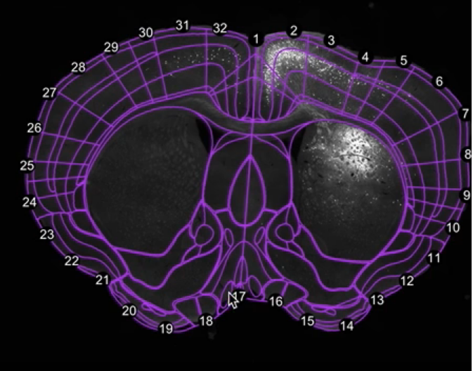

# WholeBrain工具初探

## An interactive framework for whole-brain maps at cellular resolution

> wholebrain software软件包使用教程：http://www.wholebrainsoftware.org/cms/tutorials/   
>
> https://github.com/tractatus/wholebrain

WholeBrain Software提供了一整套软件包，可以实现从图像拼接、图像配准、胞体识别再到三维重建的一系列步骤。这篇论文介了绍这一套工具的功能以及一些基本的原理，未涉及太深的细节。不过在github上开放了源码，可以研究源码。

我们仔细研究了一下作者提供的这一套工具。总的来说，感觉是把我们之前设想的功能都实现了，而且思路也基本一致。通过提取特征点进行图像配准和自动分区，然后手动设置一些参数进行胞体识别，最后统计各个脑区的胞体数目。论文中还提到了三维重建的一些内容，不过在软件包的使用教程中并没有提及，不知是不是因为暂未开源。

## WholeBrain运行效果

软件报的主要功能实现效果如下：

1. 将原始的方块图片进行拼接，示例中对63副图片进行了拼接，设置了10%的overlap。

2. 对拼接后的图像进行修复。

3. 胞体识别，有几个可以手工调节的参数。

4. 检测黑色区域和外围轮廓特征点，进行自动分区，可以手动增加特征点来矫正。

5. 最后生成报告和示意图等。

