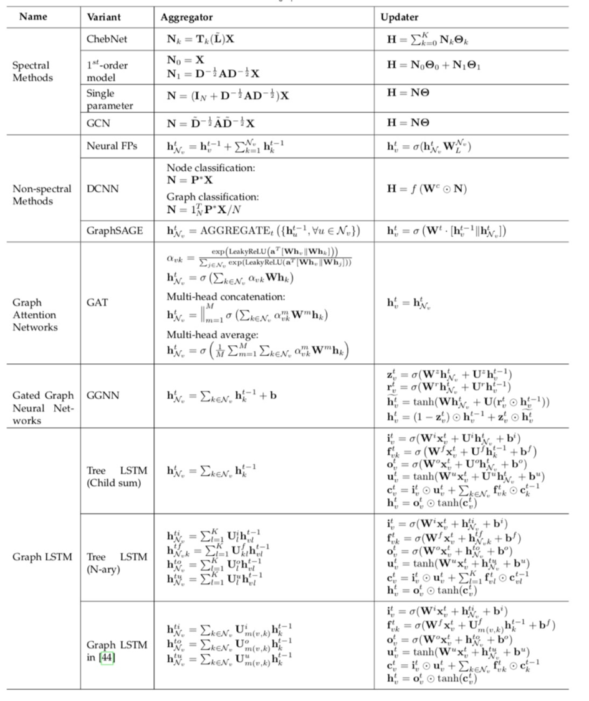

# 本周工作内容

* 完成了[“每日定时爬取Arixv论文”](https://github.com/Arlenelalala/ArxivPaper)的项目，欢迎大家试用，欢迎大家提意见

* NL2SQL进展

  1. 阅读了一些GNN的综述和应用paper，基本弄明白GNN的结构以及它的一些变种。

     下表来自于综述[1]，总结了GNN常见变种的传播、更新公式。

     

  2. 跑通并理解了[2]的代码，也是GNN+NL2SQL的base model。

【1】Zhou J , Cui G , Zhang Z , et al. Graph Neural Networks: A Review of Methods and Applications[J]. 2019.

【2】Representing Schema Structure with Graph Neural Networks for Text-to-SQL Parsing, ACL 2019

