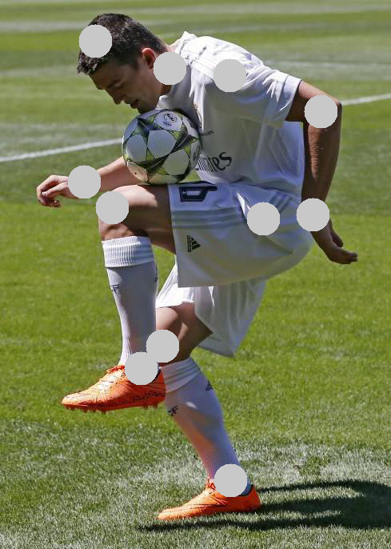
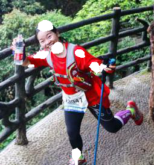

# Pose Detection

## Definition of Pose Detection Problem

想象一个场景：我们获得了一个视频，这个视频中有一个人在放松地走路，他根本没有意识到有人在拍他。我们能从这个视频中获得什么？我们可能会知道这个人有什么从表观上可以看出来的疾病，我们甚至能知道这个人的与众不同的形态和动作特征，从而定义他的身份。

所以，姿态识别，或者做一个广泛的定义，视频的语义分析，是一个很有前景的研究方向。目前对视频的处理主要集中在对视频中的帧（静态画面）的处理，但是对于帧与帧之间的关系鲜有人进行研究。

我们认为，对于将视频分析简化成图像分析是一种浪费时间序列中信息的行为。所以，我们试图通过建立一个人的姿态随时间变化的数据集，来分析这个人的某些信息（是否在打球？是否有一些疾病？）。我们希望该系统能发现人们发现不了的一些问题。

## Key Points

1. 将图像识别骨骼节点这一任务的准确率提上去，最少要在40-50%mAP以上。
2. 将单人的骨骼节点结构化输出。
3. 分析骨骼节点与姿态的关系。

# Algorithm Architecture(Pose Detection)

## OpenPose(Bottom-Up)

对OpenPose的分析见`OpenPose.md`

## Baseline Model(Top-Down)(Divide&Conquer)

### Baseline Model-Structure

#### Body-Detection Network

SSD(Pascal VOC Pre-Trained)

#### Key Points Detection(Single Person)

DeepLab V2

- Mask-RCNN(MSCOCO Pre-Trained)
- Retrained on AIChallenger

# Program Architecture(Baseline Model V1)

## Database Design

[AIChallenger数据集](https://arxiv.org/pdf/1711.06475.pdf)中的骨骼节点识别数据集共有300,000张标注照片，以70%, 10%, 10%, 10%分成了train, validation, test1, test2四个小数据集。每张照片标注的是14个骨骼节点，并存储在JSON中。

举一张图片的例子（增加注释）：

```json
{
	"url": "http://www.sinaimg.cn/dy/slidenews/2_img/2015_34/730_1570079_284793.jpg", 
	"image_id": "0a00a9aa4e31fb51611afb11752ab8b0732894ee", 
	"keypoint_annotations": 
	{
		"human1": 
		[419, 117, 2, // 1-right shoulder, labeled & NOT visible
		 405, 185, 2, // 2-right elbow, labeled & NOT visible
		 308, 227, 1, // 3-right wrist, labeled & VISIBLE
		 490, 94,  1, // 4-left shoulder, labeled & VISIBLE
		 604, 139, 1, // 5-left elbow, labeled & VISIBLE
		 594, 268, 1, // 6-left wrist, labeled & VISIBLE
		 519, 277, 2, // 7-right hip, labeled & NOT visible
		 406, 432, 1, // 8-right knee, labeled & VISIBLE
		 491, 600, 1, // 9-right ankle, labeled & VISIBLE
		 532, 273, 1, // 10-left hip, labeled & VISIBLE
		 343, 259, 1, // 11-left knee, labeled & VISIBLE
		 379, 460, 1, // 12-left ankle, labeled & VISIBLE
		 322, 51,  1, // 13-top of the head, labeled & VISIBLE
		 415, 85,  1] // 14-neck, labeled & VISIBLE
	}, 
	"human_annotations": 
	{
		"human1": [243, 10, 652, 656] 
		// bounding box
	}
}
```

一张图片中可能会有很多个不同的人，该数据集做到了对不同人的骨骼节点标注和不同人的bounding box。但是，经过对数据预处理过程后产生图片的仔细浏览，发现其bounding box并不准确，但骨骼节点比较准确。这是这个数据集的特征。

## Training Process

仅训练DeepLab负责的过程：给定一个已剪切好的人像，预测其骨骼节点。

首先，对数据进行预处理：融合JSON和图像，得到human_images, human_masks和train.txt。

###  human_images
将之前的某一张图像中的所有人根据JSON中给定的bounding box剪切下来（边界无扩充），并存储为`*PHOTONAME*_human*X*.jpg`。人的bounding box是在数据集中有体现的，直接调用数据集就可以进行剪切的预处理。
###  human_masks
将每张剪切后的`*PHOTONAME*_human*X*.jpg`所对应的mask存储为png格式的图片。
- 仅将`labeled & VISIBLE`的节点导出并存储。
- 将节点扩大成一个圆形的置信区间，该置信区间的值为__label__的值（例：头顶所属置信区间的像素值是13）。该置信区间的半径大小为：$ratio = \sqrt{width\cdot height} \cdot hyperparameter$
- 该处理骨骼节点的方法不好，仅仅是一种baseline model的处理方式。为什么不好？因为没有使用各区域的真正特征来定义的置信区间。该方法不能参考。

### Pic Examples

- 原始图像：调用每张图像所对应的JSON信息，以bounding box所指定的边界，对最原始的图像进行切割后得到。
  - 可以看出，bounding box并不好，没有达到真正的框定这一指标（周围预留出的空间太大）
- 图像mask：这之中有一些肉眼很难分辨的、深浅不一的圆圈。这就是置信区间。
  - 圆圈内部的像素点值为分类的类别。例：(14,14,14)为头顶所代表的置信区域的具体像素值。
- 合成后的图像：为了方便起见，我只是将位置标出来了，但是没有控制圆形置信区域的深浅。图像所代表的数组只能用`int`类型，不能使用`float`类型（`numpy`初始化数组，默认类型是`float`类型，），否则会出现显示上的错误。注意下图，无右髋关节（因为其不可见）。

训练DeepLab，不使用PASCAL VOC作为数据集，通过命令行改为AIChallenger的数据集。

```bash
$ python tensorflow-deeplab-resnet/train.py \
--data-dir=./ \
--data-list=train/train.txt \
--snapshot-dir=train/snapshots/ \
--ignore-label=0 \
--is-training \
--not-restore-last \
--num-classes=15 \
--restore-from=checkpoints/deeplab_resnet.ckpt \
--batch-size=8 \
--num-steps=200001 # save ckpt.200000
```

使用在PASCAL VOC预训练过的.ckpt文件作为网络初始化参数，仅对DeepLab进行训练。

- 使用设备：NVIDIA TITAN X (Pascal) ，12189MB
- 训练时间：55hrs

## Inference Process

使用设备：NVIDIA TITAN X (Pascal) ，12189MB

```bash
$ python predict.py \
--img_dir data/valid/keypoint_validation_images_20170911 \
--out_dir validation \
--out_file predictions.json \
--model train/snapshots/model.ckpt-200000
```

loading SSD model - 2.11 secs.

- GPU memory usage: 7965MB, 
- model size(.ckpt): 108MB, 
- validation set size: 2498MB.

Done cropping in 3404.75 secs.(3000 pics)

Loading DeepLab model.

Done inference in 6917.33 secs.(71867 humans)

making JSON file.

Done making in 2905.61 secs.(3000 pics)

```json
{
	"image_id": "52bb742ddd2c490ba87b6a68d79040c351254509", 
	"keypoint_annotations": 
	{
		"human1": 
		[271, 215, 1,
		 255, 233, 1,
		 204, 125, 0,
		 336, 213, 1, 
		 360, 236, 1,
		 373, 235, 1, 
		 204, 125, 0, 
		 204, 125, 0, 
		 329, 382, 1, 
		 204, 125, 0, 
		 204, 125, 0, 
		 204, 125, 0, 
		 278, 167, 1, 
		 298, 204, 1]
	}
}
```

最终，mAP-14 = 0.22061745，结果不怎么样。但是这种没有经过对该应用优化的网络能达到这个准确率已经可以说明一些问题了。

[Realtime Multi-Person 2D Pose Estimation using Part Affinity Fields](https://arxiv.org/pdf/1611.08050.pdf)这篇论文的mAP是0.29，可能是因为其比较real-time，牺牲了部分性能吧。


### mAP-Mean Average Precision

mAP越高越好，在`evaluation.py`中有计算方法。下面是一张图片预测前(Ground Truth, GD)和预测后(Prediction, PD)的结果表。这里只举了一张图片作为例子。

"image_id": "52bb742ddd2c490ba87b6a68d79040c351254509"

| Cls | X PD | Y PD | Lb PD | X GDTH |Y GDTH| Lb GDTH |
| ----- | ---- | ---- | ----- | ----- | ----- | ----- |
| 1-right shoulder | 271 | 215 |1| 278 | 216 |1|
| 2-right elbow | 255 | 233 |1|243 | 226 |1|
| 3-right wrist | 204 | 125 |0| 234 | 206 |2|
| 4-left shoulder | 336 | 213 |1| 331 | 212 |1|
| 5-left elbow | 360 | 236 |1| 363 | 232 |1|
| 6-left wrist | 373 | 235 |1|382 | 238 |2|
| 7-right hip | 204 | 125 |0|326 | 291 |1|
| 8-right knee | 204 | 125 |0|324 | 341 |1|
| 9-right ankle | 329 | 382 |1|333 | 380 |1|
| 10-left hip | 204 | 125 |0| 354 | 286 |1|
| 11-left knee | 204 | 125 |0|391 | 335 |1|
| 12-left ankle | 204 | 125 |0| 419 | 309 |1|
| 13-top of the head | 278 | 167 |1|270 | 171 |1|
| 14-neck | 298 | 204 |1|299 | 206 |1|

该原始图片为：

预测后，加上mask后的图片为：


该网络蛮聪明的，在不确定的地方将flag变为0，不显示出来。**这是因为训练样本中没有将隐藏节点标记出来的缘故**。但总觉得不加上隐藏节点的话是一种浪费信息的事情，所以得尝试一下如何才能预测到隐藏节点。

## Conclusion

### Spotlights

未使用数据库中的隐藏节点，仅仅使用了`labeled & VISIBLE`节点，这是未能最大化利用信息的表现之一。

未实现通过human pose segmentation对image crop给出建议，换句话说，image crop与human pose segmentation是分开的，这是未能最大化利用信息的表现之二。

在进行单人骨骼节点识别时，未使用整个人体的空间先验知识，这是未能最大化利用信息的表现之三。

本来DeepLab是为了解决图像的sementic augmentation而设计的，但是该方法创新性地利用其能力，解决了关键点检测这一问题。解决的思路如下：

1. 将关键点扩大范围，在这一范围中增加特定标记
2. 以剪切过的人体当作识别图像本体，以扩大范围并标记好的关键点当作语义分割的目标
3. 最终得到的语义分割后的目标进行中心点定位，还原成关键点

很大的误解：圆形区域不是置信区域。这是取巧的方法，不能继续改进完善。天花板太明显了。。。

### Image Crop

在分析数据的过程中，我发现SSD在图像分割这一步预处理过程中表现不怎么出色。因为我使用的是top-down方法，该方法对于人像的分割依赖很重，所以表现不好。

在inference之后，我随机统计了304张图片的SSD分割后输出，其中分割较好的有169张，分割不好的有135张。这个问题得全怪使用预训练模型参数的SSD。This pre-trained model is not enough for this keypoint-detection task. I need to train a new network to make a suitable crop tool. 

### Future Work 

#### Improving accuracy

I need to find a more accurate dataset and retrain a SSD or something else. Perhaps I need to transfer a multi-task classification model into a 2-task classification model to accelerate this application.

#### Inference Accelerating

该目的需要等到model足够精确之后再进行分析。主要分析方向为：

1. 在bounding box足够精确之后，输入到keypoint detection中的图片分辨率与准确率之间的关系。我们需要将图片大部分都压缩至某一个分辨率级别，再将图像输入到下一个网络中。
2. 什么样的轻巧架构可以代替这两个部件？
3. 若是将应用目标改为单人视频中的姿态检测，可否通过keypoint detection中的信息预测到下一步他会走到哪，以此作为下一步的bounding box信息？如何使得该bounding box准确？
4. 为什么keypoint detection这个组件对于输入（经过bounding box修剪的原图片）如此敏感？

#### 评价各种sementic segmentation

如果我们有了通过骨骼节点预测肢体（limb）的能力，我们就可以画出最贴切的可行域。在[OpenPose](https://arxiv.org/pdf/1611.08050.pdf)中的Part Affinity Field可以解决这一问题，需要尝试寻找其他方法。

在解决了上面这一问题之后，就可以直接将sementic segmentation这一任务transfer成keypoint detection这一最终任务。

各种sementic segmentation的例子：

- RCNN series
- DeepLab
- 。。。

# Program Architecture(Baseline Model V2)

## Changes Against V1

将所有隐藏节点可视化，重新进行预处理。
示例图片如下：
原始图片：

处理后图片：

可以看出，左右手肘原本不可见，在经过V2对于数据集的预处理之后变得可见。

接下来，训练模型，直接将V1中模型的训练结果作为V2模型的初始化权重，进行训练。将最终V2模型的snapshots（包括tensorboard和checkpoint的数据）保存至`train/snapshots_enableUnvisible`中。

```bash
$ CUDA_VISIBLE_DEVICES=1 python tensorflow-deeplab-resnet/train.py --data-dir=./ --data-list=train/train.txt --snapshot-dir=train/snapshots_enableUnvisible/ --ignore-label=0 --is-training --not-restore-last --num-classes=15 --restore-from=train/snapshots/model.ckpt-199000 --batch-size=8 --num-steps=20001
```

由于该模型与之前的模型的输入数据没有大改变，所以不需要训练过多次数。但是，预测后的mAP大约为0.18左右。原因：隐藏节点不能通过标注后预测来得到。因为隐藏节点标记的范围内像素跟隐藏节点一点关系都没有。

改进策略嘛，很难说，我觉得这个模型不能继续进行改进。找条新路。

# Keypoints 2 Skeleton

做了一个小脚本：输入图片文件夹位置以及每个图片的关键节点预测结果，输出连好线的图片。可自己设置颜色和线宽。

```
1-right shoulder                                13
2-right elbow                                   ||
3-right wrist                                   ||
4-left shoulder                           4-----14-----1
5-left elbow                             | |          | |
6-left wrist                             | |          | |
7-right hip                              5 |          | 2
8-right knee                            |  |          |  |
9-right ankle                           |  10---------7  |
10-left hip                             6  |          |  3
11-left knee                               |          |
12-left ankle                              |          |
13-top of the head                         11         8
14-neck                                    |          |
                                           |          |
                                           12         9
```

## ScriptForConnecting&Visulization

#### Input
示例：输入数据
```json
{
	"image_id": "52bb742ddd2c490ba87b6a68d79040c351254509", 
	"keypoint_annotations": 
	{
		"human1": 
		[271, 215, 1,
		 255, 233, 1,
		 204, 125, 0,
		 336, 213, 1, 
		 360, 236, 1,
		 373, 235, 1, 
		 204, 125, 0, 
		 204, 125, 0, 
		 329, 382, 1, 
		 204, 125, 0, 
		 204, 125, 0, 
		 204, 125, 0, 
		 278, 167, 1, 
		 298, 204, 1]
	}
}
```
#### Output
输出图片示例1：


输出图片示例2：


# Implementation of AlphaPose

下周工作。


# How to improve the speed of video detection -- Real-Time video processing

[基于 TensorFlow 、OpenCV 和 Docker 的实时视频目标检测](https://towardsdatascience.com/real-time-and-video-processing-object-detection-using-tensorflow-opencv-and-docker-2be1694726e5)

[GitHub地址](https://github.com/lbeaucourt/Object-detection)


运气好的话是下下周工作。


