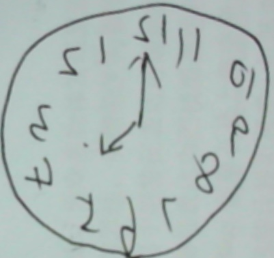
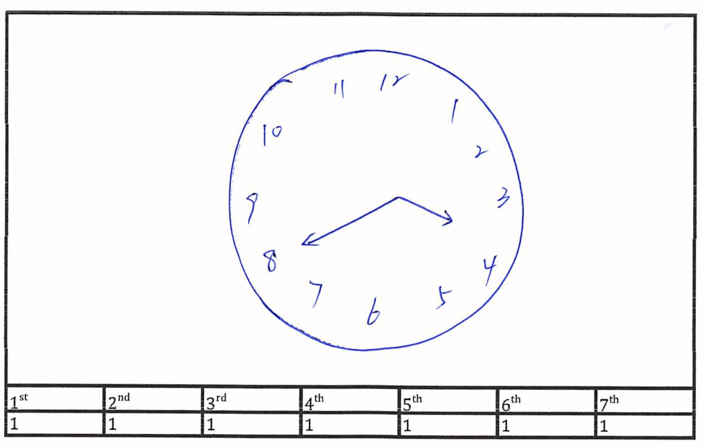
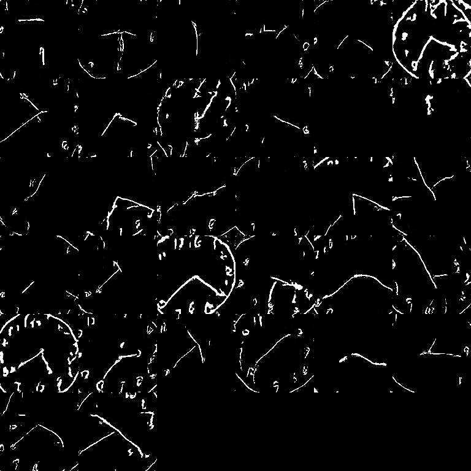
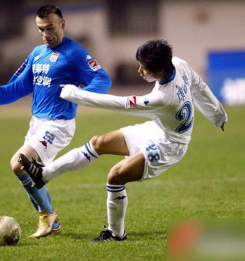
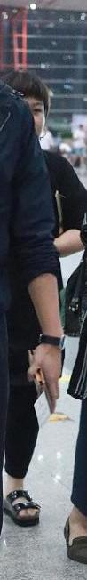
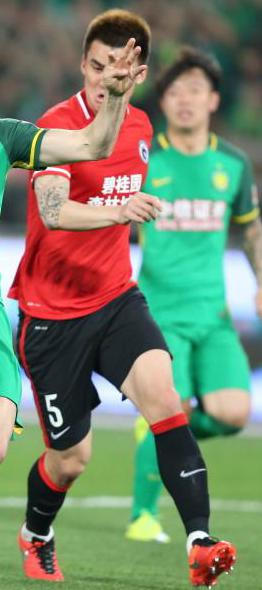
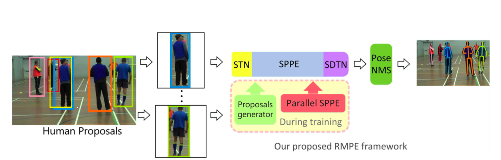
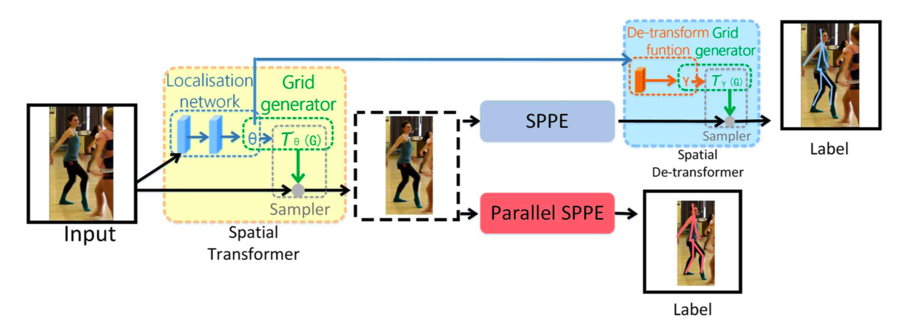

# 项目所用服务器配置需求

目前的配置是Dell T630/730，但是塔式服务器的扩展性和散热能力均不好。

项目的使用场景为：在有40个点接入的情况下，尽可能做到实时给出基于画钟和姿态的对病人的评价。

以后不只是抓取姿态，还要有其他的东西

## 1. 扩展性和性能要求

对该项目可能需要的服务器最大性能进行预估。

根据最近的成果，在姿态估计方面两种模型的具体表现为：

| Structure | FPS  | MemoryCost | mAP  |
| --------- | ---- | ---------- | ---- |
| openpose  | 30   | NULL       | 0.29 |
| alphapose | 5    | 1700M      | 0.72 |

其中alphapose未对速度进行优化。

这仅仅是从视频到骨骼节点的流程，后面还会有从骨骼节点到诊断疾病的流程，所以对于GPU的要求主要是FLOPS尽量高，显存不用太大，能否考虑马上要出的GTX1100系列？

T630的主板最多支持四个GPU，并且若是接四个的话，主板功耗扛不住。所以若是面向最终的使用场景，我觉得T630是不行的。

inference时显存压力不大，尝试将视频数据导入进显存，看看加速效果。

## 2. 散热问题

塔式的散热很差，解决散热问题可能只能是水冷，没地方安风扇。（水冷的空间也是限制蛮大的）

还有对电源的需求也是一个大问题，双显卡的主机>700W，四显卡的服务器起码>2000W。

基于以上两点，在T630里面接进去四个GPU有点难受。

# 项目场地布置需求量化

## 1. 需求拟稿

见`视频采集地点的布置清单.md`。

## 2. 未落实的需求

### 2.1 画钟摄像头

实地考察，通过现在使用的摄像头拍摄画钟图片的效果不好。该摄像头没有应对近景拍摄的能力，清晰度堪忧。

究竟清晰度为多少时可以准确识别出来图像中的数字内容？根据MNIST中样本的例子估计，画钟图像最终处理后的大小在(300,300)左右时可以识别出来。这是估计。

两种解决方法：

- 一是拉远摄像头，截图过程交给算法；
- 二是买专门用于近景拍摄的摄像头，但是比较贵。

已解决。使用近景拍摄摄像头可以达到(401,378)的分辨率。但是还是需要截图脚本。


### 2.2 步态采集摄像头

希望有两到三个步态采集摄像头，最好是有额外供电而非只有USB供电（不是强制要求）。摄像头具体型号没有确定，先听听大家的意见。

还有一个问题：如何保证摄像头对准的位置（俯视图中摄像头的角度）能够被任意操作员复现？

### 2.3 麦克风

麦克风可能噪音有点大，失真也有一些

提问：录音是为了干什么？若没有算法方面的处理过程的话，能听懂就行。

# 画钟图片的生成及评分

## 1. 集成图片预处理流程 

画钟近景拍摄，由于摄像机限制，清晰度可能不够。

应该把预处理集成到整个framework中，试图将matlab代码改成python脚本，直接接入摄像头，扫描，然后完成。




## 2. 通过GAN生成画钟图片

### 2.1 对原始GAN论文的研究

笔记见`./GAN-note-1.png`，`./GAN-note-2.png`，`./GAN-note-3.png`。

- [李宏毅的GAN教程](https://www.bilibili.com/video/av24011528/?p=5)（强烈推荐）
- [公众号混沌巡洋舰解释GAN](https://mp.weixin.qq.com/s/xDtpf40EyOlbRA0oVpKwLA)


### 2.2 DCGAN的Pytorch实现

使用DCGAN的一个想法是：DCGAN比较稳定，输出的图像中边界比较清晰。调了很久，batch size和超参数更新了很多次，下图是能看出钟表形状的最好的一次（batchsize==32, iter==100）。




我觉得GAN并不适合生成如此的比划式的图片，它更适合生成颜色像素复杂的图片。

## 3. 结论

### 3.1 GAN的可行性

我认为：为了扩充样本容量使用GAN来生成画钟图案是不可行的。

- 不清晰图案太多（29/32），很难使用
- 数字模糊（3/32的图片也是用不了的）
- 钟的边界不明确

### 3.2 对画钟过程的其他思考

目的是：给定一张画钟的照片，做到评分，我觉得不必端到端。

我的一个想法（outline）：

- 预处理
- 用fast YOLO检测出每个数字所在位置（但是我们并没有标记良好的数据集）。**能不能将MNIST迁移过来？**
- 框出所有数字，识别数字内容
- 去除所有数字，评估钟表边界形状、指针长度等
- 对于每一张钟表图片，生成以下json文件：

```json
{
  "patientID": 038274,
  "clockID": 038274001,
  "numberPosition":
  {
    "0":  [12,34],
    "1":  [12,34],
    "2":  [12,34],
    "3":  [12,34],
    "4":  [12,34],
    "5":  [12,34],
    "6":  [12,34],
    "7":  [12,34],
    "8":  [12,34],
    "9":  [12,34],
    "10": [12,34],
    "11": [12,34],
    "12": [12,34]
  },
  "handPosition":
  {
    "hour": [12,34],
    "minute": [12,34]
  },
  "centralPosition": [12,34]
}
```

- 再通过逻辑关系写个脚本打分

# 重审各种骨骼节点识别模型

## 1. aichallenger

该数据集的bbox蛮不准的。举三个例子：





这三个例子都是单人的目标bbox剪切出来的。

## 2. alphapose

从这篇论文中，我找到了一个很有启发性的想法：bbox的质量是极其影响单人骨骼节点检测的结果的。冗余背景占的比例越大，识别精度就越小（也可以理解成在视频中节点的稳定性不好，人不动的话节点预测位置一直在抖动）。

如今的bbox生成网络一般都是能将目标框出来就算是很好了，他们不考虑bbox的**贴合性**。

个人理解，这是因为本身样本标注就没有做到贴合性很好。

官方代码中是有简单的NMS的，但是我通过inference不同人姿态的视频，发现当人比较近的时候该NMS效果不好，重影。所以，naive NMS可能得改。

# 下周任务

## 1. 增加单人目标检测的准确度

论文中指出，单人骨骼节点检测是对bbox的质量很看重的。他们使用ground truth的bbox放到单人目标检测网络中得到了0.81mAP，这算是是该模型的准确度上界。我想做几个实验：

我想以一种stacked hourglass网络为对象，使用不同的四种图像做训练样本：

- 未经STN处理的不正的被截图的人
- 经STN处理的正的被截图的人
- 未经STN处理的mask抠后的人，使用黑色作为填充背景
- 经STN处理的mask抠后的人，使用黑色作为填充背景

这四种图像都是一个数据集处理出来的，所以json配置完全一样（STN之后相应的节点也要进行对应处理）。

训练完这四个网络之后衡量一下mAP。

顺便对以下三个领域做个调研：

- STN
- NMS
- mask方法

## 2. 对几种架构的深入分析

### 2.1 alphapose的原始架构





**为什么SPPE对图像的线性变换很脆弱，以至于要加STN，DSTN？**

为帮助SPPE更好地去除没用的region，又用了一个预训练好的并行SPPE，这不是鸡生蛋蛋生鸡的问题？

### 2.2 YOLO--MASK--SPPE--NMS

尝试从理论上解答：

- 图像放正为什么会增加hg的准确度
- 去除所有背景有助于增加hg的准确度么

深入研究一下hg的原理。


