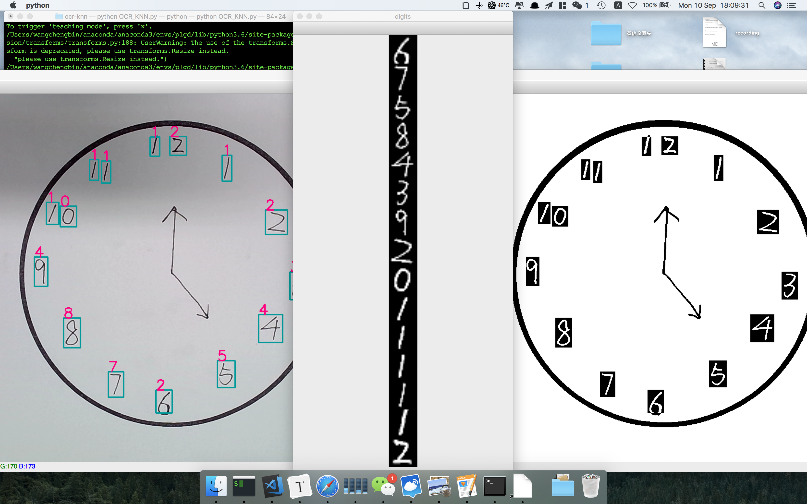

# 画钟

目前已做到baseline如下：

可手动添加学习用例，方便识别一些不常见的数字写法。

## 泛化所要考虑的问题

阅读上一次在社区里面采样的一些病人画的钟，发现与正常人的钟有很大区别。

所有画钟图像在根目录。为版面整洁，不在此全部列举。

识别数字可使用“在检测的时候遇到识别不准的数字就跳出来自东向样本库里面添加该数字及正确的标签”这个方法来加强，所以，**首要问题是如何抓准所有数字的位置**。

仅讨论如何抓准数字的问题，病人画的钟的样本库（22张从社区采样的图片）反映出了如下难点：

1. 需要两笔写成的数字（5）两笔分离，算法可能会检测成两个数字。
2. 数字与钟的边界是相交的/数字与指针的边界是相交的，去除边界的时候可能也会去除部分数字的像素点。无法采用边缘检测作为提取数字置信区域的方法。
3. 两指针原本应该相交于一点的，但是很多样本没有交于一点，这样的话给提取指针置信区域这一步骤造成了麻烦。
4. 重复描一个数字，或是病人意识到自己写错之后覆盖着写上了自己认为对的数字，或是病人重复描指针。
5. **最关键的一点：**有的病人写的数字实在太密，以至于：对于任意一个可以框住某个数字的识别框，这个识别框里面一定存在属于其他数字的笔划片段。这个问题与**如何区分两个正在踢足球拼抢的运动员**在某种程度上是一样的。
6. 数字尺寸相比于整张图片而言很小，如果对整个图片进行resize的话会认不出这是一个数字。
7. 病人加上去的其他奇怪的符号：指针中间画个圈，在整点处加竖线/圈等。
8. 指针的绘制不受控制，有的人画箭头，有的人画得歪歪扭扭，有的人画秒针等。同样，指针的中心点不一定被绘制在接近中心的区域。
9. 病人觉得一个地方的数字画错了，就划掉重写。

解决方案（对应问题的序号）：

1. 算法方面改进的可能性不大，如果改势必会影响对其他数字的检测。所以这里可能需要医生帮助一下。
2. 若控制每张图片拍出来之后的的笔迹粗细，可以实现：精确去除最大的contour。该方法同样适于处理未闭合画钟边界问题。数字与指针的相交问题暂时不可以通过该方法优化。
3. 假设：即使指针未相交，两个单独的指针分别的可行域大小也是远大于数字的。基于该假设该问题可解。需要设计一个评价标准，什么时候使用去除contour之后的最大可行域作为指针区域，什么时候使用去除contour之后的最大两个可行域的合并作为指针区域。
4. 描数字这个问题可以使用图像增强解决，但是可能识别精度不怎么好，所以可以先扩张再腐蚀（不确认效果好不好）。
5. 大问题。
6. 大问题。
7. 大问题。特殊符号原则上是可以用识别框面积区分的：小于中位数太多的就是特殊符号，但是谁知道这个病人写数字是不是一样大的呢？谁知道病人画出的特殊符号是不是一定比数字大呢？所以这个问题似乎没什么太好的解答方案。
8. 无所谓。
9. 让医生帮助一下。

总结：不可解决的问题有以下四点：

1. 数字与指针笔划相交
2. 数字太密
3. 数字相对太小
4. 特殊符号

## 新的想法

### 逻辑的重新设计

用封闭轮廓为特征找数字可行域，再使用神经网络找其相对应的数字，这个方法究竟是否有扩展可能？或者说，这个方法是否在设计之初就已经注定了其对于复杂样例的脆弱性和逻辑扩展的艰难性？我是否合理地利用了所有的信息？

换句话说，现在所遇到的各种细节问题，这些问题难以解决的原因是否是我在制定整体流程的时候欠考虑，想着先实现一个可以实现功能的方法的锅呢？

如何抽取出来一些任务，这些任务既可以被神经网络完美实现，这些任务也有可以被神经网络完成的内在逻辑？

## 数字太密而难以框住

这个问题可以泛化之后讨论。

设想一张图片，这张图片中有两个足球运动员正在拼抢一个球。这两个人的姿态重合得很厉害以至于无法用一个方框框准任意一个人。换句话说，所有能框住A的识别框中一定有B存在。

当然，这个问题在二值化很好的“非自然图像”中可以使用很简单的方式（框住边界，找出凸壳之类的方法）完美完成（使用多边形将想要的图片部分切割下来），但是在自然图像中就很难实现。

那么，为什么要在自然图像中实现这一目的呢？我的一个分析就是：只针对于姿态识别和骨骼节点预测这个任务，两个主流方法中的top-down方法的准确性被严格限制在：抓取图像的bbox的贴合度上，而bottom-up的方法规避了该风险，在图片中直接使用PAF，进行对肢体的识别（但是无truth证明该肢体就是我们想要的肢体，也就是说，这种方法的泛化性能蛮差的，实验证明采取第一种策略的alphapose的稳定性是比采取第二种策略的openpose好一些的（可能是调参的问题））。所以，不论是为了给第一种方法提供噪音尽量小的喂进SPPE的图像，还是为了给第二种方法一个truth更新其权重增加表现能力，在自然图像中找到严格的边界这一点都是值得探索的。

关于对“在自然图像中找到严格的边界”这样的问题的解决方案，alphapose使用了STN进行了初步的拟合。使用STN是不可完全解答该问题的，原因是：STN只是改变图像的拉伸等仿射变换从而适应识别框（换句话说，STN所做的工作可以理解成：将识别框拉伸成平行四边形，使这个平行四边形尽可能地贴近待识别图像）。STN无法抠出来图像。

这是一个值得研究的方向吧。。。

