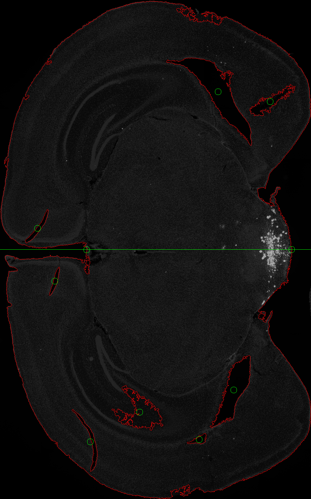
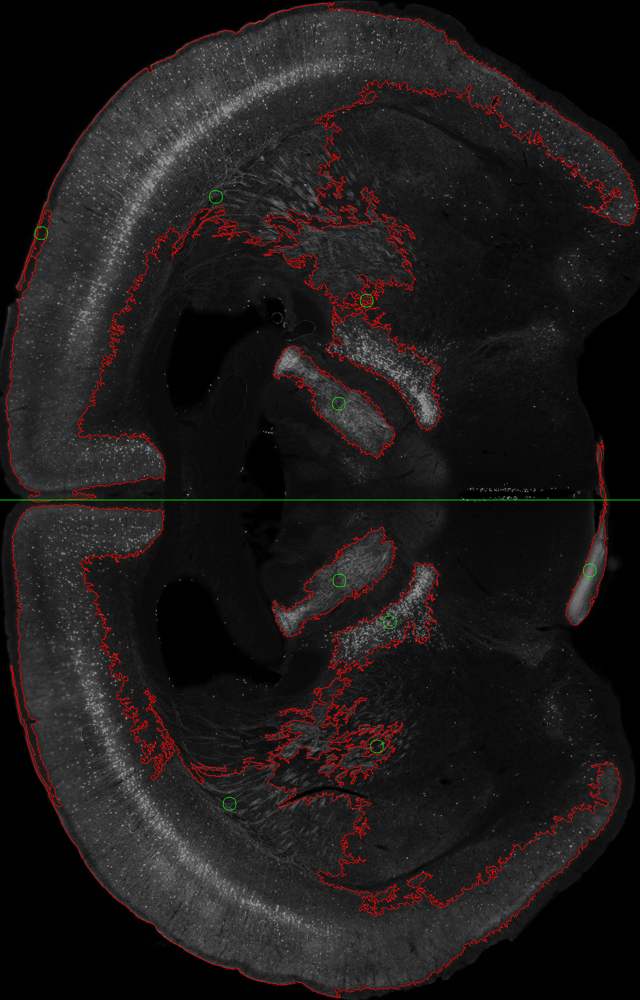
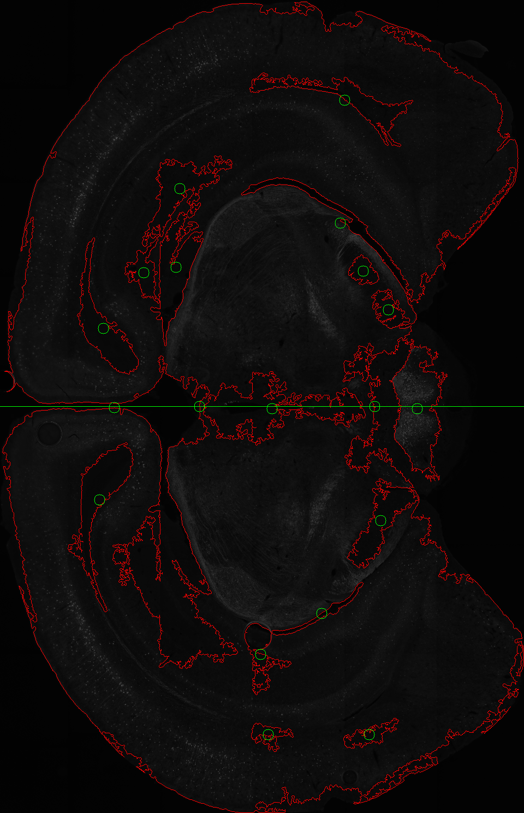
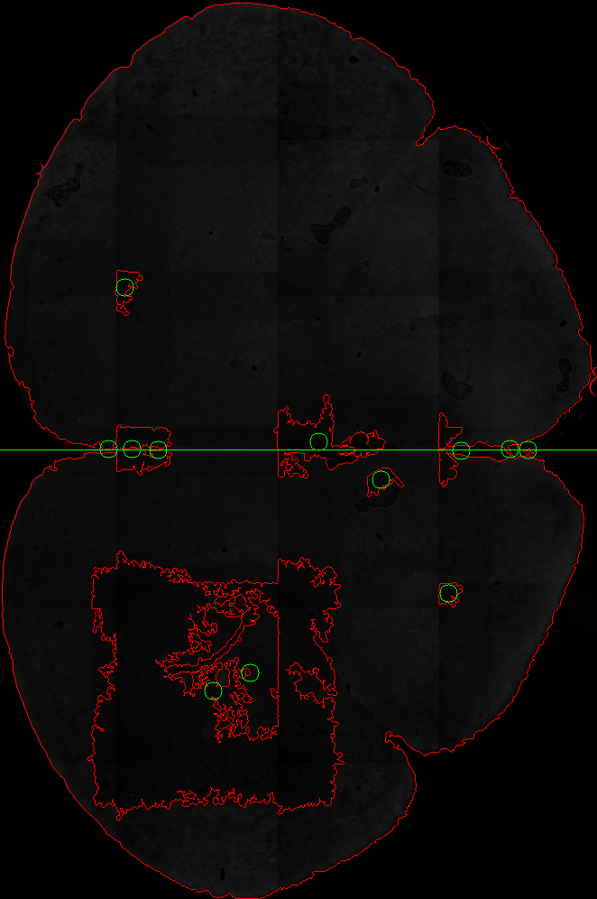
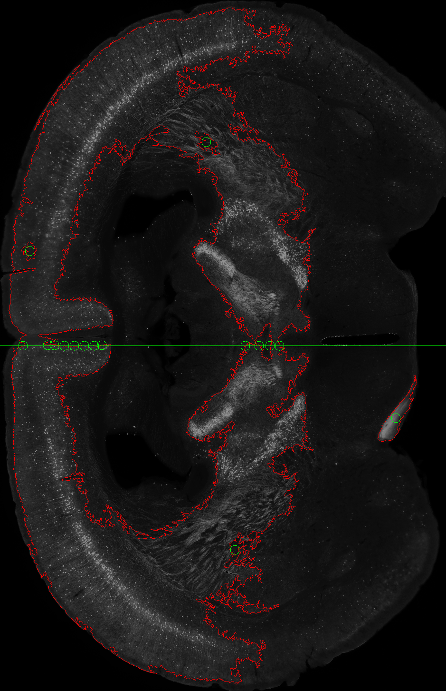
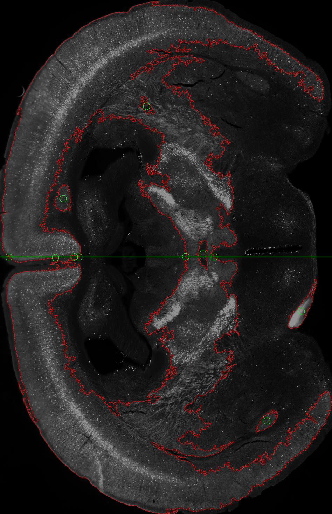
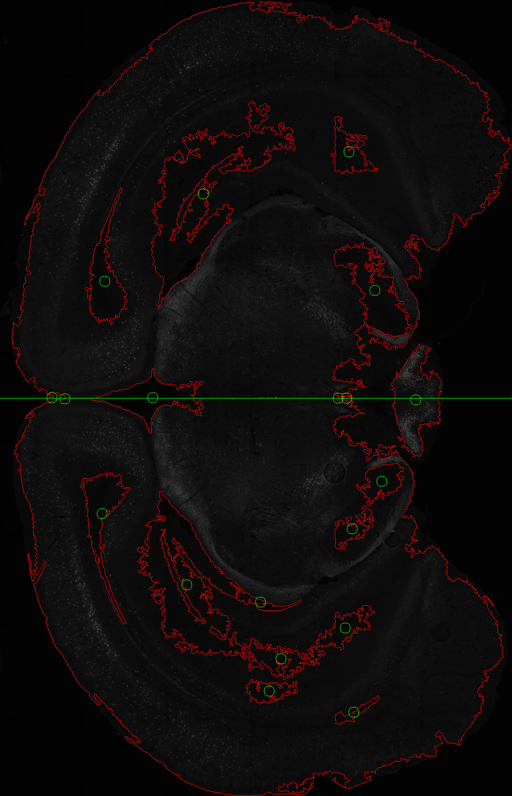
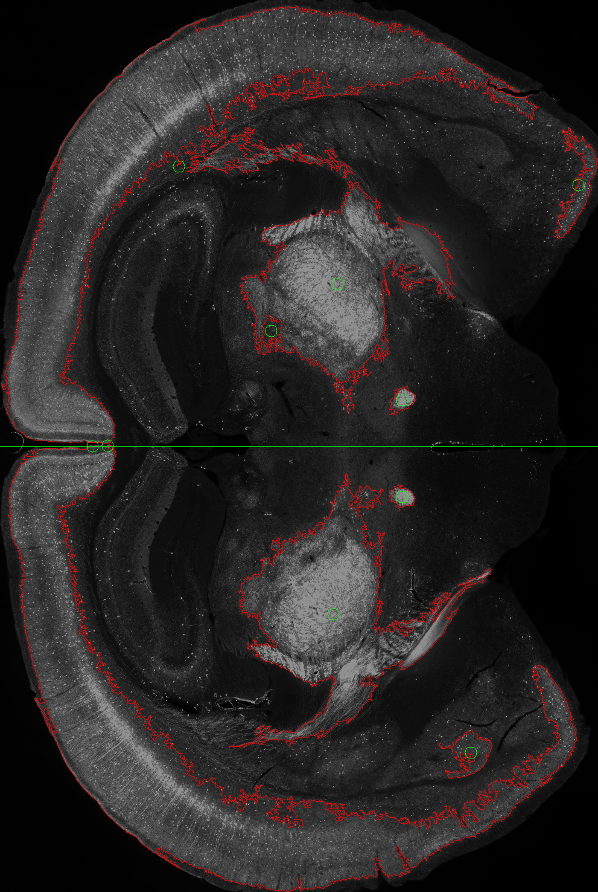

1.添加一个输入图片旋转

2.自适应阈值无效

原来那套干净的鼠脑切片图用自适应阈值，基本上就能够将关键轮廓给提取出来，最新的这套鼠脑切片图，自适应阈值不太适用了：

(1)因为各种鼠脑切片图颜色差异太大，而且图片是进行拼接的，导致自适应阈值失败，无法提取出轮廓。

(2)即使能提取出轮廓，但是因为变形严重，且有很多重叠区域，噪声很多，导致自适应阈值后很多轮廓丢失，或者提取出来的轮廓锯齿严重。

3.将需要调整的参数放到config.py里
