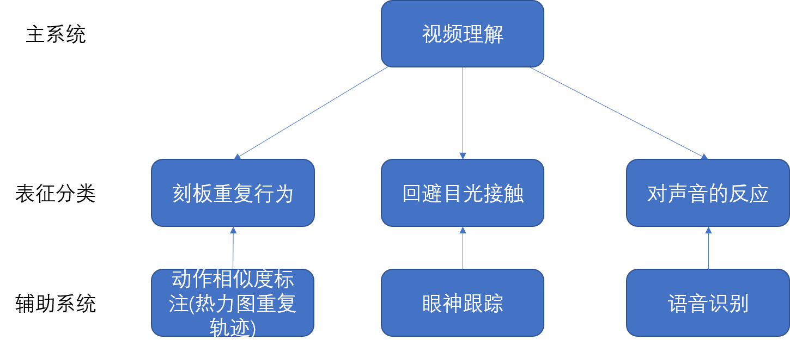
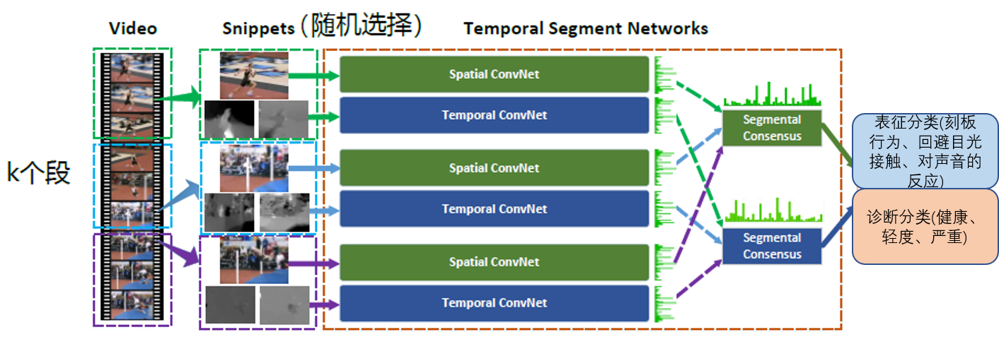
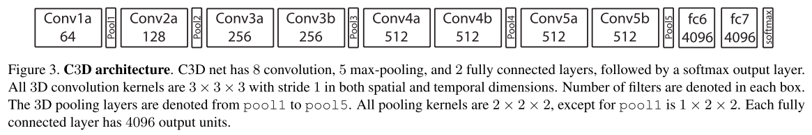

# 基于视频行为理解的自闭症预防

### 临床表现

自闭症一般起病于36个月以内，主要表现为三大类核心症状，即：社会交往障碍、交流障碍、兴趣狭窄和刻板重复的行为方式。

**社会交往障碍**

该症患儿在社会交往方面存在质的缺陷。在婴儿期，患儿回避目光接触，对人的声音缺乏兴趣和反应，没有期待被抱起的姿势，或抱起时身体僵硬、不愿与人贴近。在幼儿期，患儿仍回避目光接触，呼之常无反应，对父母不产生依恋，缺乏与同龄儿童交往或玩耍的兴趣，不会以适当的方式与同龄儿童交往，不能与同龄儿童建立伙伴关系，不会与他人分享快乐，遇到不愉快或受到伤害时也不会向他人寻求安慰。学龄期后，随着年龄增长及病情改善，患儿对父母、同胞可能变得友好而有感情，但仍明显缺乏主动与人交往的兴趣和行为。虽然部分患儿愿意与人交往，但交往方式仍存在问题，他们对社交常情缺乏理解，对他人情绪缺乏反应，不能根据社交场合调整自己的行为。成年后，患儿仍缺乏交往的兴趣和社交的技能，不能建立恋爱关系和结婚。

**交流障碍**

1．非言语交流障碍  该症患儿常以哭或尖叫表示他们的不舒适或需要。稍大的患儿可能会拉着大人手走向他想要的东西缺乏相应的面部表情，表情也常显得漠然，很少用点头、摇头、摆手等动作来表达自己的意愿。

2．言语交流障碍  该症患儿言语交流方面存在明显障碍，包括： 

①语言理解力不同程度受损

②言语发育迟缓或不发育，也有部分患儿2-3岁前曾有表达性言语，但以后逐渐减少，甚至完全消失

③言语形式及内容异常：患儿常常存在模仿言语、刻板重复言语，语法结构、人称代词常用错，语调、语速、节律、重音等也存在异常

④言语运用能力受损：部分患儿虽然会背儿歌、背广告词，但却很少用言语进行交流，且不会提出话题、维持话题或仅靠刻板重复的短语进行交谈，纠缠于同一话题 

**兴趣狭窄**

该症患儿对一般儿童所喜爱的玩具和游戏缺乏兴趣，而对一些通常不作为玩具的物品却特别感兴趣，如车轮、瓶盖等圆的可旋转的东西。有些患儿还对塑料瓶、木棍等非生命物体产生依恋行为。患儿行为方式也常常很刻板，如：常用同一种方式做事或玩玩具，要求物品放在固定位置，出门非要走同一条路线，长时间内只吃少数几种食物等。并常会出现刻板重复的动作和奇特怪异的行为，如：重复蹦跳、将手放在眼前凝视、扑动或用脚尖走路等。

目前为止没有完全治愈的解决办法，对自闭症最好的救治是及早预防。自闭症最早的症状出现在生命的头一两年，但是诊断的平均年龄通常为3岁，对自闭症的早期筛查与诊断有助于增加儿童从早期干预中获益的机会。于是，我重点考虑对3岁以下的婴幼儿进行自闭症的早期筛查和诊断。

### 辅助诊断系统设计

可从下面几方面入手：

(主)**视频理解**：识别刻板重复行为、回避目光接触、对声音是否有反应

(辅)**眼神跟踪**：确认是否有眼神交流

(辅)**语音识别**：识别刻板重复言语，对声音是否有反应

(辅)**动作相似度标注(热力图重复轨迹)**：识别刻板重复行为

####                                             基于视频理解的自闭症预防系统初步框图

  

#### 视频理解

##### 1.Action Recognition

给婴幼儿拍摄一段视频(有外界影响和无外界影响)，通过视频跟踪孩子的头部、肢体、眼球的运动，可以从行为中分析出是否异常，与自闭症进行联系，分析有无自闭症的可能性，若有自闭症的倾向，可及时就诊。![u=951343840,308847999&fm=200&gp=0[1]](C:\Users\18292\Desktop\u=951343840,308847999&fm=200&gp=0[1].jpg)

可将视频输入到TSN或者C3D模型中，来对视频进行训练。

##### TSN模型

TSN是由空间流卷积网络和时间流卷积网络构成。TSN使用从整个视频中稀疏地采样一系列短片段，每个片段都将给出其本身对于行为类别的初步预测，从这些片段的“共识”来得到视频级的预测结果。在学习过程中，通过迭代更新模型参数来优化视频级预测的损失值。

​                                                                          **TSN网络示意图**

由上图所示，一个输入视频分为***K***段(segment)，一个片段(snippet)从它对应的段中随机采样得到。不同片段的类别得分采用段共识函数(The segmental consensus function)进行融合来产生段共识(segmental consensus)，这是一个视频级的预测。然后对所有模式的预测融合产生最终的预测结果。

具体来说，给定一段视频***V***，把它按相等间隔分为***K***段{*S1*,*S2*,...,*Sk*}。接着，TSN按如下方式对一系列片段进行建模：
$$
TSN(T_1,T_2,···,T_k)=H(G(F(T_1;W),F(T_2;W),F(T_2;W),···,F(T_K;W)))
$$
其中：

- (T1,T2,...,Tk)代表片段序列，每个片段Tk从它对应的段Sk中随机采样得到。
- F(Tk;W)函数代表采用W作为参数的卷积网络作用于短片段Tk，函数返回Tk相对于所有类别的得分。
- 段共识函数G(The segmental consensus function)结合多个短片段的类别得分输出以获得他们之间关于类别假设的共识。
- 基于这个共识，预测函数H预测整段视频属于每个行为类别的概率(本文H选择了softmax函数)。

通过训练这样一个网络，可以得到例如刻板行为、回避目光接触、对声音的反应等表征分类，再基于这些表征分类的分数，得到诊断分类(例如健康，轻度，严重)。

##### C3D模型

也可以将模型更换成C3D，C3D模型速度更快，实时性好，但是比起two-stream的模型精度低。

基于3D卷积操作，设计了如上所示的C3D network结构。共有8次卷积操作，4次池化操作。其中卷积核的大小均为3x3x3，步长为1x1x1。池化核的大小为2x2x2，步长为2x2x2，但第一层池化除外，其大小和步长均为1x2x2。这是为了不过早缩减时序上的长度。最终网络在经过两次全连接层和softmax层后就得到了最终的输出结果。网络的输入尺寸为3x16x112x112，即一次输入16帧图像。

2.Temporal Action Detection

Action Recognition主要是基于剪辑后的视频进行分类的，假如拍摄的视频有长有短，且有大量无用信息片段，实用性较差，这时候就要考虑用Temporal Action Detection的方法来对视频行为进行分析。其中proposal的质量是影响模型精度的关键。 

3.Action Similarity Labeling

也可以针对刻板重复行为这一特点，将同一个视频切分成前后两段，通过Action Recognition的模型对两段视频进行动作相似度分析。

热力图重复轨迹

##### 眼神跟踪

##### 语音识别
