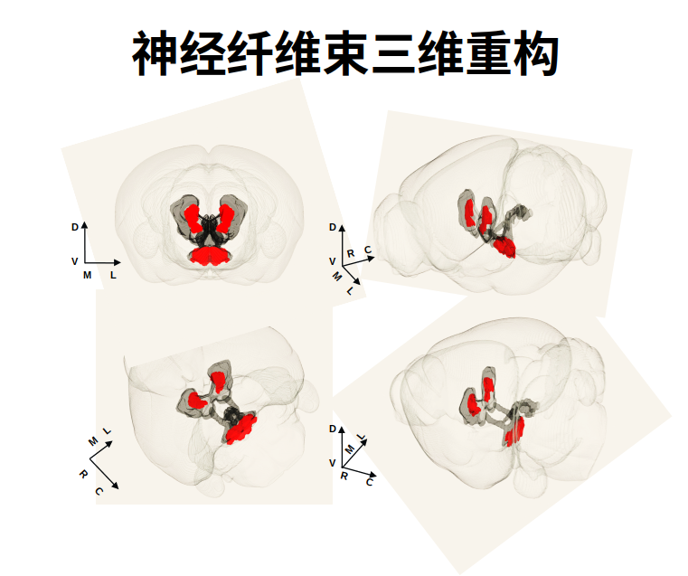
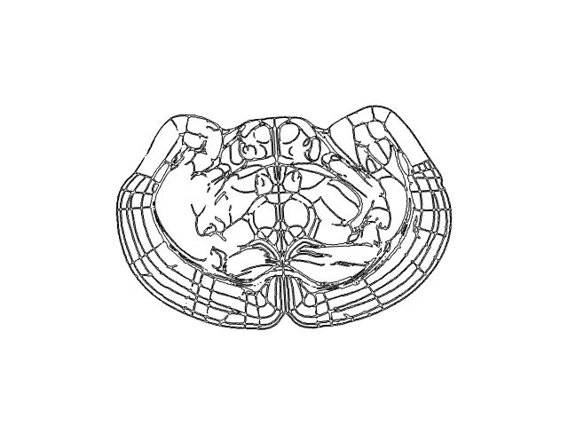

## 上周工作进展                                 

1. 帮学姐装好软件，让她通过软件把需要重建的脑区以及信号标注出来返回给我。

2. 对标号的数据进行重建，但是图片太少，图片插帧（image-morphing-master）扩充图片。

   

3. 调整重建结以满足对方要求（平滑，镜像）。

   

4. 解决对方对软件的新要求（三通道在软件上分别显示问题）

   ### 存在问题

   1. MarchingCubes算法中间有空隙，导致截取切面的时候会有断线。换算法TM, 找找与深度学习结合的切片重建算法。

      

2.  配准不够准，根据软件打点得到的数据进行重建会有错位发生。

## 下周目标

​    看四篇论文：
     Fast R-CNN

​    目标追踪综述

​    siamfc

​    siamrpn
