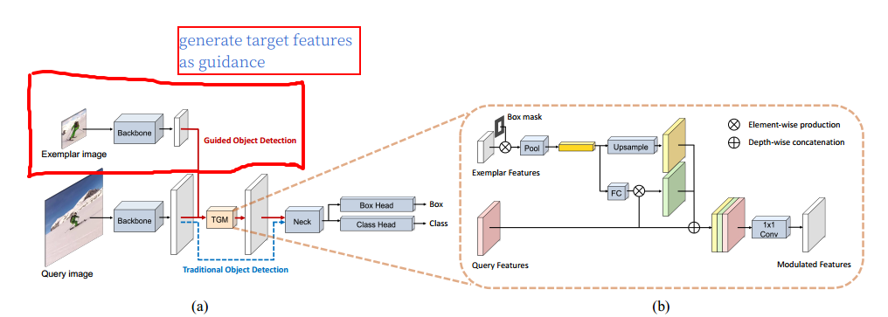
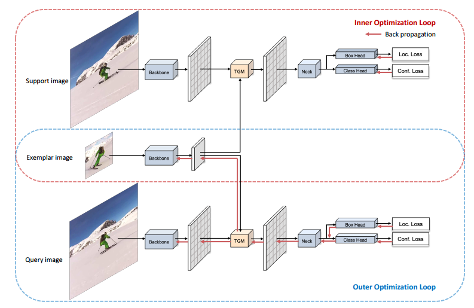
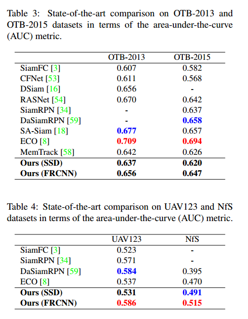
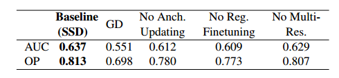

## Bridging the Gap Between Detection and Tracking: A Unified Approach

#### 		                                                                                                                     —— ICCV2019, CRISE

1. ### target

   提出一种通用框架，可以将任何检测网络改到跟踪。

2. ### method

####    2.1 检测 to 跟踪的难点

- 检测预先知道目标种类，跟踪不知道。
- 检测不关心同类物体之间的区别，跟踪关心。
- 跟踪还关心时间信息，对长时间跟踪有用，检测不关心。

####   我认为难点在于：

- 如何将exemplar与srch img 融合到一起，目的就是告诉网络需要跟踪的对象，实际上也就是作者提出的第一个难点。
- 网络不可能提前知道要跟踪的目标从而进行相应的训练，如何使得网络能够识别出“临时”挑选的目标。采用meta-learning的方法如何避免过拟合。
- siam成功的地方在于将上述两个问题转化为匹配问题，即在srch img中匹配exemplar，siam的问题在于网络的判别性，即不会匹配到背景，另外exemplar是否更新，如何更新，尺度变换问题如何解决。

####   2.2 idea summary

- 提出了target-guidance module（TGM）将exemplar图像融合到检测的feature map里。
- 在线学习Meta-learning对classification head微调。
- 在线更新权重
- anchored updating strategy减少Meta-learning的overfitting。

####   2.3 network framework

​	  值得注意的是TGM： exemplar先通过ROI， conv得到C×1×1的特征向量（图b中黄色的细长条feature），然后将此特征向量与query image进行元素乘得到图b绿色的feature map（与siamPoint类似），该特征向量上采样得到黄色的feature map，再加上query三张feature经过1×1 conv融合得到一张feature map作为TGM的输出。即feature map包含了target，srch img and their interactions，以提供充足的信息。

​	  但是作者实验发现，仅仅这样网络仍然很难检测到目标，作者假设认为这是由于目标周围的negatives没有被利用造成的（siamPoint是否也存在这个问题，但hourglass具有全局信息）。于是作者对检测的head进行在线的meta-learning。

####   2.4 training procedure

​	  在线训练时需要三张图，support image，exemplar，query image。红框为内优化，篮框为外优化。内部优化只优化检测器的head。外优化优化整个网络。

3. ### 在线跟踪策略

####   3.1 在线学习

​		主要是meta-learning部分，对于第一帧以及每隔T帧，学习的迭代次数为5，其他帧迭代1次

####   3.2 anchored updating

​		为了减少meta-learning的过拟合， 在第t步的finetuning，使用第一帧以及上一帧的参数进行在线学习，其余帧只使用上一帧的参数。

####   3.3 target localization

​		在输出使用NMS之前，叠加一个余弦窗，在尺度和横纵比方面使用一个函数修正，对bbox的中心进行跟新。对bbox的尺度使用学习率为0.275的更新策略。

4. ### experiments

####   4.1 AUC

​		效果一般

#### 4.2 ablation study

