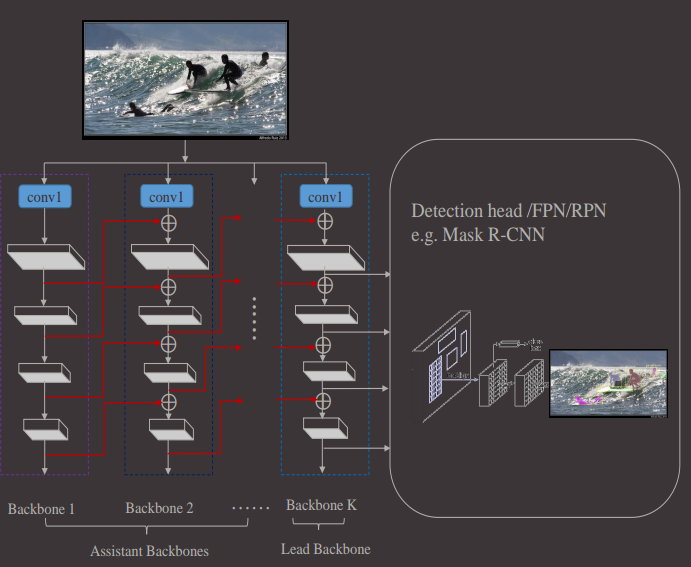
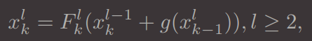
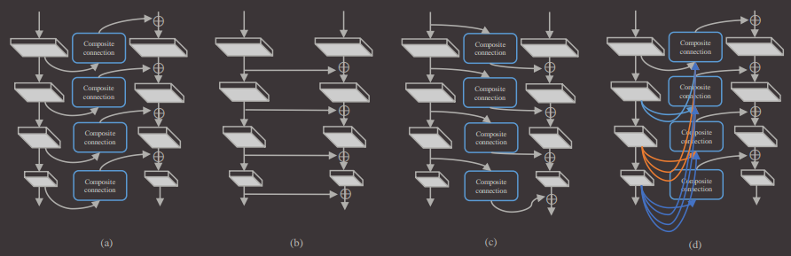

#                            CBNet

[机器之心参考]: https://zhuanlan.zhihu.com/p/83004945

## 解决问题

​	根据现有的主干网络，组合调整，提出一种更强劲的用于目标检测的主干网络。可以将FPN，Mask rcnn，cascade rcnn这些检测网络在coco数据集上的mAP提高1.5-3.0个百分点。将CB net集成到cascade mask rcnn中，可以将coco上的mAP提高到53.3（目前最高2019/9/9）。

## 解决方法

​	

​	上图很清晰的显示了CBNet是如何运行的，Each backbone comprises L stages (generally L = 5), and each stage consists of several convolutional layers with feature maps of the same size. The l-th stage of the backbone implements a nonlinear transformation Fl(·).

关键就是在于红线部分是什么操作，即如何把两个backbone的feature map整合起来。

上式中F是同一个backbone的feature map与feature map之间的操作，g就是图中红线的操作。

where g(·) denotes the composite connection, which consists of a 1×1 convolutional layer and batch normalization
layer to reduce the channels and an upsample operation. 

#### 其他高阶cbnet

（疯狂交叉融合，融合得越复杂，AP值越高）

#### 识别效果上的分析

​	通过CBNet的融合，网络能够更好的区分前景与背景（即对于前景的响应更加大，对于背景的响应更加小）。

速度方面：DB（有两个backbone的cbnet） increases the AP of FPN by 1.6 percent but slows down the detection speed from 8.1 fps to 5.5 fps. 

## 一些思考

	1. 特别值得一提的是，这个方法能够更好的区分前景与背景。
 	2. 个人觉得这篇论文提出的CBNet只能算是一种trick，即提出了一种把各种特征提取模型综合起来的方法，并没有提出什么新的网络结构，创新性不足。
 	3. 集成了这么多模型，虽然mAP有所上升，但是运行速度也受到一定影响。虽然作者说在训练时可以直接使用单个模型的预训练结果，不过实际落地使用起来肯定还是要自己训练最好，所以时间成本是不是很高。