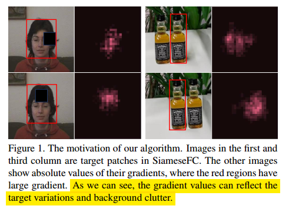
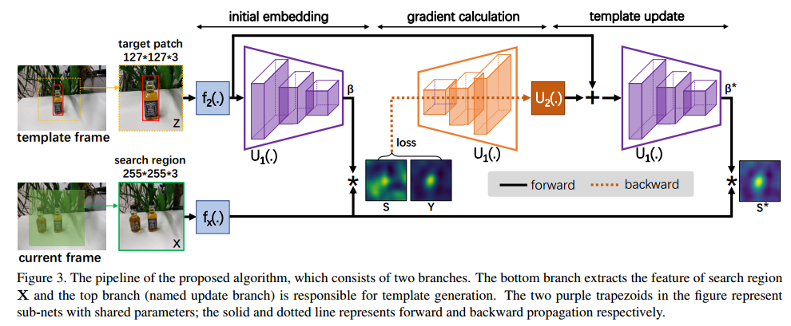
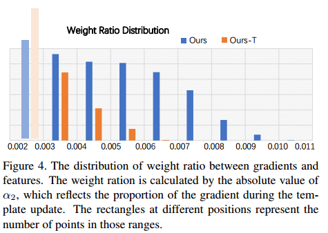
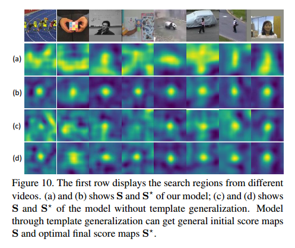

## GradNet: Gradient-Guided Network for Visual Object Tracking

####  —— ICCV 2019 Oral 

#### 大连理工Peixia Li†, Boyu Chen†, Wanli Ouyang§, Dong Wang†∗ , Xiaoyun Yang‡, Huchuan Lu†

1. work summary

   ​	本文基于在线训练时BP的梯度，对siam的template进行更新修正，使得网络能够利用背景信息。从模板更新的角度，跟踪网络可分为两类，一类是在线finetuning的网络，这类网络都需要BP很多次（不知道DiMP怎么样），拖慢，速度。另一类是siam系列，速度快，但是该系列网络要么不更新，要么仅仅根据target更新，只利用target更新的策略网络学不到关于背景的信息，导致网络判别性不够。作者提出的更新修正策略只需要BP两次。

   ​	一般的在线训练修正template是基于梯度（BP），作者做了实验表明梯度确实具有修正的作用，如下图，当出现干扰物或者有遮挡等复杂变化时，出现这些变化的位置的梯度会更大，使得网络学习到这些特征。

​		上面的分析证明梯度确实包含了template修正需要的信息，同时在计算梯度时，分子上的loss是一个整合了包括前景背景的综合参数，即包含了背景信息。所以使用梯度不仅能够对template进行修正，这种修正还蕴含了背景信息。那么最直接的想法就是在线BP一次对template进行修正，但是作者实验发现，无论学习率怎么设置，都不可能通过一次BP完成修正。因为基于梯度的优化是非线性的。但是CNN是可以进行非线性预测的。因此作者的想法就是通过卷积网络替代在线更新数次的BP（数次BP与作者的方法孰优孰略作者并没有实验比较）。

​		同时在线更新修正模板有个通病就是过拟合问题，此外作者发现想要从梯度中学习是很困难的，因为比起从梯度中学习背景等信息，网络更加倾向与更简单的图像特征信息。对于这两个问题，作者从训练的角度巧妙的强迫网络学习梯度。

2. network frame

​		网络流程见上图，首先是简单siamFC，然后得到heatmap S，计算loss，然后将loss进行BP求得其梯度矩阵，将此矩阵作为U_2的输入，与template_embedding融合后，再次导入一个网络得到最终的S。注意此处在进行相关操作之前，template_embedding比srch_embedding多进过了一组卷积，与传统的siamFC不同。

3. 强迫网络学习梯度信息(Template Generalization)

   ​	因为学习梯度信息比学习图像特征信息难，所以网络更加倾向于学习图像特征。那么只要让他们的难度差不多就可以强迫网络学习到梯度信息。于是作者对于一组来自不同vedio的4个srch_img,选用同一个template（该template在4个srch_img上都能一定程度的匹配），这样使得他们的匹配难度加大，网络强迫学习梯度信息。

   

4. experiments

   

   ​	作者的目的是提高判别性，因此主要看R，可见R确实很高。

   

   
