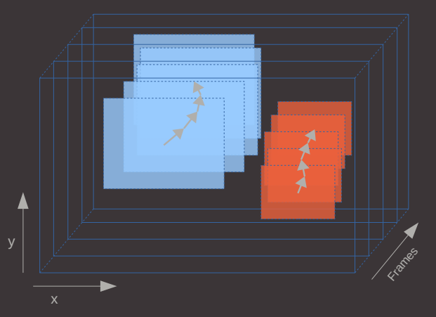
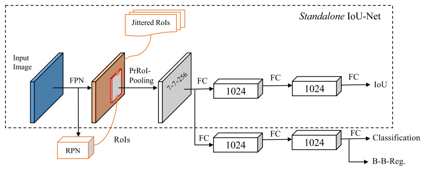

IOU-Net

--《Acquisition of Localization Confidence for Accurate Object Detection》

解决问题

​	一般的检测算法在对目标打分时，只根据分类的结果，没考虑到位置的因素。因此在NMS阶段就会存在bbox分类结果好但是位置其实并不是最佳的bbox被当做最优bbox，使得检测得到的bbox效果不佳。

​	本文在最终打分的阶段引入了位置方面的参考，使得bbox的位置更加准确。作者提出的方法可以应用到其他检测网络中，AP可以提升1个点左右，效果不算显著但是很新颖。

解决方法

2.1 网络结构

​	在常规检测网络的基础上增加IOU预测分支。

2.2 iou-guided NMS

​	传统的检测在NMS阶段排序完全根据分类的打分结果，作者提出的NMS则是完全根据IOU预测结果；同时，对于IOU最高的bbox由max函数赋予其最大的分类得分。保证最佳bbox的iou与分类得分都是最大的。

2.3 reg直接得到bbox坐标

​	训练时，作者将bbox_det与bbox_gt的IOU最为目标函数，使用他们提出的优化方法，直接求出bbox_det的坐标值。

2.4 PrRoI Pooling

​		作者提出PrRoI Pooling，在得到feature map阶段采用双线性插值，pooling阶段采用积分均值，以解决ROI不连续的问题，减少误差。

问题
