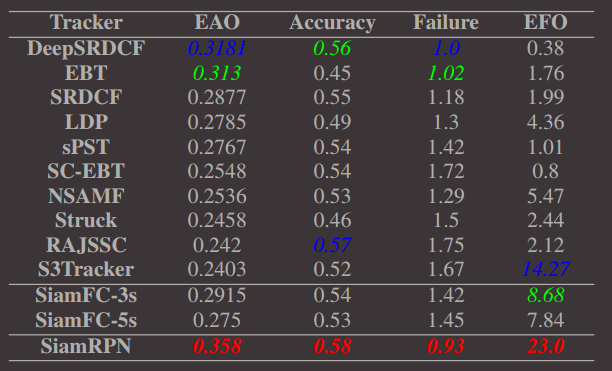
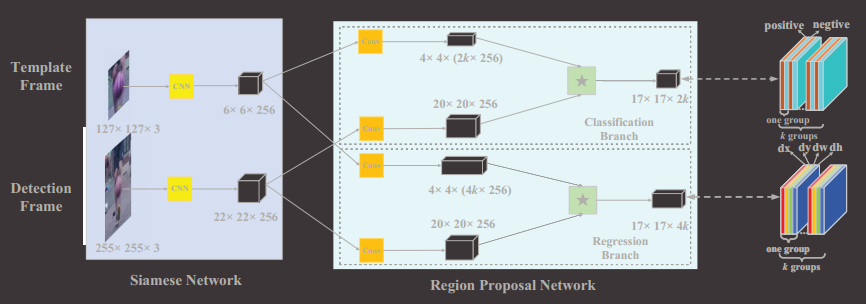
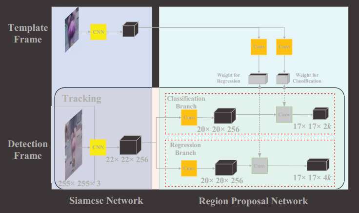

# siamRPN

## 解决的问题

​	提出了一种性能很好的端到端离线训练的网络(18年提出，效果比之前的方法都好无论是速度还是精准度都完爆之前的的模型VOT2015数据集)。

## 实现方法

​		

​    如图，siamRPN结合了siamFC与RPN网络，用siamRPN来提取特征，用RPN来产生proposals进行分类与回归。

图中siamese网络的CNN完全一样,用的是AlexNet, 其中conv2与conv4被移除。

​	region Proposal包含两个部分，配对相关部分与监督部分。监督部分就是上图中卷积后面的部分，和RPN一样，此部分包含了classofocation与regression两个任务。配对相关部分就是用template frame得到的数据作为卷积核，对detection frame进行卷积。具体来说，先将template frame的特征的channel增加到2k，4k；detection frame的channel数量不增加。图中的*表示卷积。（实际上，配对相关部分还是属于siamFC的方法）

​	用下面这幅图理解更方便

​	

训练时的损失函数与faster rcnn一样。分类部分采用cross-entrop loss，回归部分采用smooth L_1 Loss。

### 训练

​	template与detection patches来自于同一个视频的两帧。作者先将siamese subnetwork在Imagenet上训练好，然后再对siamesRPN进行端到端训练。

​	由于两帧之间对象的变换很小，所以anchors只采用一种尺度with三种纵横比。

​	在选择proposal时也有技巧，有两种方法。第一种，抛弃那些离中心太远的anchors，作者只选择在classification feature距中心在7之内的。第二种方法，The second proposal selection strategy is that we use cosine window and scale change penalty to re-rank the proposals’ score to get the best one.

## 一些思考

1. 没看论文之前一直以为是先通过RPN产生候选框，然后再通过siamFC对候选框进行挑选。这种方法本质上还是一种全图搜索匹配的思想，而且相当于对一幅图进行了两次搜索，第一次是rpn产生候选框，第二次是再对候选框进行匹配，相当于比siamFC多了一个网络。而siamRPN实际上还是siamFC，只是对其中一条支路（x那条）插入了rpn分类与回归的方法。实际上只进行了一次全图搜索匹配，即用z与x进行卷积那一步。所以作者的这种思路应该更快。
2. siamRPN比siamFC更加复杂啊，为什么速度还要比siamese快？？？可以达到160FPS几乎是siamFC的两倍，86FPS。