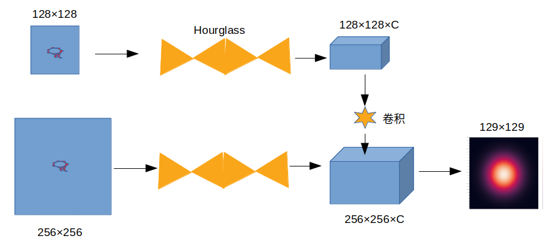
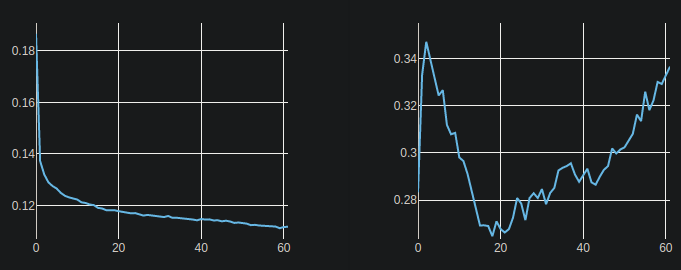
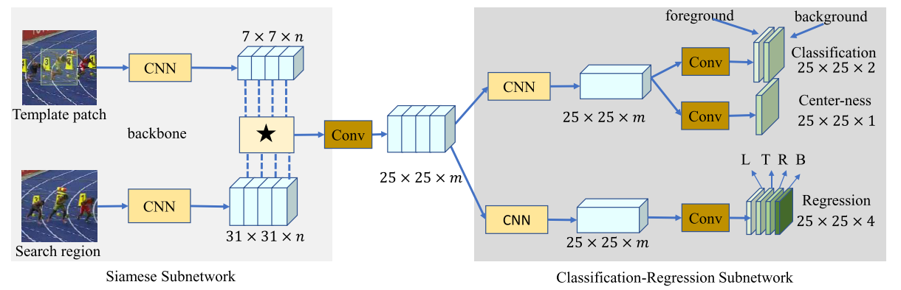

## 19-11-21 工作总结

### 一. 实验

1. #### 实验思路

   基于目标中心点的siamese跟踪。

   ##### 1）为什么基于中心点

   ​	对比实验表明，在检测领域，基于关键点的检测效果比基于bbox的效果(AP)更优.更加细粒度。

   ##### 2）网络

   

   ​	（为了对比Hourglass对网络性能的提升，测试了只更改backbone的siamFC）

   

   ##### 3）实验设计时发现的问题

   ​	a) 对于template与search imgage的裁取，总是先resize然后将bbox放到图片中央，边缘pad以生成固定尺寸，

   每次都放到中央引入bias（siamRPN++），裁剪使得不能有效利用背景信息，pad影响backbone深度（siamDW）。

   ​	b) 本质上只是更换了backbone， label， loss的siamese，并不是基于关键点的跟踪，由于siam template 与search img卷积的操作，导致关键点跟踪难以实现。

   ##### 4）实验运行时发现的问题

   ​	a) 训练太慢

   ​	b) 显存占用异常多

2. #### 实验改进

   ​	1) **由于siamese卷积的操作，可能无法实现基于点的跟踪，整理思路换框架。**

   ​	2) 改代码，训练太慢。

### 二. 论文阅读

《SiamCAR: Siamese Fully Convolutional Classification and Regression for Visual Tracking》

