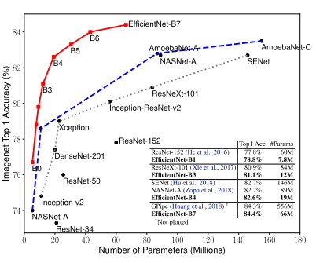
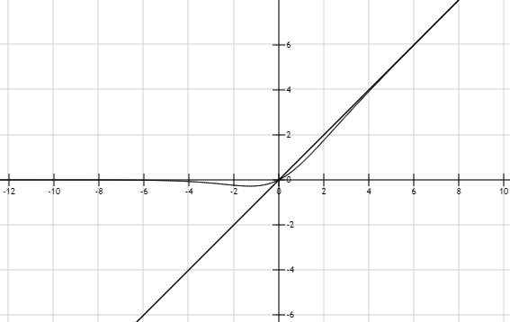
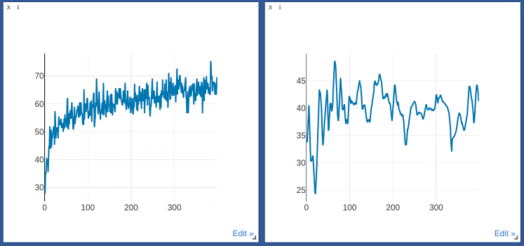

# X-Cov2019, X 光片预测肺炎比赛总结

#### 比赛结果56 / 171

## 工作总结

1. backbone：调了efficientNet b2-b7，又参考Kaggle一个医学图像分类比赛的前十的网络，把他们的网络调了下，主要是深度res，SEres， resnext，最终选择efficientNet b2.
2. 数据增强：数据集为x光片，增强只采用了水平翻转，尝试过颜色抖动以及旋转，但acc反而会掉。
3. 优化器采用SGD(momentum, nesterov=true)
4. 为了增强对困难样本(prob较低的的样本)的学习，使用过focalloss，但结果并不如CrossEntropy，低了两个点左右。
5. 对efficientNet b2, b7, b8, SEres50, b2(focalloss)的推理结果，使用投票法融合结果。
6. 后期经过分析，怀疑特征提取器提取得特征不够好，部分“复现”《intertract channels...》,但是并没有效果。

## 经验教训

1. backbone推荐， efficientNet

   

   - 参数量小，可以快速训练，且acc比其他backbone高。

   - 但是efficientNet的网络深度，宽度以及输入图像的大小基本固定。即如果输入图片尺寸与网络固有的参数不同，acc会掉，因为efficientNet本身就是用NAS搜索网络输入、深度和宽度的关系从而得到的。

   - activate function可以尝试 f = x*sigmoid(x), acc比ReLu高，速度没感觉慢。

     

   - 输入图片尺寸一定要与网络深度匹配， 否则acc掉得很厉害，应该是感受野的问题。

2. 提升acc的战略方向：数据 > 网络 > 融合

   - 数据大概能提升10个点，网络七八个点，模型融合只能提升一个点左右
   - 本次比赛很大的错误在于没有把更多的精力放在数据上，太多的时间浪费在网络本身，最后还没得到理想的结果，有点本末倒置。参考Kaggle一个医学图像分类比赛前十的方案，基本没有对网络进行什么改进，都是对数据进行合适的增强，跑很多个网络，最后把推理结果融合在一起。

3. 优化器 SGD + lr策略，慎用adam等自适应优化器

   

   - 自适应的优化器的收敛速度很快，但是在验证集上的acc会比SGD低几个点。
   - 实际上pytorch中的SGD相比原始的SGD集合了很多，可以将最后一个参数设为true，加快收敛。

4. 关于复现paper
   - 关于tensor的操作尽量不要自己写，仔细翻pytorch文档，一般都有。
   - 跑了几个epoch后，出现NAN一般都是未加BN，导致网络爆炸。
