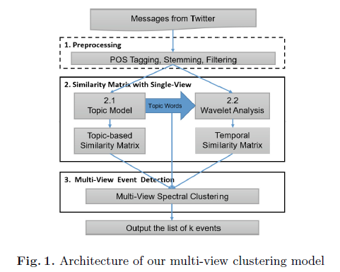
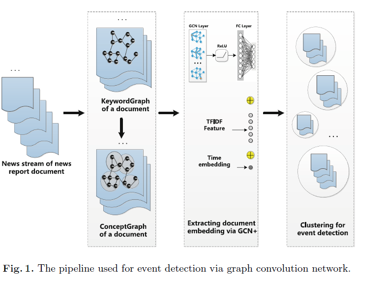
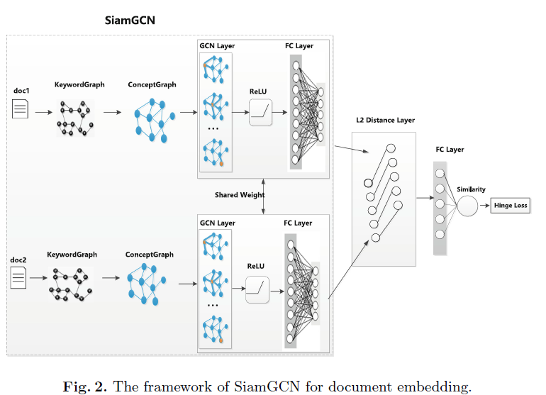

# 2020.04.07

* 实验

  

  

  * 整个网络最重要的就是两个部分  input 和 network
  * 对于一般的短文本匹配任务来说，一般使用孪生网络的结构，即共享参数的方法
  * 对于NSMED方法来说，input就是推特文本，network就是bi-GRU+attention，输出推特的一维表示
  * 对于文本-事件的匹配来说，左右输入并不对称，所以应使用不共享参数的伪孪生网络
  * 对于事件输入，考虑以词为核心的表示方法
  * 尝试不同的结构作为Network，包括GRU，LSTM和Transformer

  |                         | NMI        | ARI        | P          | R          | F1         |
  | ----------------------- | ---------- | ---------- | ---------- | ---------- | ---------- |
  | tf-idf                  | 0.7825     | 0.3047     | **0.6998** | 0.2015     | 0.3129     |
  | NSMED(bi-GRU+attn,共享) | 0.7866     | 0.5334     | 0.5141     | 0.5831     | 0.5464     |
  | bi-GRU+attn             | **0.8132** | **0.6961** | 0.6725     | **0.7396** | **0.7044** |
  | bi-LSTM+attn            | 0.7459     | 0.6822     | 0.6489     | 0.7391     | 0.6911     |
  | Transformer             | 0.6562     | 0.6282     | 0.5965     | 0.6871     | 0.6386     |

  * 分开输入文本和事件明显得到了较好的结果，Tansformer参数较多，容易过拟合，较难训练，在测试集并未得到较好的结果

* 以上实验基本说明用某些词来作为输入表示事件是可行的且可解释的

* 对于事件来说，图是比较合适的表示方法

* 接下来重点在于把图表示模型搭起来

* 专利
* 实习

---
## [A Multi-view Clustering Model for Event Detection in Twitter](https://link.springer.com/content/pdf/10.1007%2F978-3-319-77116-8_27.pdf)(CICLing 2017)

* 介绍

  * 很少有方法考虑时间序列信息
  * 使用多视角聚类方法对关键词进行聚类
  * 基于文本聚类的方法需要处理大量的文本
  * 主题模型较难捕捉同一时间段的事件，对于短文本效果也不好
  * 关键词聚类是主要方法

* 方法

  

  * 三个假设：1）关键词的集合可以代表事件；2）主题模型可以很好地捕捉到主题词；3）在同一时间段共同出现的词可能代表着同一事件
  * 使用DTW（dynamic time warping）算法计算两个词的距离

* 实验

  * 使用FSD2011和EVENT2012两个数据集
  * 使用ARK进行预处理
  * 与MABED和LDA方法进行对比
  * 使用人工评估

---

## [ A Novel Event Detection Model Basedon Graph Convolutional Network](https://kopernio.com/viewer?doi=10.1007/978-981-15-3281-8_15&route=6)(WISE 2019)

* 介绍

  * tf-idf和LDA的方法没有捕捉到文本的结构信息,本文提出使用图卷积网络的方法,使用ConceptGraph来表示文档,并使用SiameseGCN来计算相似度

* 方法

  

  * 首先建立一个ConceptGraph,将结构信息和语义信息进行融合,然后训练一个SiamGCN,以初始化的conceptGraph作为输入,输出graph embedding,加上tf-idf向量和1维的时间向量,最后使用bik-means方法进行聚类
  * 使用jieba进行分词,使用LTP进行命名实体识别和关键词识别

  

  * 首先构建关键词共现图,以一个句子作为时间窗口,将密集的子图称为concept,使用**betweenness centrality score** based on overlapping community detection algorithms 提取 concept,以平均word2vec来表示节点的初始特征向量,tf-idf相似度作为边权重
  * Siam GCN

  $$
  H^{(l+1)} = σ(\tilde{D}^{-1/2}\tilde{A}\tilde{D}^{-1/2}H^{(l)}W^{(l)})
  $$

  * 通过L2 distance将两个graph embedding结合,并使用hing loss作为损失函数
  * 使用bik-means算法进行聚类

* 实验

  * 标注了中文数据集,包括12865对正样本和16198对负样本
  * 用一些方法作为baseline,TF-IDF,JS-IDF等方法,
