#　画钟第一版实验数据整理

## 1.flow

扫描件:

Faster Rcnn 获得1-12数字以及13左指针14右指针的bbox和confidence　->　

基于规则的画钟评分办法　->　得到七分结果

摄像头拍摄:

小型单目标检测网络，获取钟的bbox -> Faster Rcnn 获得1-12数字以及13左指针14右指针的bbox和confidence　->　

基于规则的画钟评分办法　->　得到七分结果

目前针对扫描件的flow已经完成，包括Faster Rcnn网络，以及基于规则的画钟评分办法。

## 2.Faster Rcnn结果分析

图片总数:1120

训练集:120

测试集:1000

训练办法:batch = 4 300个epoch，从中找出map大的使用batch=1再训练100个epoch，找到最大的

ｍAP:90.65

分析网络对每一类的预测结果，取confidence大于0.99的判断bbox与gt的iou是否大于0.5，若大于为正例，否则为反例

下面是结果:

1 = 93%

2 = 98%

3 = 97%

4 = 98%

5 = 99%

6 = 99%

7 = 94%

8 = 97%

9 = 94%

10 = 98%

11 = 94%

12 = 98%

13 = 93%

14 = 91%

再取每类图片对每类预测结果置信度最大的的框的precision，除14外都是100%

分析目的:目前第一版画钟评分中，只接受每一类置信度最大的一个框进行分析，即每类一个框，或零个框，上述分析初步确定检测网络对准确性带来的影响

## 3.基于规则的画钟评分方法结果分析

​	1.由于基于规则的评分办法完全依赖于ground truth框，首先我们测试输入gt框，算法的预测结果，随后测试输入Faster Rcnn，算法的预测结果

|             ground truth框 | Faster Rcnn框              |
| -------------------------: | :------------------------- |
|              Total  = 1001 | Total  = 1000              |
|          Error 0  = 47.55% | Error 0  = 43.00%          |
|          Error 1  = 27.57% | Error 1  = 26.40%          |
|          Error 2  = 10.19% | Error 2  = 12.20%          |
|          Error 3  = 10.59% | Error 3  = 8.70%           |
|           Error 4  = 3.30% | Error 4  = 5.90%           |
|           Error 5  = 0.70% | Error 5  = 2.90%           |
|           Error 6  = 0.10% | Error 6  = 0.80%           |
|           Error 7  = 0.00% | Error 7  = 0.10%           |
| *******result of n1******* | *******result of n1******* |
|         Precision = 99.29% | Precision = 97.85%         |
|            Recall = 89.52% | Recall = 87.69%            |
|       Sensitivity = 89.52% | Sensitivity = 87.69%       |
|       Specificity = 90.91% | Specificity = 72.73%       |
| *******result of n2******* | *******result of n2******* |
|         Precision = 97.82% | Precision = 97.41%         |
|            Recall = 90.17% | Recall = 87.72%            |
|       Sensitivity = 90.17% | Sensitivity = 87.72%       |
|       Specificity = 65.45% | Specificity = 60.00%       |
| *******result of n3******* | *******result of n3******* |
|         Precision = 98.13% | Precision = 97.40%         |
|            Recall = 81.02% | Recall = 78.78%            |
|       Sensitivity = 81.02% | Sensitivity = 78.78%       |
|       Specificity = 85.26% | Specificity = 80.00%       |
| *******result of h1******* | *******result of h1******* |
|         Precision = 96.77% | Precision = 92.36%         |
|            Recall = 92.41% | Recall = 95.81%            |
|       Sensitivity = 92.41% | Sensitivity = 95.81%       |
|       Specificity = 69.57% | Specificity = 21.74%       |
| *******result of h2******* | *******result of h2******* |
|         Precision = 60.78% | Precision = 51.76%         |
|            Recall = 77.19% | Recall = 72.62%            |
|       Sensitivity = 77.19% | Sensitivity = 72.62%       |
|       Specificity = 82.25% | Specificity = 75.85%       |
| *******result of h3******* | *******result of h3******* |
|         Precision = 94.67% | Precision = 90.92%         |
|            Recall = 95.24% | Recall = 96.66%            |
|       Sensitivity = 95.24% | Sensitivity = 96.66%       |
|       Specificity = 72.05% | Specificity = 49.69%       |
| *******result of h4******* | *******result of h4******* |
|         Precision = 79.05% | Precision = 74.40%         |
|            Recall = 91.68% | Recall = 88.02%            |
|       Sensitivity = 91.68% | Sensitivity = 88.02%       |
|       Specificity = 63.50% | Specificity = 54.39%       |

​	分析:基于规则的方法上限较低，应该考虑别的方法进行设计

2. 指针13和14长度探究

   计算方法，指针13长度等于bbox右上角到左下角的距离，指针14长度等于bbox左上角到右下角之间的距离

   随后计算(len_13 - len14) / len13的分布，如下图所示

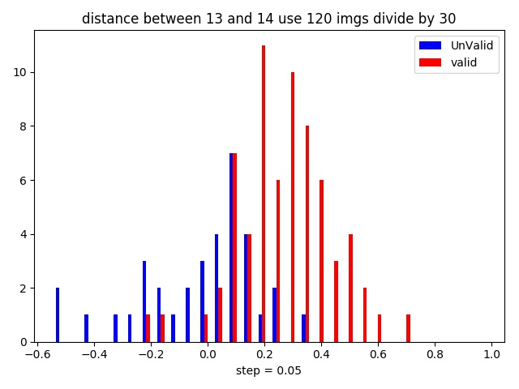

3. 指针14到数字34的距离探究

   计算方法，分别计算数字3,4到指针14所在直线的距离dis_3_14,dis_4_14，以及34所在bbox的中心点距离dis_3_4

   得到(dis_3_14 - dis_4_14) / dis_3_4之间的距离分布，如下图所示

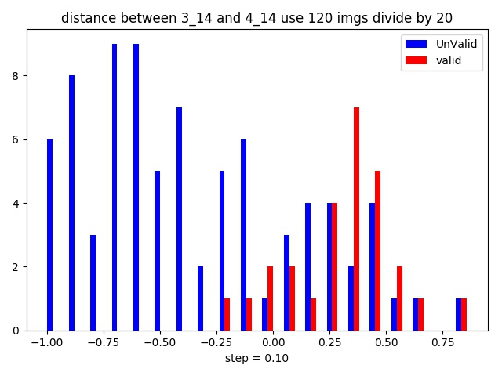

4. 指针和数字位置分布

   

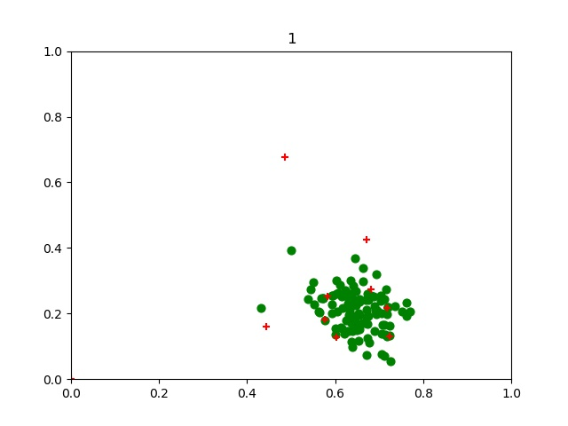

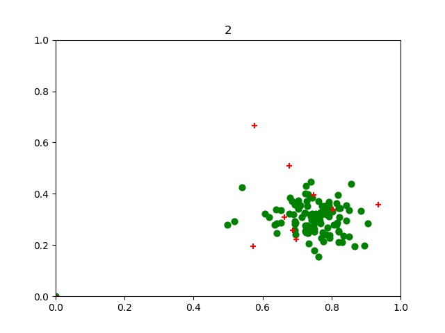

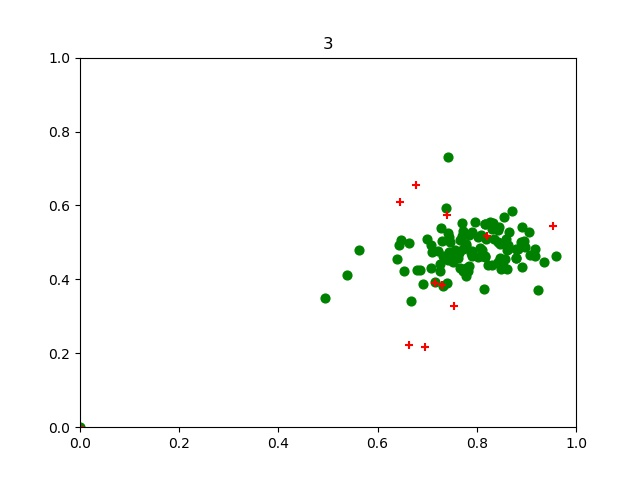

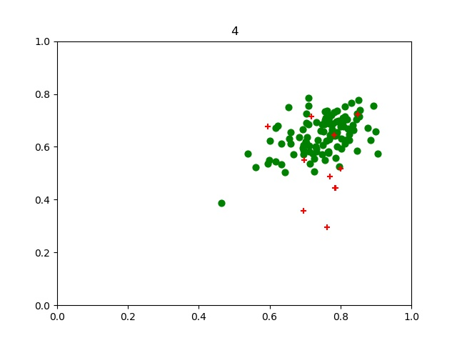

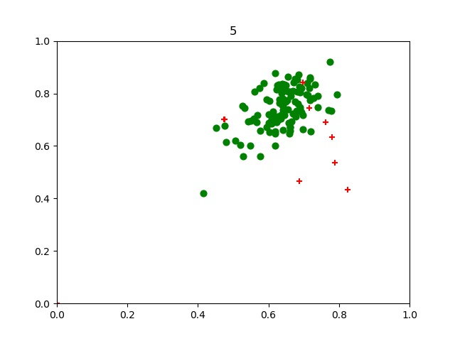

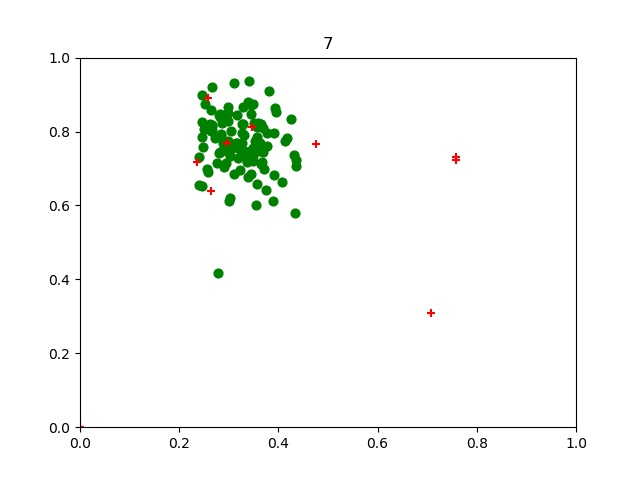

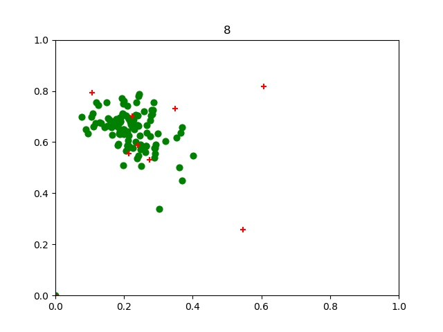

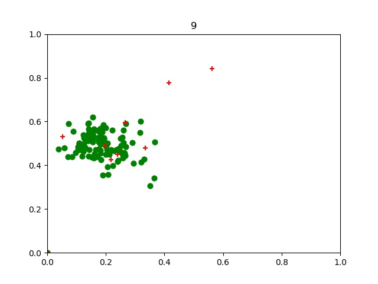

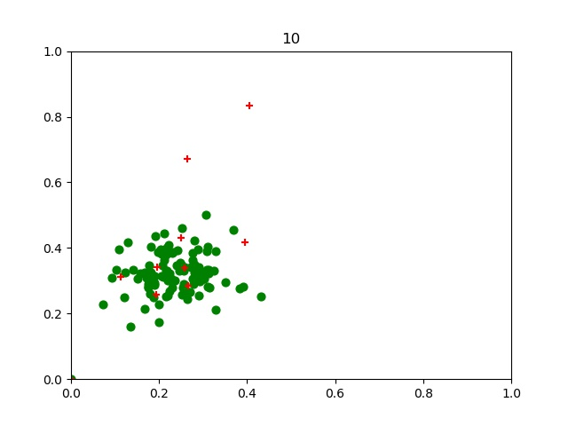

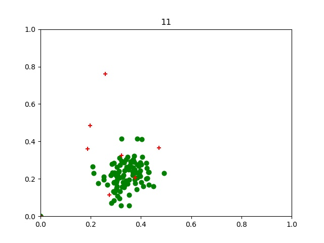

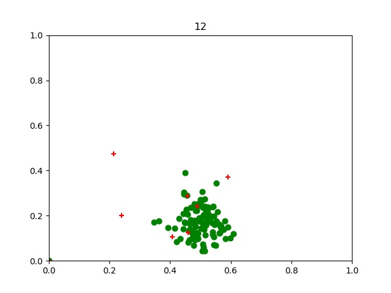

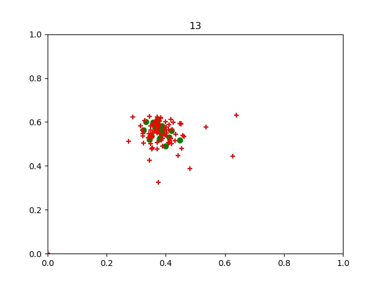

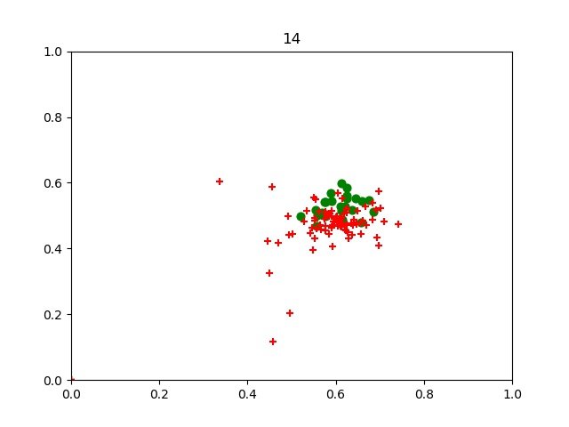

## 4.总结

Faster Rcnn的识别已经做的可以，目前亟待解决的问题是:

1. 画钟评分算法应基于规则和机器学习的结合，不能只用规则
2. 扫描件到照片的映射，fr在照片上的map只有73，还需要fine-tuning
3. 应用于摄像头画钟图片，应尽快做出来一个小网络用于检测整个画钟轮廓