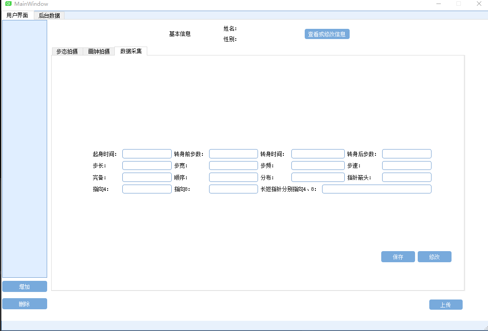
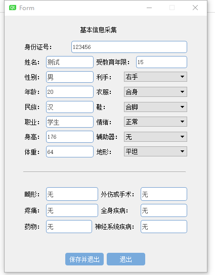
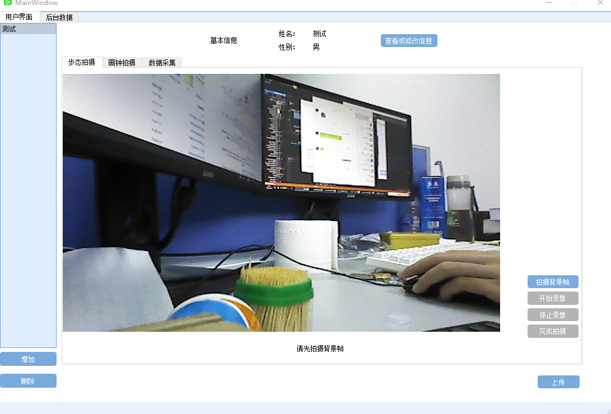
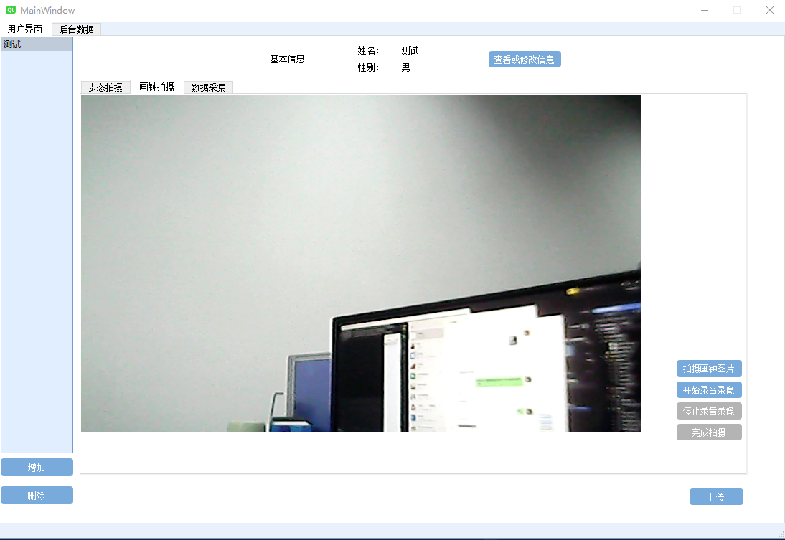
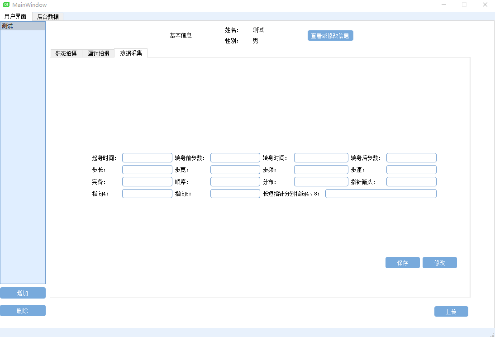

# 0816组会

## 上周工作总结

- 客户端界面

- HTTP post Json数据

目前可以实现客户端采集完全部数据后，上传到FTP服务器，随后给http服务器发送约定好的Json数据包，然后根据respose获得解析信息。

## 下周任务

- 多摄像头改进

现有的步态拍摄是基于单个深度摄像头、画钟和图片拍摄改用两个摄像头，加入多个摄像头，界面和控制都需要再改进，相应代码要重写；多摄像头的识别和配置要做一个界面。

- config配置

包括http服务器地址，ftp服务器ip，port，user，passwd等需要单独做一个配置文件

- download通信

待完成...

- 系统日志输出

现在还没有头绪...