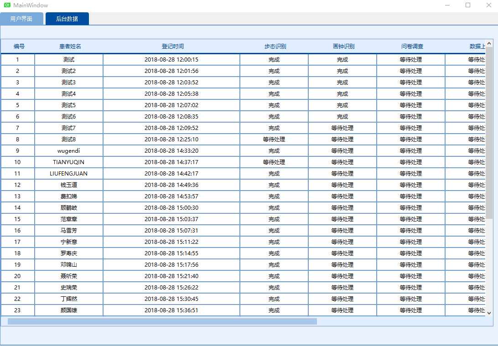

# 0830组会

## 上周完成任务

- 客户端多摄像头同时工作代码写完，但因驱动问题未能实践
- 客户端增加了后台数据界面

- ftp上传,http post病人数据和获取处理结果跑通
- 增加了任务保留的log，未完成的任务在软件重新启动时会自动进行
- 修改代码的汉字编码为utf8
- 对界面进行一定程度
- 周二社区实地测试客户端

一共录制了23个视频，图片1类型的视频有7个，图片2、3类型的视频分别有8个，我已经询问了摄像头售后，目前未得到答复。

## 下周工作

- 开学报到
- 对界面交互进行优化