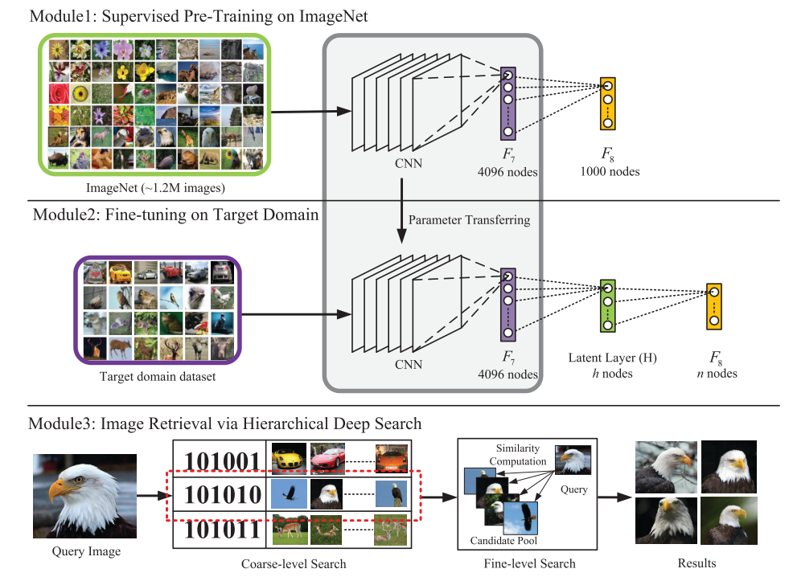
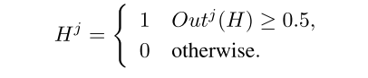
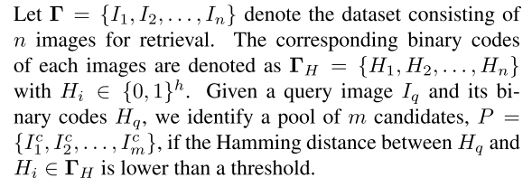
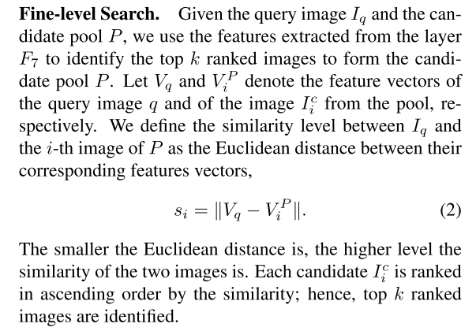
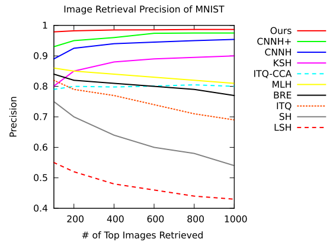
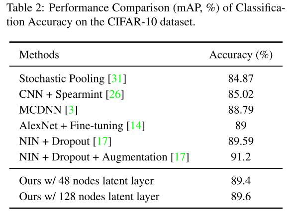
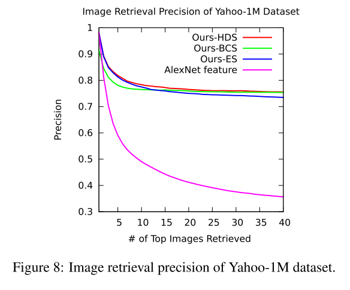

# 1017组会

## 论文阅读

### Deep Learning of Binary Hash Codes for Fast Image Retrieval

- 摘要：Our idea is that when the data labels are available, binary codes can be learned by employing a hidden layer for representing the la- tent concepts that dominate the class labels. The utilization ofthe CNN also allows for learning image representations. Unlike other supervised methods that require **pair-wised** in- puts for binary code learning, our method learns hash codes and image representations in a point-wised manner, mak- ing it suitable for large-scale datasets. 

- 检索策略
  1. coarse-level

​	outH是添加的隐含层的输出值，二值化后得到hash码。

​	首先我们有一个关于待搜索数据集的图片集合，以及相对应的hash码的集合。搜索的策略就是，待搜索图片	所得到的hash码同整个数据集的hash码比较汉明距离，找出距离最小的m个。

​         2. fine-level

F7的输出 和In计算欧氏距离，并在pool 中取topK.

- 实验结果

  - MNIST数据集

    

    

  - CIFAR-10数据集

    

  - Yahoo-1M

    

