上周工作：

- hash相关的两篇论文
- 李宏毅GAN课程学习
- 训练了一个二次元人物头像的DCGAN网络

下周任务：

- 客户端改进。需要处理当磁盘空间不足的情况
- 阅读cvpr hash 和 Gan相关的论文

### HashNet: Deep Learning to Hash by Continuation∗

- 摘要

  Subject to the ill- posed gradient difficulty in the optimization with sign acti- vations, existing deep learning to hash methods need to first learn continuous representations and then generate binary hash codes in a separated binarization step, which suffer from substantial loss ofretrieval quality. 

  This work presents HashNet, a novel deep architecture for deep learning to hash by continuation method with convergence guarantees, which learns exactly binary hash codes from imbalanced similarity data. 

  The key idea is to attack the ill-posed gra- dient problem in optimizing deep networks with non-smooth binary activations by continuation method, in which we be- gin from learning an easier network with smoothed activa- tion function and let it evolve during the training, until it eventually goes back to being the original, difficult to opti- mize, deep network with the sign activation function.

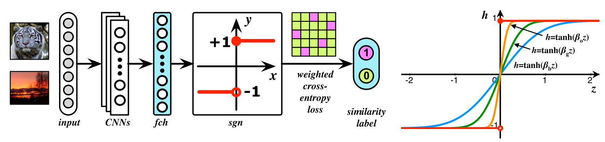

两个亮点：

1. 使用带权重的最大似然估计

   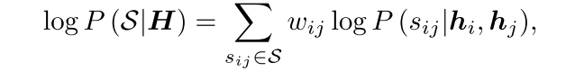

   

   考虑了样本类别分布不均匀的问题。

2.使用正切函数来逼近sgn符号函数

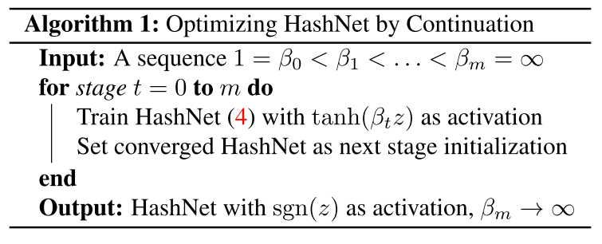

文中提到m = 10

3.结果分析

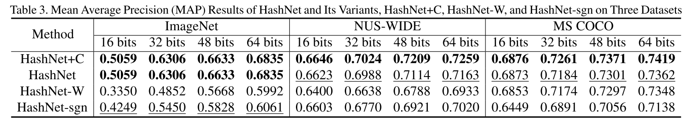

我们可以发现：

- 对于样本类别不平衡的数据集，去掉权重的最大似然估计方法精度下降极其多；
- sgn 方法在ImageNet上效果与原方法差距最大，但在其余两个数据集上差别较小；

这张图对比了使用符号函数前后loss的影响，在使用符号函数后，DHN的loss值大幅度增大，说明之前的方法不能学到真正的二进制值，可以理解为在量化过程中损失了很多的信息。

思考：

现有的hash网络都是基于类别的分类，这种方式和直接使用CNN并无本质的区别。图像检索和图像分类应该是两个不同的任务，图片检索应基于内容，或者说图像语义，那么如何表征内容，或者说图像语义？亦或者说我们如何评判网络得到的输出是符合我们要求的呢，这就需要对内容或者图像语义进行进一步定义，在这个意义上说，现有的网络的定义方式都是类别。那么我们能否找到别的定义方式呢？

如果一个训练好的模型在使用过程中，发现了新的样本或者说标注，那么如何对已经训练好的网络进行更新呢，是在线学习，还是重新训练网络？能否采用贝叶斯的方法，将先前训练的网络作为先验知识？

GAN

对于生成器，输入vector的每一个维度都代表所生成图像的一个特征。

对于判别器，输出scalar代表是否输入的图片是真实的。

把生成器和判别器看作一个巨大的网络。

structured learning

输出比较复杂

例如机器翻译，语音识别，智能回答。

one-shot learning

假设某些类别，只有非常少的例子。

buttom-up and  top-down

generation can not generate by itself.

auto-encoder。

解决非线性问题

variational auto-encoder

结构化学习输出的components之间的关系？

auto-encoder is hard to think the relation between conponents.

discriminator: evalution funtion

can discriminator generate picture?

since we only have positive database,so that discriminator will see all things is good. 

generator will generate negative picture.

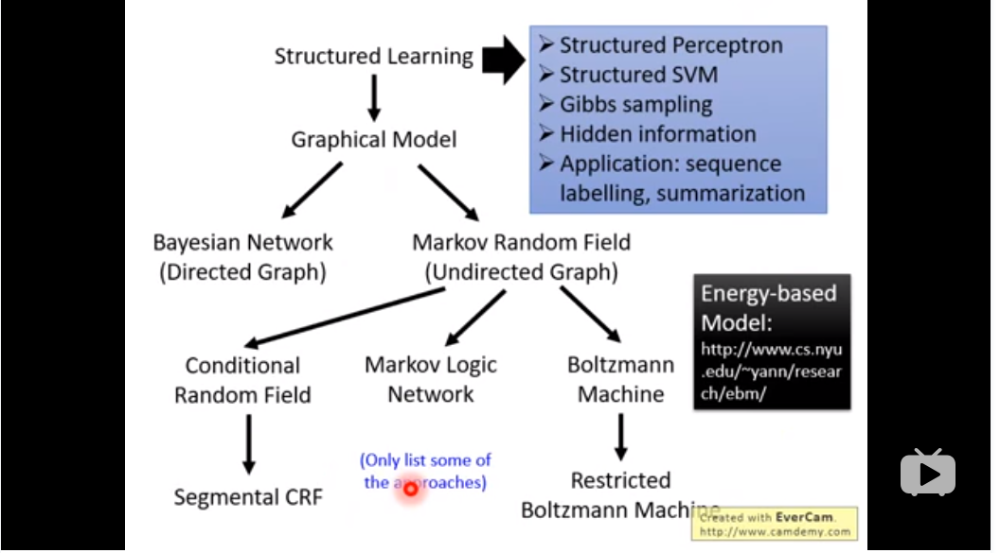

conditional Gan：

traditional supervised approach  会学到同种事物不同图片的平均。

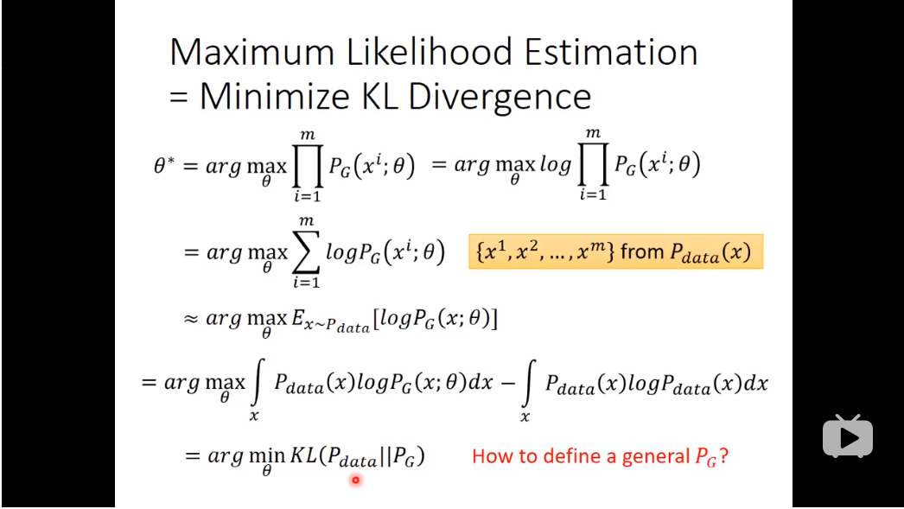

从积分最大，到对于每一个x，都是最大。

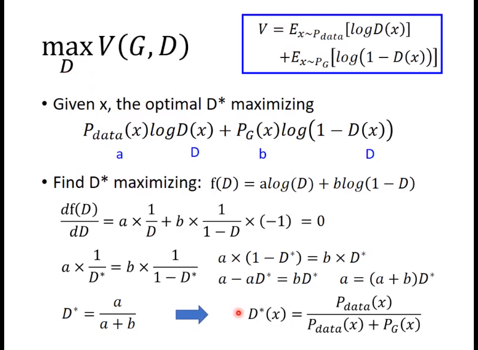

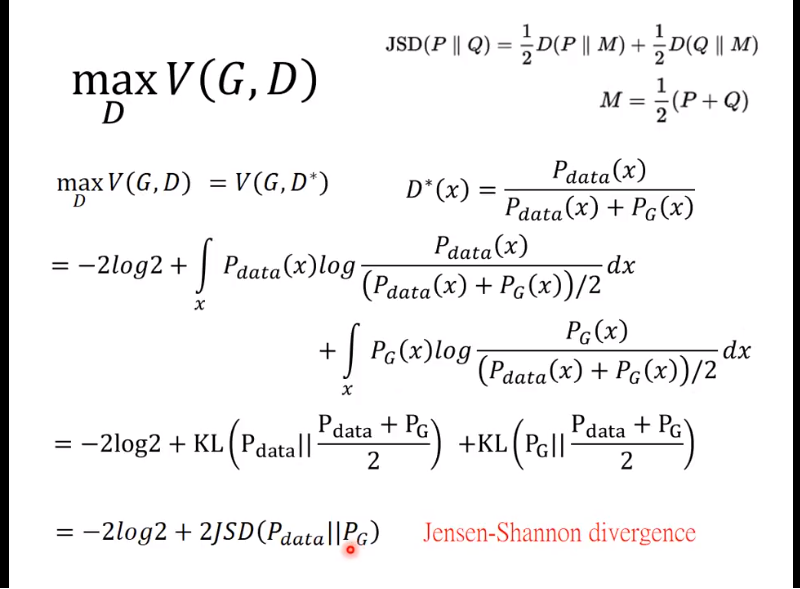

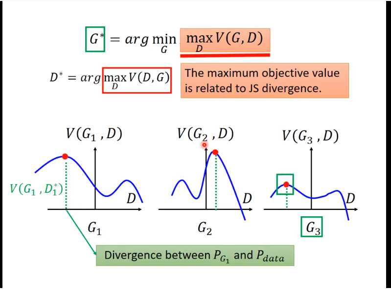

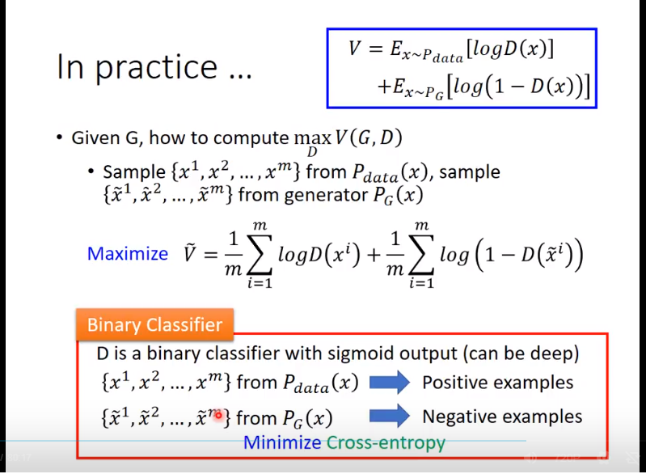

train discriminate 是在求出js散度

train generator 是在求Js散度的最小值

js 散度 就是V(G,D)

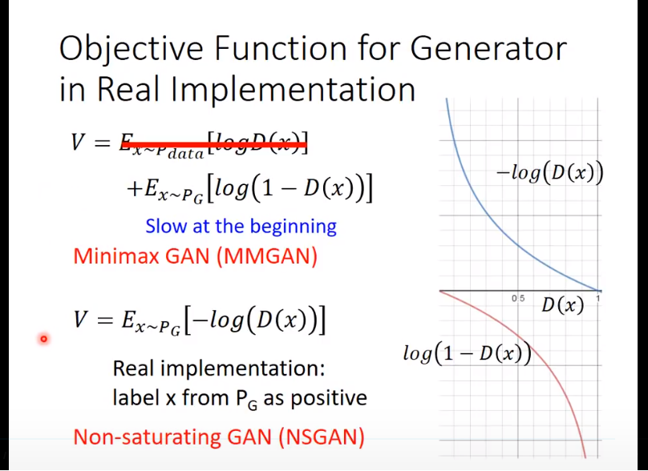

如果输入一个图像，输出一个向量，如果输出的向量能够按我们的想法行事。