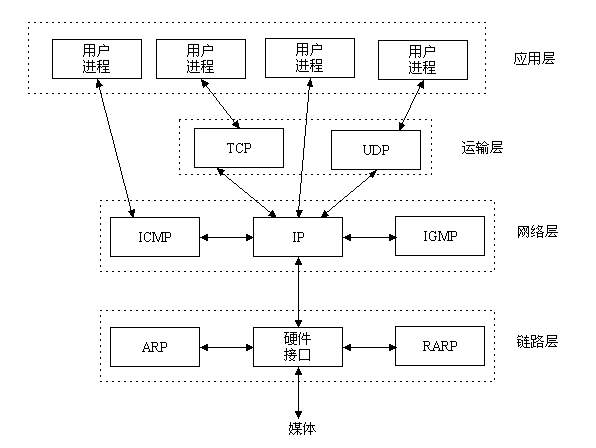

# SOCKET通信

## 什么是SOCKET




socket协议是存在于应用层和运输层之间的一种抽象，即用户进程并不直接使用运输层协议如TCP、UDP，而是使用socket协议，这层抽象的意义我猜可能是和Unix的设计哲学有关系，因为socket的使用同文件描述符一样，端口就是文件，打开端口就是打开文件，接受数据就是从文件中读取，发送数据就是写入文件，可能是这样子。

有了一层socket抽象之后，socket就可以被认为是文件指针，对端口的所有操作都是通过socket来完成，socket意译为插座。


## SOCKET通信过程


- 服务器端建立过程

```c++
int socket(int domain, int type, int protocol);
```

用于创建一个socket描述符，可以理解为文件指针，socket描述符规定了该socket的协议族，类型，以及传输协议。

```c++
int bind(int sockfd, const struct sockaddr *addr, socklen_t addrlen);
```

将socket描述符同一个端口绑定，后续的通信都是基于这个端口，可以理解为文件指针打开了一个文件。

**客户端不使用Bind如何绑定端口？**客户端也可以在connect之前Bind一个端口，若不然，系统会自动分配一个端口。此时的连接方式是主动

```c++
int listen(int sockfd, int backlog);
```

listen函数用来监听这个socket，如果有客户调用connect()，服务器端就会接收到这个请求

```c++
int accept(int sockfd, struct sockaddr *addr, socklen_t *addrlen);
```

listen()监听到请求之后，会调用accept接受请求，这样就建立了连接。

注意：accept的第一个参数为服务器的socket描述字，是服务器开始调用socket()函数生成的，称为监听socket描述字；而accept函数返回的是已连接的socket描述字。一个服务器通常通常仅仅只创建一个监听socket描述字，它在该服务器的生命周期内一直存在。内核为每个由服务器进程接受的客户连接创建了一个已连接socket描述字，当服务器完成了对某个客户的服务，相应的已连接socket描述字就被关闭。

- 客户端建立过程

```c++
int socket(int domain, int type, int protocol);
int connect(int sockfd, const struct sockaddr *addr, socklen_t addrlen);
//connect函数的第一个参数即为客户端的socket描述字，第二参数为服务器的socket地址，第三个参数为socket地址的长度。客户端通过调用connect函数来建立与TCP服务器的连接。
```


    ```c++
struct hostent * server = gethostbyname(host);
 struct hostent {
               char  *h_name;            /* official name of host */
               char **h_aliases;         /* alias list */
               int    h_addrtype;        /* host address type */
               int    h_length;          /* length of address */
               char **h_addr_list;       /* list of addresses */
           }
#define h_addr h_addr_list[0] /* for backward compatibility */

    ```

    hostent->h_name
    表示的是主机的规范名。例如www.google.com的规范名其实是www.l.google.com。
    
    hostent->h_aliases
    表示的是主机的别名.www.google.com就是google他自己的别名。有的时候，有的主机可能有好几个别名，这些，其实都是为了易于用户记忆而为自己的网站多取的名字。
    
    hostent->h_addrtype    
    表示的是主机ip地址的类型，到底是ipv4(AF_INET)，还是pv6(AF_INET6)
    
    hostent->h_length      
    表示的是主机ip地址的长度
    
    hostent->h_addr_lisst
    表示的是主机的ip地址，注意，这个是以网络字节序存储的。千万不要直接用printf带%s参数来打这个东西，会有问题的哇。所以到真正需要打印出这个IP的话，需要调用inet_ntop()。
    
    const char *inet_ntop(int af, const void *src, char *dst, socklen_t cnt) ：
    这个函数，是将类型为af的网络地址结构src，转换成主机序的字符串形式，存放在长度为cnt的字符串中。返回指向dst的一个指针。如果函数调用错误，返回值是NULL。


TCP/IP协议

三次握手规则：

- 第一次握手， A向B发送消息， SYN = 1，SEQ = a，附带一些信息          **B，你能听到吗**
- 第二次握手：B收到A请求后，向A发送一个消息，SYN = 1， ACK = a + 1， SEQ = b   **我能听到，A你能听到我吗**
- 第三次握手：A收到请求后，向B发送一个消息， ACK = b + 1，SEQ =  a  + 1      **我也能听到**


如果信道不可靠，两个人要通信的话，必须双方都要知道对方是否收到了自己发送的消息。

假如说是两次握手， A问B能听到吗，B说能听到，此时A知道双方的连接建立了，但是B不知道，也就是说下一个消息只能A向B发送，而不能B向A发送，这显然不好。