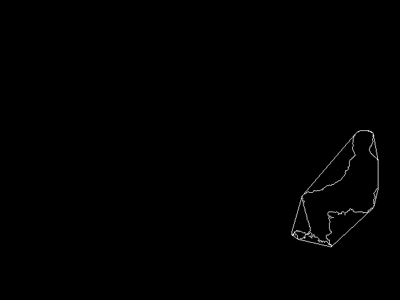

# 20180803-20180809

## 周待做列表

* 目前整个系统已经基本跑通，接下来还需要做一些细化的事情

* 优化画钟识别的代码
  * 能处理拍摄的彩色图片
  * 批量处理功能去除
  * 目前的resize是直接截取中间部分
  * 受光线影响

* 优化步态识别的代码
  * 先把深度视频用起来

* svn上面的代码整理
  * [svn地址](https://118.178.19.58:8443/svn/zs-hospital)

* 寻找合适的核心代码

  * OpenPose源码

    * Body-Foot Estimation

    >  

    - gpu环境搭建
      - [cuda测试](https://blog.csdn.net/u012235003/article/details/54575758)
        - failed: CUDA driver version is insufficient for CUDA runtime version(CUDA和cuDNN系统已经安装，所以不用重新安装……)
      - mark：安装cudnn时候安装pytorch因为gcc版本太低识别不了一个命令，下载了高版本的gcc在download里面还没有安装
      - 

# 20180727-20180802

## 周待做列表
* 更多更稳定视频的拍摄和前处理；
* 步宽检测失败原因排查；
* 重构python代码，尝试处理正面视频；
* 将画钟代码应用到服务器；
* 尝试得到转身步数。
* 搭建系统

### 步宽

* 摄像头精度：正常，至少能达到厘米量级

* opencv 的grayToBgr和BgrToGray函数转换可逆，并且opencv可以直接输出灰度视频

* 步宽测量不准确的主要原因在于关键点识别不准确

  * 尝试将关键点识别有效域扩大为11*11，阈值提高为50，downsampling倍数降为2，无效
  * 降低需求，延续上述操作，并且使用转身前所有帧左右脚深度平均值之差代替步宽，8个视频16组数据中2组无效。但是这种方法依赖于转身帧数测量的准确度。

* 步宽和深度对应关系：看SDK源代码得到**gray_pixel*10000/255mm**

  > [OpenNI2编程说明](http://blog.sina.com.cn/s/blog_4a628f030102v6k4.html)
  >
  > [CvMat，Mat和IplImage之间的转化和拷贝](https://www.cnblogs.com/Key-Ky/p/4150531.html)

* 

### 关键点识别精度

* 暂时无解

### 轮廓识别精度

* 轮廓识别精度好像会受到光照条件的影响，受到背景颜色的影响

* 调研opencv动态物体捕捉算法，尝试运用背景差法，帧差法，背景帧差法效果远好于帧差法，所以决定**在视频采集模块中加入背景帧采集按钮（增加了对操作者的要求）**，后期如果需求无法去除的话可以在实际系统中的上一步操作按钮中集成背景帧采集按钮。

  * 如果椅子固定不动，还可以摆脱椅子对轮廓识别的干扰
  * 背景帧直接输入视频第一帧
  * 成功
  * 遇到的问题：
    - 因为是通过帧像素点差，所以如果颜色比较接近，则容易产生问题，如实验中的腿和地板颜色接近带来的问题
    - 虽然背景帧没有问题，但是人的影子投射到墙上仍然会对实验产生影响

* 尝试将上述视频换为**深度视频**处理

  + 优点:
    + 除去了颜色对图像处理的影响

  + 缺点:

    + 墙角处噪点太重，刚好在人脚的部分------去除高斯滤波和形态学膨胀，取diff的最大contours
    + 人脚和地面接触部分的深度变化不大------将diff二值化处理的阈值降为10（39.2cm）（不能高于25.5（100cm））------**要求病人和背景墙之间距离大于此阈值**
    + 两个视频同时处理，降低处理速度-----**将步宽处理整合到主处理程序中（需要一段时间，暂放）**
* 效果图 

| color_contour | depth_contour |
|:---------|:--------------------|
|  |  |
| shadow，color | no feet |

​    

### clock代码编译dll

* [python调用C语言](https://www.cnblogs.com/lovephysics/p/7237227.html)

* [python使用ctypes调用C/C++](https://blog.csdn.net/u012449363/article/details/75452374)

  -----------------发现思路跑偏---------------------

### clock在linux下运行

* [windows和linux下文件和文件夹互传](https://blog.csdn.net/jiandanokok/article/details/51387922)
* [linux下使用g++编译cpp工程](https://www.cnblogs.com/battlescars/p/cpp_linux_gcc.html)（实战）
* [gcc/g++编译的四个步骤](https://www.cnblogs.com/zjiaxing/p/5557549.html)（理解）
* [makefile的使用](https://blog.csdn.net/tototuzuoquan/article/details/38459119)
* [gcc/g++动静态库编写](http://www.cnblogs.com/zjiaxing/p/5557629.html)
* 其他
  * [vi命令](http://man.linuxde.net/vi)
  * [ubuntu16.04配置VNC远程桌面连接](https://www.cnblogs.com/EasonJim/p/7529156.html)
  * [opencv安装](https://blog.csdn.net/cocoaqin/article/details/78163171)
  * [python调用c++可执行程序并传入参数](https://blog.csdn.net/caobin0825/article/details/79657401)
* 目前难点：
  * clock代码中用到了opencv的imgproc.hpp库函数，但是linux版本的opencv中没有imgproc库函数，将windows版本的库函数导入出错，卡住ing……
  * 尝试在服务器安装opencv，需要管理员权限，卡住……（创建环境，安装opencv）
  * 在anconda下创建环境安装了opencv，但是还是没用
* 用codeblocks IDE运行，成功
* 总结
  * opencv库函数包含特别复杂，用opencv的一个头函数可能需要好几个库的支持，所以用的时候可以直接把OpenCV的所有库丢进去
  * opencv的库函数头文件路径设置为环境变量总是不成功，暂时还不知道为啥

# 20180720-20180726
## 周待做列表
* 将clock代码封装成一个class，给冯新宇提供接口；
* 改步态识别的代码，搭建系统；
* 看自然语言处理的一些东西，了解什么叫词向量等。
## clock class封装
>参考：https://blog.csdn.net/dfdfdsfdfdfdf/article/details/52439651
>>vector作为参数的三种传参方式：https://www.cnblogs.com/xiaoxi666/p/6843211.html
## 改步态识别的代码
>要拍摄视频 
买三脚架 
得到步宽信息 
尝试正面视频的处理 

### 面临问题
* 步态识别所使用模型openpose不够精确，侧面识别和正面识别的精确度都不高
  + 可能因为视频的像素影响
  + 可能因为视频背景对轮廓识别的影响
* 深度摄像头得到的深度视频没有灰度-深度之间的对应关系
* 深度视频的精确度不高（像素点抖动等）
* 搭建系统的空间
### 需要做的工作
* 首先要忽略识别的精确度去做深度视频的深度提取、深度精确度考察
>对步宽的定义：人物在视频中部，且人物迈开步子时，两脚踝深度之差 
1.导出全视频过程中两脚踝深度信息 
由于没有灰度和深度之间的函数对应关系，所以暂时先导出两脚踝的灰度值进行对比。
但是经过对比，两脚踝的灰度并没有很大差别，所以利用深度摄像头侧面信息获得步宽信息的可行性有待考量。

可能原因: 
a) 摄像头精度问题（实验排除） 
b) gray to bgr和bgr to gray的可逆性问题 
c) 16UINT-8UINT的精度损失 
d）视频中人走路太快 
摄像头存疑问题: 
a) 黑色对识别有影响 

* 更多更稳定的视频的拍摄
* 尝试正面识别
* 精度评估