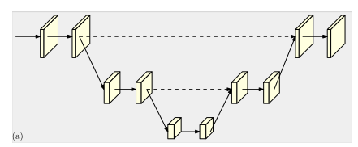
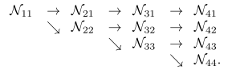

[TOC]

## 快速跳转：

[20190904](#9.1)

[20190911](#9.2)

[20190918](#9.3)

[20190925](#9.4)

## 20190904

### 两周总结

* 论文：SAIL: A Video-based Gait Assessment System for Neurological Disease
* 专利：自动化步态参数评估和异常检测算法
* 项目：
  * 步态异常数据审核
  * 更多参数提取

### 计划

- 关键点检测COCO竞赛
- 8.12-8.13 Related work
- 8.14下周组会和乔莎老师一起改论文，整理格式，准备论文提交工作
- 项目计划：开会+错误视频审查

* 项目算法
* 论文阅读

## 20190911

### Papers

#### 1. Simple Baselines for Human Pose Estimation and Tracking (SimpleBaseline)

* **Related work:**

  * **Pose Estimation Using A Deconvolution Head Network**

  * **Pose Tracking Based on Optical Flow**

    The winner of ICCV'17 PoseTrack Challenge first uses Mask R-CNN to estimate human pose, then performs online tracking with a greedy bipartite matching algorithm frame by frame.

* **Proposed method:**

  * **Pose Estimation Using A Deconvolution Head Network**

    The popular SPPEs perform pose estimation by high-to-low and low-to-high processes. This work differs from the typical Hourglass and CPN in low-to-high process with combining the upsampling and convolutional parameters into deconvolutional layers.

  * **Pose Tracking Based on Optical Flow**

    Following the pipeline of ICCV'17 PoseTrack Challenge winner, this work adds a human detector generated from previous frames using optical flow and utilizes a flow-based pose similarity metric in greedy matching algorithm.

    When the processing frame is difficult for human detectors, the flow-based human detector works.

* **My views:**

#### 2. Deep High-Resolution Representation Learning for Human Pose Estimation (HRnet)

* **Related works:**

  This is the state-of-the-art work for multiple person pose estimation (MPPE), based on SimpleBaseline, achieving 0.770 mAP on the COCO2017 test-dev set.

  The two typical methods of MPPE is top-down and bottom-up. The former have achieves better mAP of 0.770 while the latter is 70.5. **This work belongs to the former**, which mainly consists of a human detector and single person pose estimation (SPPE).

  **This work focus on the the design of SPPE**. The popular design of SPPE is divided into two steps: high-to-low process aiming to generate low-resolution and high-level representations,  and low-to-high process aiming to produce high-resolution representations. Hourglass and its extensions combine low-level features in the high-to-low process progressively through skip connections.

  | Hourglass                                                 | HRnet                                                     |
  | --------------------------------------------------------- | --------------------------------------------------------- |
  |  |  |

  

* **Proposed method:**

  **This method builds parallel multi-resolution subnetworks** rather than sequential multi-resolution subnetworks in existing works.

  | sequential multi-resolution subnetworks                   | parallel multi-resolution subnetworks                     |
  | --------------------------------------------------------- | --------------------------------------------------------- |
  |  |  |

  **This work introduces repeated multi-scale fusion across parallel subnetworks.** By using *exchange units*, the features can be generated from various informations.

  Haven't fully understand:no_mouth:

* **My views:**

  * Strengths:
    * Compared to other works, this method keeps high resolution representations in the whole process, which I think can maintain the low-level features, thus achieving better results.
    * It looks like the work adds a lot of operations in the processing but in fact the parameters and GFLOPs slightly decrease. I think it is because that during upsampling, they adopt the simple nearest neighbor sampling following a 1x1 convolution rather than deconvolution which needs two convolutional operations. 
  * Shortcuts:
    * In writing, this paper hasn't clearly illustrated the process of exchange units. :joy::joy::joy:

#### 3. Bottom-up Higher-Resolution Networks for Multi-Person Pose Estimation (HigherHRNet )

* **Related work:**

  * As illustrated above, pose estimation work are divided into two fields, and the former two belong to  top-down while this belongs to bottom-up. But what's funny is that the most related work are the former two. 
  * **The current state of pose estimation is that the top-down method has achieve 0.770 mAP,  much better than bottom-up's 0.687.** The bottom-up method first extracted heatmaps for every key points and then assembling the key points to identities, during which the author believes the accuracy of predict heatmaps is the bottleneck. By introducing another extracted algorithm, **this work has achieved state-of-the-art result of 0.705 mAP among bottom-up field. **

* **Proposed method:**

  Inspired by HRnet and SimpleBaseline, the author utilizes the architecture in HRnet to maintain high resolution feature maps to predict heatmaps rather than the traditional ones recovering  from low resolution maps. They propose a multi-resolution supervision in training stage and a heatmap aggregation strategy for inference to let HigherHRNet predict scale-aware heatmaps.

* **My views**:

  * This work has not much innovations but introducing some new structures in state-of-the-art method in top-down into up-bottom. But it works.:joy:

  * The assembling methods develops as below: 1, PCA is proposed in openpose which learns a 2D vector field linking two keypoints, grouping pairs with the most line integral. 2, Associate embedding assigns each keypoint with a 'tag' (a vector representation) and groups keypoints based on the l2 distance between tag vectors. 3, PersonLab uses dilated ResNet and groups keypoints by directly learning a 2D offset field for each pair of keypoints.

    From the process we can see, the grouping method tends to use more rich representation and tends to learn automatically without the prior knowledge, during which we can possibly do something.

### Works

None

### Plans

* Reachieve the HRNet
* Redealing with the  past data before setting out for Guizhou
* Solving the occasionally data traffic jam caused by ftp post failure.

## 20190918

### Papers

#### 1. Single-Stage Multi-Person Pose Machines (SPM)

* **Related work:**

  Current pose estimation networks, no matter top-down or bottom-up, both are two-stage based, greatly reducing the efficiency. They tend to represent the human keypoints by isolated cordinates, which breaks down the nature association of human body. Through there have been a lot of methods to assemble the joints of a certain identity, such as PCA in openpose,  embedding vector combining with a greedy algorithm, association scores.

* **Proposed method:**

  The author proposes a new method to represent the location and the keypoints in a unified way and regress them in dingle-stage, truly achieving end-to-end training and testing. The result is not so stunning but the method is innovative enough to inspire more inventions. What's more, the introduction of *Hierarchical SPR* can effectively solve the long-distance offset problem.

  The unified way is that the author introduce the person centroid as the root joint of a person instance and keypoints as offset vectors, namely structured pose representation (*SPR*). During training , the network produces a root joint heatmap and K joints heatmaps for every picture. In the case of large scale action, we can replace the *SPR* with *Hierarchical SPR*.

* **My views:**

  * In Hierarchical SPR, the author divides the joints into four stage, and the position of joints in fourth stage is accumulated stage by stage, during which the error will transfer and accumulate gradually, harming the accuracy of final results. (Guessing)
  * The calculation method of centroid by keypoints location labels is not introduced clearly, making me confused and unhappy.

#### 2. Cascade Feature Aggregation for Human Pose Estimation (CFA)

- **Related work:**

  Stacked hourglass network captures information of various scales for robust human pose estimation by stacking hourglass networks and employing a highway connecting low encoder and decoder parts.

  FPN applies 1 x 1 convolutional kernel before each element-wise sum procedure in the up-sampling process.

  CPN design another strategy for cascading multiple stages, i.e., a GlobalNet followed by a RefineNet, takeing the advantage of both hourglass and FPN 

- **Proposed method:**

  This work has two simple but effective creation.

  The first is it takes both the input and output of previous stage as input of current stage rather than mere output information in previous work.

  The second is it fuses the result from different stages.

- **My views:**

  - This work has two simple but effective creation
  - Try

#### 3. Cascaded Pyramid Network for Multi-Person Pose Estimation(CPN)(2018CVPR)

- **Related work:**

  Although huge progress has been made in recent years in pose estimation field, there still exists a lot of challenging cases, such as occluded keypoints, invisible keypoints and crowded background. 

  **In top-down field**, Stacked hourglass stacks eight hourglasses to enhance the performance. *Towards Accurate Multi- person Pose Estimation in the Wild* utilizes a ResNet to estimate pose in the wild. **Motivated by the two works, author of CPN achieves state-of-the-art result by involving two subnetworks: GlobalNet and RefineNet.**

- **Proposed method:**

  

  The main contributions of this work lie in two fields. Firstly, CPN achieves state-of-the-art result by two strategies: GlobalNet and RefineNet. 

  **GlobalNet** learns a good feature representation based on feature pyramid network. The ResNet backbone uses a U-shape structure to maintain both the spatial resolution and semantic information for the feature layers. FPN futher improves it with deeply supervised information. **The only difference of GlobalNet is  applying 1x1 convolutional kernel before each element-wise sum procedure in the upsampling process.**

  **RefineNet** transmits the information across different levels and finally intergrates the informations of different levels via upsampling and concatenating asa HyperNet. For introducting the network to pay more attention to "hard" points, the author explictily select the hard keypoints online to packpropagate the losses from the selected keypoints only.

  The second contribution of the work is finishing a lot of experiments to explore the effects of various factors contributing to multi-person pose estimation involved in top-down pipeline.

- **My views:**

  haven't fully understand the RefineNet

  The essay has done a good work in introducing related works, which make me feel there are still a lot of  papers to read. Come on,  baby!

### Works

In last week's planning:

- Reachieve the HRNet（fail to finish）
- ~~Redealing with the  past data before setting out for Guizhou~~
- ~~Solving the occasionally data traffic jam caused by ftp post failure.~~

Out of last week's planning:

* 三天博览会

### Plans

* 周四周五：订餐系统
* 周三周六：博览会
* 周日晚上：审查一遍异常数据
* 下周一-周五：贵州出差

## 20190925

### Papers

#### 1. 

### Works

- 订餐系统(未完全完成)

  | 待完成需求                                                   | 计划完成时间 | 完成时间 | 备注                                                         |
  | ------------------------------------------------------------ | ------------ | -------- | ------------------------------------------------------------ |
  | 对于实验室每个人建立数据库，数据库按照周，日，餐分级         | 20190924     | 20190924 |                                                              |
  | 网页交互界面，每个人可以在网页选择一周的点餐                 | 20190924     | 20190924 |                                                              |
  | 每周的数据可以按照以人为行标，以周几为行标导出周点餐表格     | 20191013     |          |                                                              |
  | 每周日晚11点将点餐表格邮件发送陈凡老师，对点餐数据格式化     | 20191013     |          |                                                              |
  | 设置每天的10:30之后不能更改本周当天之前(包括当天)的点餐选择  | 20191013     |          |                                                              |
  | 每天10:30统计点餐结果，邮件发送给陈凡老师                    | 20191013     |          | 这部分功能完成之后可暂时上线使用，后需根据计划和用户体验完善 |
  | 每周创建新的周点餐，点餐界面只显示本周点餐数据，以往点餐数据保存数据库 |              |          |                                                              |
  | 考虑到有时会临时修改某餐，进行优化                           |              |          |                                                              |
  | 点餐结果由每周统计改为每四周统计一次，并直接给出点餐表格和点餐统计表格 |              |          |                                                              |

### Plans

* 三篇论文

## Something fun:

https://www.webfx.com/tools/emoji-cheat-sheet/

