[TOC]

## 快速跳转

[第一周20190502-20190508](#第一周)

[第二周20190509-20190516](#第二周)

[第三周20190517-20190523](#第三周)

[第四周20190524-20190530](#第四周)

## 20190502-20190508

### 周计划

* 完成统计学习的课程报告
* alphapose架构分析已经重新训练
* 模型压缩论文

### 周总结

* 论文阅读

  | 论文分类     | 论文名称                                                     | 阅读状态                  | 时间 |
  | ------------ | ------------------------------------------------------------ | ------------------------- | ---- |
  | 模型压缩综述 | A Survey of Model Compression and Acceleration for Deep Neural Networks，2017 CVPR | [简单笔记](#第一周论文一) |      |

* 资料阅读

  [模型压缩总览]( http://www.sohu.com/a/232047203_473283)

  [详细笔记](#详细笔记)

#### **1. A Survey of Model Compression and Acceleration for Deep Neural Networks，2017 CVPR**

* **Motivation**

  

* **Main idea**

* **Parameter pruning and sharing**

  * **Quantization and binarization**

    * [6-2014CVPR-Compressing Deep Convolutional Networks using Vector Quantization](https://arxiv.org/abs/1412.6115)

      * 这篇论文主要针对全连接层进行压缩，之前的方法都是采用矩阵分解方法，但是本篇采用了向量量化方法。在参数值上用kmeans方法，得到了8-16倍的压缩，0.5%的精度损失。进一步用结构量化方法，得到24倍压缩，1%精度损失。

      * 矩阵分解方法（数学真重要）
  
        我们使用[SVD](<https://blog.csdn.net/u011251945/article/details/81362642>)来分解参数矩阵，，其中W是原始全连接层权重矩阵，大小是m*n，分解后可得到U为m\*k，S是k\*k的对角矩阵，V为n\*k，所以压缩比是mn/k(m+n+1)
  
      * **向量分解方法**（本文使用）
  
        * 二值化BINARIZATION
          
  
          这种方法可以对数据进行32倍的压缩，因为二值化。
  
        * 使用kMEANS的标量量化SCALAR QUANTIZATION USING kMEANS
  
          就是用kmeans方法做了个聚类，但是这句话感觉不对吧，，这只能说是index的压缩，权重包含进去的话压缩率肯定没这么高啊，搞笑~
  
        * 乘法量化PRODUCT QUANTIZATION
          结构化向量量化
  
          其实就是把一个m*n的矩阵按照列分成s片，那么每一片都是m\*n/s，将每一片的一行看成kmeans聚类中的一个元素，也就是以一个1\*n/s长度的向量来聚类，最后理论压缩率是(32mn)/(32kn + log2(k)ms)
  
    * [7-2015CVPR- Quantized convolutional neural networks for mobile devices](https://arxiv.org/abs/1512.06473)
  
      6,7两篇文章都采用了k均值聚类算法来量化参数的值，k均值聚类算法可参考
  
    * k-means scalar;8-bit;16-bit;
  
      > 韩松提出的：普通学习——剪枝权重小的网络——用huffman编码剩余权重——重新训练refine一下现存连接
      >
      > hessian weight能表示网络参数的重要性：提出新的聚类方法，通过最小化hessian权重量化误差。
      >
      > 1-bit
    
      1-bit Drawback：
  
      ​	1.在处理大的CNN网络如GoogleNet时精确度会很差
  
      ​	2.现存的二值化框架基于简单的矩阵近似，忽略了二值化对精度的影响
  
      为了解决上述问题：
  
      [16]近似牛顿算法，对角海森近似，直接最小化二值化权重的损失
  
      [17]的工作通过随机二值化权值和将隐状态计算中的乘法转换为显式的变化，减少了训练阶段浮点数乘法的时间
  
  * **Pruning and Sharing**
  
    之前用来解决过拟合问题
  
    早期方法：
  
    > Biased Weight Decay
    >
    > Optimal Brain Damage [19] and the Optimal Brain Surgeon [20]:降低连接的数目，并且说pruning之后的精度可能会更好
  
    现在方法1：剪枝预训练CNN模型
  
    >以前的方法都是从头训练，现在流行一种**剪枝预训练模型的方法**
    >
    >韩松论文相当于之前方法一个总结：先移除多余连接，量化权重，最后权重聚类，用Huffman编码。
    >
    >基于soft weight-sharing的一种正则化方法
  
    现在方法2：训练紧凑的具有稀疏约束的CNN
  
    >稀疏约束是在正则化中被引入的，如l0正则化或者l1-norm正则化。
    >
    >[25]得到的群稀疏性约束，可以让我们进行group-wise fashion的操作
    >
    >[26]group-sparse regularizer
    >
    >[27]在每一层加上了一个结构化洗漱正则器。
  
    Drawback：
  
    l1,l2正则化比一般需要更多的迭代次数去收敛
  
    所有层需要手动设置敏感度，所以需要fine-tuning
  
  * **Designing Structural matrix**
  
    全连接层一直是瓶颈
    
    定义：x变为一个参数化结构矩阵，M变为比m*n表示稀疏得多的结构矩阵，不仅可以减少参数数量，还可以加速训练和推论的速度。
    
    循环预测：

****

#### 模型压缩总览阅读

[阅读资料](http://www.sohu.com/a/232047203_473283)

* 目前方案：

  低秩近似（low-rank Approximation），网络剪枝（network pruning），网络量化（network quantization），知识蒸馏（knowledge distillation）和紧凑网络设计（compact Network design）

* Low-rank：

  Previous low-rank based methods:

  [张量分解](<https://blog.csdn.net/flying_sfeng/article/details/87453217>)

  * SVD

    > *Zhang, Xiangyu, et al. "Accelerating very deep convolutional networks for classification and detection." *IEEE transactions on pattern analysis and machine intelligence* 38.10 (2016): 1943-1955.*

  

Tensor分解：

  * CP decomposition
  
    >Lebedev, Vadim, et al. "Speeding-up convolutional neural networks using fine-tuned cp-decomposition." 2014-CVPR . 
    >
    >[张量的CP分解](<https://zhuanlan.zhihu.com/p/25067269>)
    >
    >
* Tucker decomposition
  
    >Kim, Yong-Deok, et al. "Compression of deep convolutional neural networks for fast and low power mobile applications." 2015-CVPR.
    >
  >[张量的Tucker分解](https://zhuanlan.zhihu.com/p/24798389)
    >
  >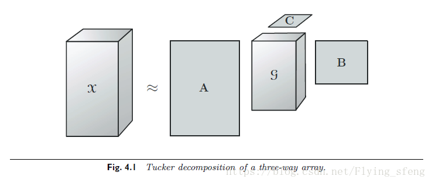
  
    * Tucker分解和CP分解的对比 
  
    CP分解是Tucker分解的特殊形式
  
    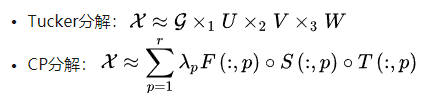
  
  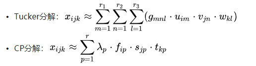
  
  * Tensor Train Decomposition
  
    >Novikov, Alexander, et al. "Tensorizing neural networks." *Advances in neural information processing systems*. 2015.
    >
    >* [ref](<https://blog.csdn.net/flying_sfeng/article/details/87453217>)
    >
    >* Tensor-train Decomposition将原来的高维张量分解为多个三维张量的乘积（首尾张量为二维）
    >
    >  
    >
    >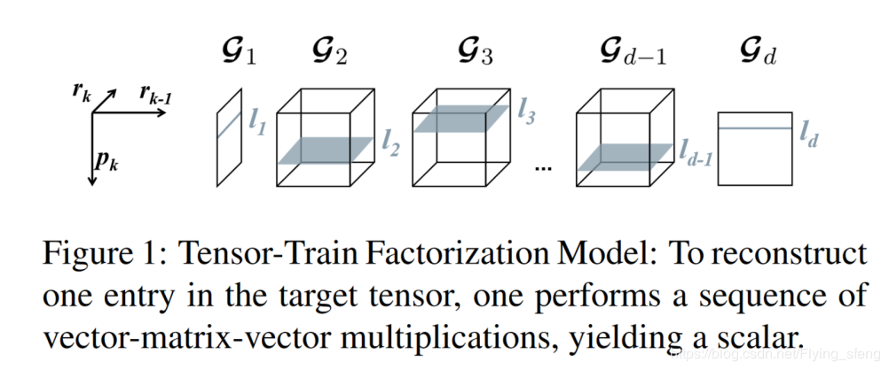
  
  * Block Term Decomposition
  
    >Wang, Peisong, and Jian Cheng. "Accelerating convolutional neural networks for mobile applications." *Proceedings of the 24th ACM international conference on Multimedia*. ACM, 2016.
    >
    >* [ref]([http://www.xiongfuli.com/%E6%9C%BA%E5%99%A8%E5%AD%A6%E4%B9%A0/2017-06/tensor-decomposition-BTD.html](http://www.xiongfuli.com/机器学习/2017-06/tensor-decomposition-BTD.html))
    >
    >* ref中的一个思考很有意思，就是说CP分解中是讲一个稀疏张量分解为R个秩一张量相加，但是不同秩、或者说不同尺度的特征是不同的，这时候CP分解无法直观做到。将秩一张量换成秩k矩阵，那么就得到了BTD模型
    >
    >* 
    >
    >  其中，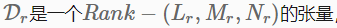
    >
    >  
    >
    >* 所以L，M，N怎么确定？
  
  为什么low-rank不再流行？
  
  * 对1*1卷积无效率
  * 在bottleneck结构中3*3卷积的计算复杂度并不大
  * 深度卷积，组卷积已经很快了
  
* Pruning

  ICLR2017斯坦福提出deep compression方法，但是随机剪枝对硬件非常不友好，所以就是用成块出现的pruning方法。

  * Structured pruning

    ****
    
    **对weights**
    
    >combined group and exclusive sparsity for deep nerual networks, 2017ICML
    >
    >* [补充数学知识-非凸正交正则化](<https://www.docin.com/p-1216479127.html>):有点太数学化了，看不下去
    >
    >* [补充数学知识-正则化]：看的链接找不到了，但是分享资料满天飞，随便看
    >
    >* [补充数学知识-理解凸优化](<https://zhuanlan.zhihu.com/p/37108430>)：讲的不错
    >
    >* 论文阅读：
    >
    >论文提出了对权重进行分析剪枝我的方法，首先用Group Sparsity组稀疏的方法对分组特征添加稀疏正则来修剪掉权重矩阵的一些列，然后通过Exclusive Sparsity增强不同权重之间特征的竞争力来学习更有效的filters，两者共同作用取得了很好的Pruning结果。
    >
    >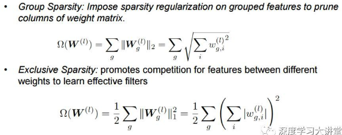
    
    ****
    
    **对feature map和activation**
    
    >Learning Efficient Convolutional Networks through Network Slimming，2017ICCV
      >
    >
      >
    >论文思想很简单，给每个通道channel添加一个尺度因子scaling factor，然后对这些尺度因子scaling factor添加sparsity regularization，最后根据尺度因子大小对相应的通道channels进行修剪，将一些尺度因子比较小的通道剪掉，实现对整个网络的瘦身效果。
    
    ****
    
    **对gradients**
    
    >
    >
    >
    
      
    
  * Filter Pruning 
  
  * Gradient Pruning
  
  * Fine-grained Pruning in a Bayesian View
  
    

 

## 20190509-201905015

### 周计划

- 完成统计学习的课程报告
- alphapose架构分析已经重新训练
- 模型压缩论文

### 周总结

* 统计学习的课程报告完成，细看略看了一些论文，压缩的主要框架，常用方法了解得差不多了，下周可以给大家作报告

- alphapose代码研究

  - sppe重新训练

    sppe重新训练分为两个步骤：用coco2017数据训练，加上PNG（对数据进行随机生成）训练，现在只实现了第一个部分，计划实现第二部分训练的同时对第一部分进行压缩，测试准确度等。

  * Pytorch学习时的一些启发
    * 步态数据训练时候对于分类数据进行one-hot编码
    * 步态数据对于正常数据进行标准化 
    * 关于风格的loss定义和内容的loss定义

## 20190516-20190522

### 周计划

* sail-sppe之数据准备（[简要思路记录](#sail-sppe思路)）
* 准备闵老师课程报告和组会报告（有需要的话）
* 读论文thundernet（陈佳禹推荐，不好就揍他）

### 周总结

* sail-sppe数据准备工作

  

- 论文阅读

  | 论文分类     | 论文名称                                | 阅读状态                  | 时间 |
  | ------------ | --------------------------------------- | ------------------------- | ---- |
  | 目标检测论文 | CenterNet :Objects as Points，2019 CVPR | [简单笔记](#第一周论文一) |      |

- 资料阅读

  [模型压缩总览]( http://www.sohu.com/a/232047203_473283)

  [详细笔记](

#### 1.sail-sppe思路

* Motivation

  现有的up-bottom方法的关键点检测都是两步，一是检测人物的bounding box，二是对bounding box中的人物进行关键点检测。大多使用的数据集是coco这种。

  > coco: 
  >
  > * 91类目标，328,000影像和2,500,000个label
  >
  > - 250,000 people with keypoints

  其中图片场景类别非常多样化，得到的网路的鲁棒性也很好，但随之而来的是网络参数量和计算量剧增，运行效率很低。在sail应用场景中，我们应用场景非常明确，我们完全有理由相信，通过折损一定的泛化性，我们可以得到一个在速度和精度上都更高的网络。

* Experiments

  * 数据准备

    我们延续两步走策略，需要的数据集是**图片+bounding box+节点坐标**

    * 图片的获取

      将目前所得的所有步态视频按帧读取，得到数据集。

      需要注意的是：

      1.逐帧读取的话就要注意数据过拟合问题，所以训练集和测试集不能来自相同的视频

      2.数据读取的时候注意深度视频和彩色视频的帧匹配问题。 

    * Way1：

      bounding box和节点坐标通过将网络输入到alphapose中获取。

  * 实验

  * 可预见的困难

* Results

#### 2. 论文

##### 2.1 CenterNet :Objects as Points，2019 CVPR

[参考博客](<https://blog.csdn.net/c20081052/article/details/89358658>)

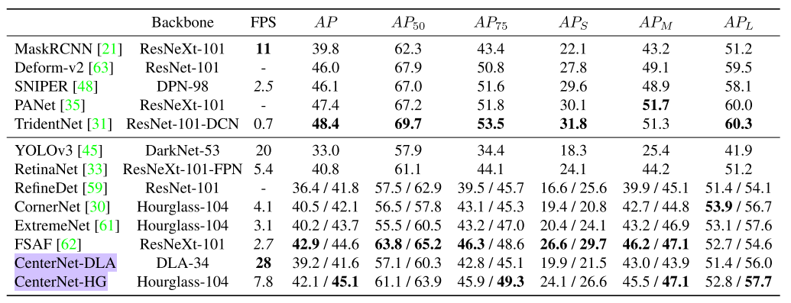

**1. Main Idea:**

  本文通过目标中心点来呈现目标（见图2），然后在中心点位置回归出目标的一些属性，例如：size, dimension, 3D extent, orientation, pose。 而**目标检测问题变成了一个标准的关键点估计问题**。我们仅仅将图像传入全卷积网络，得到一个热力图，**热力图峰值点即中心点，每个特征图的峰值点位置预测了目标的宽高信息**。

**2.Related Work**

2.1 Object detection with implicit anchors

* Faster RCNN

* anchor shape priors [44, 45], different feature resolution [36], and loss re-weighting among different samples [33].

* 其实我们的中心点就可以看做是传统目标检测中的锚点获取，但是：

  1.我们只基于位置，不基于框，所以不需要前景后景的分类;

  2.我们对于每个类别只有一个正锚点，不需要NMS，我们只从keypoint map中产生局部峰值；

  3.用大分辨率图像

2.2 Object detection by keypoint estimation

* CornerNet:预测左上角和右下角
* ExtremeNet：预测四个角和中心
* 但是他们都需要聚类，很耗时。我们的Centernet因为只有一个中心点输出，所以不需要聚类或者其他后处理。

2.3 Monocular 3D object detection

* Deep3Dbox：slow-RCNN [19] style framework：先检测2D物体，喂入3D网络
* 3D RCNN:在Faster-RCNN基础上加了一个头
* Deep Manta：corsetofine Faster-RCNN
* 我们工作和前两个的一阶段形式很像，但是更简单更快

**3. Preliminary**

* input：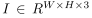

* output：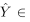注意在这里C是值对弈每一个类别关键点的个数，所以对于每一个分类都有这么一个map，最终输出还要乘上分类。

* 损失函数：

  * focal loss

    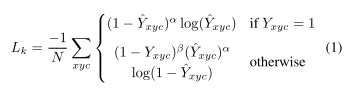

  * offset loss

    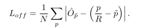

* 这个只是输出每一个类的一个feature map，并且每个类中只要一个目标，**所以有一个很大的弊端就是对于同一个类有多个目标没办法检测**。

* 还有一个问题就是如果某个类在某张训练图片中不存在的话那损失怎么计算。

**4.Objects as Points**

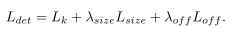

​	points to bounding boxes:

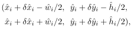

所以输出的是C+4

**4.1. 3D detection**

需要增加的是points depth(1)，3D dimension(3) 和orientation(本来是1，但是因为比较难回归，所以用8表示)

所以输出的是C+4+12

**4.2. Human pose estimation**

其实没太看懂，各种channel什么的。

## 20190523-20190529

### 周计划

- centernet复现
- keypoint做检测方向论文
- 步态数据集建立

### 周总结

- 论文阅读

  | 论文分类                                        | 论文名称                                                     | 阅读状态                   | 时间 |
  | ----------------------------------------------- | ------------------------------------------------------------ | -------------------------- | ---- |
  | 目标检测基于关键点37.4%AP/52FPS，28.1%AP/142FPS | CenterNet :Objects as Points，2019 CVPR                      | [简单笔记](#第一周论文一)  | 5.24 |
  | 目标检测基于关键点 41%AP/4.1FPS              | Cornernet：Detecting objects as paired keypoints             |                            | 5.25 |
  | 目标检测基于关键点 41.5%AP/3.1FPS            | Bottom-up Object Detection by Grouping Extreme and Center Points Xingyi | [简单笔记](#extremenet)    | 5.27 |
  | 目标检测基于关键点 34.4%AP/29FPS             | CornerNet-Lite: Efficient Keypoint Based Object Detection    | [简单笔记](#conernet-lite) | 5.28 |

  19年出来很多keypoints的object detection，互相之间没有对比，所以做以下表格供参考：

  | Methods           |Backbone| FPS  | AP   | APs  | APm  | APl |
  | ----------------- | ----- | ---- | ---- | ---- | ---- | ---- |
  | YOLOv3(CVPR,2018) | DarkNet-53 | 20 | 33.0 | 18.3 | 25.4 | 41.9 |
  | RetinaNet(ICCV,2017) | ResNeXt-101-FPN | 5.4 | 40.8 | 44.4 | 24.1 | 51.2 |
  | CornerNet(CVPR,2018) | Hourglass-104 | 4.1/0.87 | 40.5/42.1 | 19.4/20.8 | 42.7/44.8 | 53.9/56.7 |
  | ExtremeNet(CVPR,2019) | Hourglass-104 | 3.1 | 40.2/43.7 | 20.4/24.1 | 43.2/46.9 | 53.1/57.6 |
  | **CenterNet-DLA(CVPR,2019)** | DLA-34 | 28 | 39.2/41.6 | 19.9/21.5 | 43.0/43.9 | 51.4/56.0 |
  | CenterNet-HG(CVPR,2019) | Hourglass-104 | 7.8 | 42.1/45.1 | 24.1/26.6 | 45.5/47.1 | 52.8/57.7 |
  | CornerNet-Lite-Saccade(CVPR,2019) | Hourglass-104+attention | 5.26 | 43.2 | 24.4 | 44.6 | 57.3 |
  | **CornerNet-Lite-Squeeze(CVPR,2019)** |  | 33.4 | 34.4 | 14.8 | 36.9 | 49.5 |

  

- 代码实践

  [centernet代码实践](#centernet代码)

* 一些想法
  * **其实用关键点来检测如果要检测bbox的角的坐标的话（比如centernet，cornernet）就不适合用cnn去做**，毕竟cnn的视角是有限的，很难很好的去做到定位到点，这个问题在centernet中应该会有一点缓解，因为centernet是在中心点去回归物体的宽高，不直接去检测角的坐标，这样只需要多重视中心点处的定位和视角就好。
  * extremenet中关于四个extreme点的检测其实也不合适，因为一个物体的上下左右极值很可能根本就不是一个点，而是一条线（比如桌子的边缘），或者是很多点（比如汽车的两个轮子），作者用edge aggregation解决了第一个问题，但是弱化阈值就不是根本的解决办法，**根本的解决办法应当是可以在heatmap中把极值点聚类出来的**。（**ok,fine,我收回我的话，不得不说作者的处理办法还是不错的**）
  * cornernet中的那个新奇的pooling方法存疑mark一下，粗暴的向一个方向到底pooling应该会受到其他大物体的影响，所以想改进的方法是用一个average pooling+

#### 1.centernet代码实践

#####  1.1. 代码install：

* undefined symbol: __cudaRegisterFatBinaryEnd 

  原因：http://www.cnblogs.com/luruiyuan/p/10720581.html

  解决方案：卸载原来的pytorch，安装cuda10版本对应的

* 好烦啊，pytorch换成了1.1.0版本，但是作者用到了`from torch.utils.ffi import _wrap_function`，但是在pytorch1.1.0ffi已经弃用了，于是改成`from torch.utils.cpp_extension import _warp_function`，然而吧，在cpp_extension中有没有_warp_function这个函数，对pytorch的函数和神经网络具体过程一无所知的我并不知道该用什么函数代替

* 最终在金创服务器159上的实现了，但是inference过程顺利，train过程总是出现cuda的out of memory问题。

* 非常想实现这个代码，感觉这个新奇的思想会是以后的一个热门方向，但是，，，，我自闭了，，等到明天再试吧，，，

#### 2.Alphapose代码实践

alphspose官方放出三版代码：#

| 版次   | 框架    | 备注                                                       | 实现情况                                                     |
| ------ | ------- | ---------------------------------------------------------- | ------------------------------------------------------------ |
| 第一版 | lua     | 大概是因为第一版伴随着论文开源的缘故，写得很认真很详细     | 未实现                                                       |
| 第二版 | pytorch | 最方便安装，但是好像只有sppe的训练代码，没有整体的训练代码 | 实现了sppe，但是也没有作者的单独的sppe结果做对比，不知道复现效果怎么样，就当练手吧 |
| 第三版 | mxnet   | 一个新的框架，代码简介，但是框架集成了很多东西             | 没能成功复现，这个要不要继续尝试再说吧                       |

a.原版用lua

b.第二版用pytorch

##### 2.1 sppe代码研究

进行了四次训练，结果如下图：

只记录了第四次训练的命令 `CUDA_VISIBLE_DEVICES=4,5,6,7 python train.py --dataset coco --expID exp4 --nClasses 17 --LR 1e-5 --addDPG --loadModel ../exp/coco/pre_model/model_49.pkl`

#### 3.Extremenet论文阅读

**Abstract**

* 准确度说是和two stage达到了一样的效果，43.7% on coco test-dev，但速度3.1fps（好慢，但是和cornernet差不多）。
* 因为得到了四个极值点，那么可以扩充为一个八边形，也就是一个粗略的mask，输入到DEXTR中可以得到mask，准确度和人工标注+DEXTR得到的准确度相当。这个点的意义在于可以用extremenet取代人工去做mask的标注。

**1.Introduction**

矩形框不一定是物体最自然的表达

物体不一定是轴对称的，矩形框会损失背景信息，自上而下的策略计算了很多无用框，效率很低。

**检测出来四个extreme坐标，聚类时候按照n^4进行匹配，只有匹配的中心在center map上的得分高于预设阈值才算一个正例。**

**2.Related Work**

* Deformable Part Model：

  我们将中心点和四个极值点聚类的想法来自于Deformable Part Model论文

* Grouping in bottom-up human pose estimation

  四种方法可以做关键点聚类：

  * 对每类的每种关键点学习an associative feature，通过an embedding loss训练（centernet和cornernet好像都是这个思路）
  * 学习paird keypoints之间的相似性
  * 学习在human skeleton tree中各个关键点之间的displacement信息
  * 学习特征作为中心点的偏移
  * **我们的方法：暴力组合他们中心点和四个极值点**

* Implicit keypoint detection

  对每一类的每个关键点得到一张map

**3.Preliminaries**

* Extreme and center points：

  做Extreme keypoint的时间要比画bbox框要快得多，哈哈哈哈，这也可以……

* Keypoint detection

* Cornernet

  * object detector：Hourglassnet

  * 学习cornernet的两个loss：

    

​				没有学习associative embedding

* Deep Extreme Cut Deep

  DEXTR这个网络是一个可以人工标注物体边缘点传入它就可以得到mask的一个网络。我们得到四个extrem点之后取代人工标注输入DEXTR也可以得到mask，而且精度和人工标注的相当。

**4. ExtremeNet for Object detection**

* output：5*C heatmaps：4 for extreme points and 1 for center point

  ​				4*2 offset maps

* 几个重点的部件

  * Ghost box suppression

  * Edge aggregation Extreme

    这个算法挺有意思的，可以有效地增大极大值

  * Extreme Instance Segmentation Extreme

    这个是结合DEXTR进行segmentation

**5.Experiments**

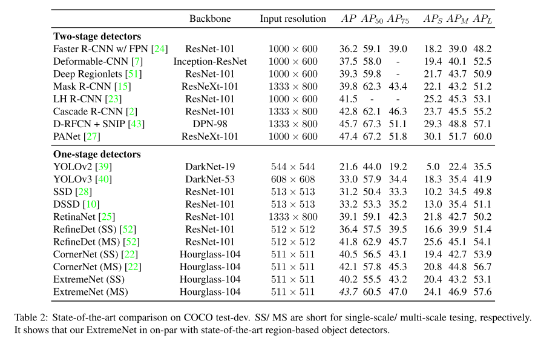

说两点：

* table 1中可以看出作者的center grouping的效果不错，也就是中心点检测其实很准的，所以centernet中利用中心点回归宽高等思想是非常正确的。
* table 2 中可以看到extreme的效果挺好的，速度真的慢（3.1fps），但是要注意的是，作者是用的mask选的extreme点训练的，得到的bbox肯定是紧贴着物体，所以会比GT小，得到的AP也会小，但是并不意味着不好。

#### 4.CornerNet-Lite论文阅读

##### **4.1.CornerNet-Saccade**

* CornerNet-Saccade可以实现43.2%AP at 190ms per image，相较于cornernet损失了1%AP，提升了6倍速度，有很大的改进

* Conernet--Saccade主要是通过在Hourglass降维降到最低时候加上attention，然后只对a subset  of crop恢复高像素，从而大大提高了速度。

  这是第一个将keypoint方法和Saccade结合的，因为之前用Saccade的方法要么是detect a single object per crop，要么是produces multiple detections per crop with a two-stage network involving additional sub-crops (e.g. AutoFocus [37]).但是Conernet-Saccade是produces multiple detections per crop with a single-stage network.

  因为可以在一个crop中检测多个物体，所以说明crops的数量可以少于物体的数量

****

* 网络结构
  * 降维降到255和192 pixels（padding with 0 to the size of 255）
  * 对于小，中，大物体分别产生attention map，从upsampling的不同层中提取不同尺度下的attention map，由不同尺度的attention map产生不同尺度的物体的中心点坐标，所以做detection之前进行zoom in就可以根据不同物体的尺度设置不用的倍数。
  * 从feature map中也会进行一个bbox的产生，这里可以得到更多关于物体size的信息，所以可以直接进行crop。
  * 在送入detection之前，我们可以通过设置k来决定一张图中最大检测物体数目，从而控制精度和速度的平衡
  * NMS抑制多余候选框
  * 对Hourglass-104做了改进，命名为Hourglass-54，并且在训练过程中加入了中继监督。

##### 4.2.CornerNet-Squeeze

* CornerNet-Saccade可以实现34.4%AP at 30ms per image，比YOLO v3更好更快

* CornerNet-Saccade结合了Mobilenet和SqueezeNet的思想，通过使用了很多1*1 convolution, bottleneck layer,and depth-wise separable convolution得到了new hourglass backbone。

  **这个其实揭示了hourglass不仅在精度方面有用，在速度方面也可以得到很大提升，非常有启发性，完全可以用到步态检测啊！！！！**而且Hourglass的应用太多了，这样子相当于又产生了一个又快又好的backbone，为什么你们都可以这么优秀呢！**突然意识到CenterNet-HG中的hourglass-104如果用这个backbone改进之后速度不是要飞起？**

* 网络结构

  * Hourglass-104 is built from residual blocks，we usethe fire module in CornerNet-Squeeze instead of the resid- ual block. Furthermore。
  * we replace the 3 × 3 standard convolution in the second layer with a 3 × 3 depth-wise separable convolu- tion
  * We replace the 3 × 3 filters with 1 × 1 filters in the prediction mod- ules of CornerNet.
  * Finally, we replace the nearest neighbor upsampling in the hourglass network with transpose convo- lution with a 4 × 4 kernel.

* Training：

  * 250k iterations，batch size 55

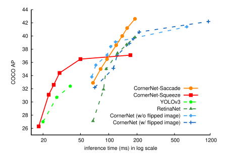

