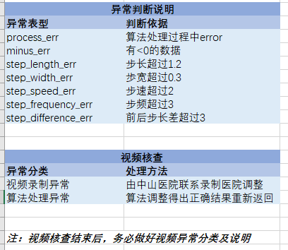

### 项目进展：

* 目前上海+贵州布点工作已经全部完成

* 数据量
  * 每日数据量：50-100
  * 目前总数据量：1600左右（100左右测试+一些无效）

* 数据监测：约每周一次

### 算法优化：

目前步态评估算法运行速度：8fps，准确率（mAP）：94.85%（在sail数据集上）

* 目标：保持90%以上的mAP的情况下使步态评估算法运行速度达到30fps

* 进展：

  * 建立sail数据集：

    **404例视频，30k张单人图片，候选框+关键点坐标标注**

    *注：coco数据集是144k张图片*

    和coco相比，我们的：

    * 使用场景单一，数据集针对性更强
    * 无遮挡，无半身

    所以，有理由相信，可以通过对步态算法模型进行压缩等方法得到一个运行速度更快的模型。

  * 在sppe上面的一些测试：

    | sppe训练测试       | coco-valid(5.9k) | sail-valid(1k) |
    | ------------------ | ---------------- | -------------- |
    | coco-train(138.3k) | 57.04mAP         | **97mAP**      |
    | sail-train(30k)    | 94.85mAP         | 21.12mAP       |

  * 模型压缩：

    目前单人目标检测的公认竞赛数据集是MPII：

    MPII上的结果：

    

    

### 暑假计划：

* 完善sail数据集
* 完成保持90%以上的mAP的情况下使步态评估算法运行速度达到30fps的目标

