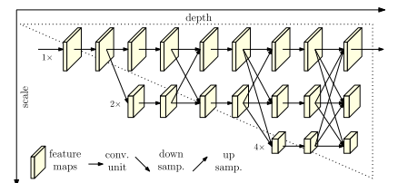
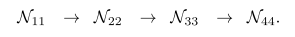
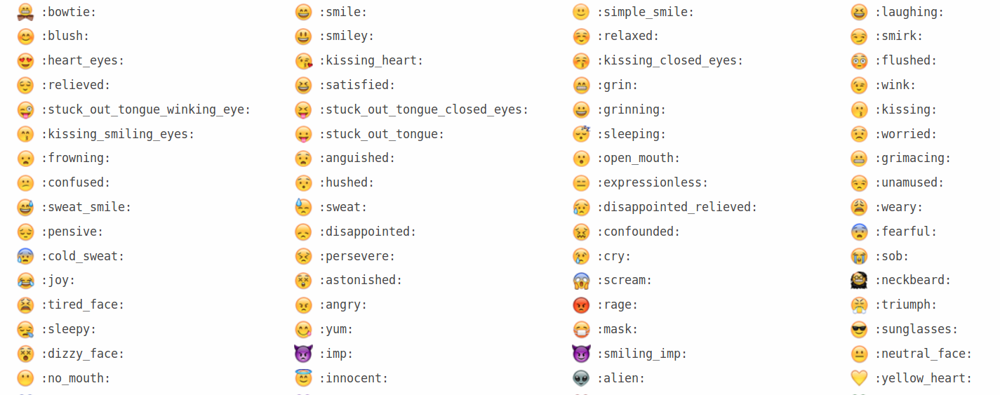

[TOC]

## 快速跳转：

[20190904](#9.1)

[20190911](#9.2)

## 20190904

### 两周总结

* 论文：SAIL: A Video-based Gait Assessment System for Neurological Disease
* 专利：自动化步态参数评估和异常检测算法
* 项目：
  * 步态异常数据审核
  * 更多参数提取

### 计划

- 关键点检测COCO竞赛
- 8.12-8.13 Related work
- 8.14下周组会和乔莎老师一起改论文，整理格式，准备论文提交工作
- 项目计划：开会+错误视频审查

* 项目算法
* 论文阅读

## 20190911

### Papers

#### 1. Simple Baselines for Human Pose Estimation and Tracking (SimpleBaseline)

#### 2. Deep High-Resolution Representation Learning for Human Pose Estimation (HRnet)

* **Related works:**

  This is the state-of-the-art work for multiple person pose estimation (MPPE), based on SimpleBaseline, achieving 0.770 mAP on the COCO2017 test-dev set.

  The two typical methods of MPPE is top-down and bottom-up. The former have achieves better mAP of 0.770 while the latter is 70.5. **This work belongs to the former**, which mainly consists of a human detector and single person pose estimation (SPPE).

  **This work focus on the the design of SPPE**. The popular design of SPPE is divided into two steps: high-to-low process aiming to generate low-resolution and high-level representations,  and low-to-high process aiming to produce high-resolution representations. Hourglass and its extensions combine low-level features in the high-to-low process progressively through skip connections.

  | Hourglass                                                 | HRnet                                                     |
  | --------------------------------------------------------- | --------------------------------------------------------- |
  |  |  |

  

* **Proposed method:**

  **This method builds parallel multi-resolution subnetworks** rather than sequential multi-resolution subnetworks in existing works.

  | sequential multi-resolution subnetworks                   | parallel multi-resolution subnetworks                     |
  | --------------------------------------------------------- | --------------------------------------------------------- |
  |  |  |

  **This work introduce repeated multi-scale fusion across parallel subnetworks.** By using *exchange units*, the features can be generated from various informations.

  Haven't fully understand:no_mouth:

* **My views:**

  * Strengths:
    * Compared to other works, this method keep high resolution representations in the whole process, which i think can maintain the low-level features, thus achieving better results.
    * It looks like the work adds a lot of operations in the processing but in fact the parameters and GFLOPs slightly decrease. I think the *exchange units* works.
  * Shortcuts:
    * In writing, this paper hasn't clearly illustrated the process of exchange units. :joy::joy::joy:

#### 3. Bottom-up Higher-Resolution Networks for Multi-Person Pose Estimation

### Works

### Plans

## Something fun:

https://www.webfx.com/tools/emoji-cheat-sheet/

