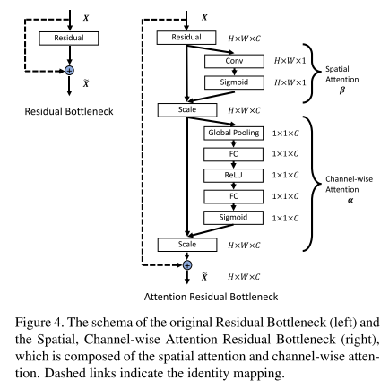

[TOC]

## 快速跳转：

[201901107](#11.1)

[201901114](#11.2)

[201901121](#11.3)

[201901128](#11.4)

## 20191107

### Works

- In last week's plans:

### Plans

### Papers

#### 1. CrowdPose: Efficient Crowded Scenes Pose Estimation and A New Benchmark

* **Info:**

  --2019CVPR

  --Jiefeng Li, Cewu Lu

- **Related work:**

  To address the crowd problem in MPPE(Multi-persons pose estimation).

- **Proposed method:**

  Three contributions:

  * The author proposed joints candidate loss  in SPPE, which takes the inference joints into consideration.
  * The author developed a new globally optimizing association algorithm to replace the historical NMS algorithms, achieving better performance with the same complexity. This method draws on the person-joint graph.
  * To better evaluate the proposed method, the author established CrowdPose dataset which follows unified distribution at crowd index. *Crowd index* is a standard to evaluate the crowding level, defined by the author.

- **My views:**

  - awesome. I like this boy.(The author) And I have watched his presentation, he is handsome.
  - The dataset has been released. Maybe there is something I can do with it.

#### 2. Multi-Person Pose Estimation with Enhanced Channel-wise and Spatial Information

* **Info:**

  * --2019CVPR

    --Kai Su

    --ByteDance AI Lab

- **Related work:**

  * ShuffleNet proposed the channel shuffle operation, the author further exploit the channel shuffle operation to promote the information communication across the channels among the feature maps at different resolution layers.
  * Attention machanism

- **Proposed method:**

  

  Two main contributions.

  - We propose a Channel Shuffle Module (CSM), which can enhance the cross-channel information communication between the low-level and high-level feature maps.

    

  - We propose a Spatial, Channel-wise Attention Resid- ual Bottleneck (SCARB), which can adaptively enhance the fused pyramid feature responses both in the spatial and channel-wise context.

    

- **My views:**

  - This work is not difficult to understand and not difficult to realize. But the ideas are creative and effective. So I give it a score of 80.
  - But the design of channel-wise attention here is worth to explore cuz the author doesn't give some explanations.