* 工作计划：

  |      | 实验                                         | 目的                       |
  | ---- | -------------------------------------------- | -------------------------- |
  | 1    | 继续enwik8数据实验                           | 还原了论文结果             |
  | 2    | 修改该模型为column combine训练（正在修改中） | 尽量减少精度损失           |
  | 3    | 允许conflict实验（刘诗玮想法）               | 尽量在上面的基础上提高效果 |

  - 考虑到enwik8数据集训练时间过长（47hours）问题，会考虑换成Character PTB
  - 在3的实验过程中，column combine的规则需要结合硬件制定一下
  - 1,2,3实验进行的同时了解一下量化方法，3个实验结束后尝试量化实验

### 实验1：Character level enwik8 with LSTM

| 网络                    | Params | 论文BPC | 实验BPC                 | 运行时间 |
| ----------------------- | ------ | ------- | ----------------------- | -------- |
| 3 layer LSTM (h = 1840) | 47M    | 1.232   | valid:1.247  test:1.255 | 约47h    |

### 实验2：Word level Penn Treebank (PTB) with LSTM

训练时间太长，附加其他数据集（PTB）实验：

| 网络                    | Params | 代码公布的BPC       | 实验BPC                                       | 运行时间 |
| ----------------------- | ------ | ------------------- | --------------------------------------------- | -------- |
| 3 layer LSTM (h = 1000) | 13.8M  | valid61.2 test:58.8 | <font color=red>valid:5.942 test:5.882</font> | 约10h    |

| 训练参数 | CUDA_VISIBLE_DEVICES=0 python main.py --batch_size 20 --data data/penn --dropouti 0.4 --dropouth 0.25 --seed 141 --epoch 500 --save PTB4.pt |
| -------- | ------------------------------------------------------------ |
| 训练bpc  | 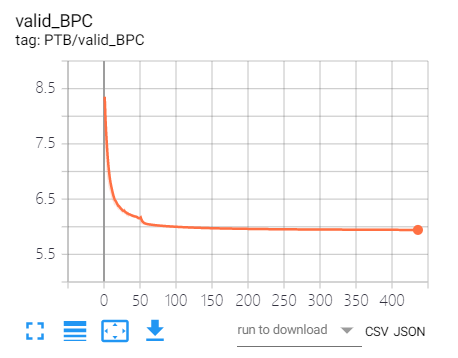 |

Word level Penn Treebank (PTB) with LSTM这个实验在论文中没有对比数据，所以换成Character level Penn Treebank (PTB)。

### 实验3：Character level Penn Treebank (PTB) with LSTM

需要记录比较的数据有：训练过程中权重数量，训练过程中每个batch所用的时间，valid bpc。

【因为内部是自定义的网络结构，此处看论文，写测试代码和训练可视化用了一天……（2020/3/7）】

| 训练参数           | `CUDA_VISIBLE_DEVICES=0 python -u main.py --epochs 500 --nlayers 3 --emsize 200 --nhid 1000 --alpha 0 --beta 0 --dropoute 0 --dropouth 0.25 --dropouti 0.1 --dropout 0.1 --wdrop 0.5 --wdecay 1.2e-6 --bptt 150 --batch_size 128 --optimizer adam --lr 2e-3 --data data/pennchar --save PTBC.pt --when 300 400` |
| ------------------ | ------------------------------------------------------------ |
| valid/test BPC     | 1.214/1.182                                                  |
| trainingTime/epoch | 72s                                                          |
| numNonzeroWeights  | 13.8M                                                        |
| numNonzeroWeights  |      非零权重一直是13.8M |
| trainingTime/epoch |   每个epoch的训练时间最终稳定在72s左右，总训练时间为10h |
| valid BPC          | 最终最优的valid BPC是1.214 |

### 实验4 ：Character level Penn Treebank (PTB) with LSTM <font color=red>with CC</font>

实验4中代码改动比较大，遇到了比较多的问题：

```python
#issue1:
self.dropout, self.training, self.bidirectional, self.batch_first)
RuntimeError: shape '[4000000, 1]' is invalid for input of size 4000
```

调试发现python3.7会出现这个问题，python3.6一下不会。

```python
#issue2:
RuntimeError: Input and parameter tensors are not at the same device, found input tensor at cpu and parameter tensor at cuda:0
```

主要因为作者源码中为了使用weight dropout做了一个神操作：把`weight_hh_lx`关键词删除，用`weight_hh_lx_raw`代替,修改了源码，不知道是否会有其他负面影响。

=====================================================================================

**这段我好像理解有误，芯片只做inference时候不需要每个epoch和每个batch都做CC。**

> <font color=purple>一个严重的问题是，从来combine后训练时间太长。。。。</font>
>
> | 训练时间对比            | column combine前 | column combine后 |
> | ----------------------- | ---------------- | ---------------- |
> | time/per iteration      | 0.276s           | 200s             |
> | time/per epoch/261iters | 72s              | （估计）14.5h    |
> | time/500 epochs         | 10h              | （估计）302d     |
>
> 主要原因有两点：
>
> 1. **column combine在每次梯度更新后进行，与梯度更新是同步的**：在CNN的训练中由于不存在序列问题，所以可以采取 **批训练** 方法，也就是一批训练数据的梯度一次性更新，那么column combine一批做一次。但是在LSTM这种存在序列问题的网络训练中对每个数据都要进行一次权重更新，这样才能保证权重学习序列信息。一般批训练方法会采取100-200的batch size，所以LSTM需要多做很多次column combine。
>
> 2. **LSTM中的权重维度远大于CNN**：
>
>    一个简单对比：
>
>    | LSTM(400,1840) | LSTM(1840,1840) | LSTM(1840,400) | CNN(64,3,3,64) |
>    | -------------- | --------------- | -------------- | -------------- |
>    | 16.5M          | 27.1M           | 3.6M           | 3.7M           |
>
>    除了数据量上的更大，还有因为维度更大引入的计算量的激增。
>
> 解决办法：
>
> 1. 为了快速看到column combine的效果，暂时采用每个epoch去做一次pruning，中间的权重迭代忽略，虽然这样做会引入很多误差，完全违背了column combine的思想。
> 2. 一个可能的解决办法是优化column combine代码，提高速度，但是这个应该比较困难。
> 3. 另一个可以思考的方向是寻找LSTM的批训练方法（还未调研）。

**这段我好像理解有误，芯片只做inference时候不需要每个epoch和每个batch都做CC。**

=======================================================================================

暂时采用的训练方案是在500个epoch中抽选10个进行CC（<font color=red>实验进行中</font>）

| 训练参数           | `CUDA_VISIBLE_DEVICES=0 python -u main.py --epochs 500 --nlayers 3 --emsize 200 --nhid 1000 --alpha 0 --beta 0 --dropoute 0 --dropouth 0.25 --dropouti 0.1 --dropout 0.1 --wdrop 0.5 --wdecay 1.2e-6 --bptt 150 --batch_size 128 --optimizer adam --lr 2e-3 --data data/pennchar --save PTBC.pt --when 300 400` |
| ------------------ | ------------------------------------------------------------ |
| hyper parameters   | CC: max_paths=3  overlap=2  prun_epochs=10                   |
| valid/test BPC     | 训练还未完成                                                 |
| trainingTime/epoch | 138s（笔记本训练，比服务器慢一倍左右）                       |
| numNonzeroWeights  | 13.8M——随着CC不断降低中                                      |
| numNonzeroWeights  | 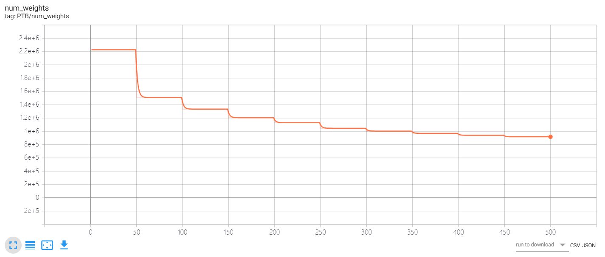     非零权重一直在降低，每次骤降是因为CC  <br /><font color=green>mark:有个问题是CC之后权重数量不上升,很好奇这个是代码中写的吗</font> |
| trainingTime/epoch | 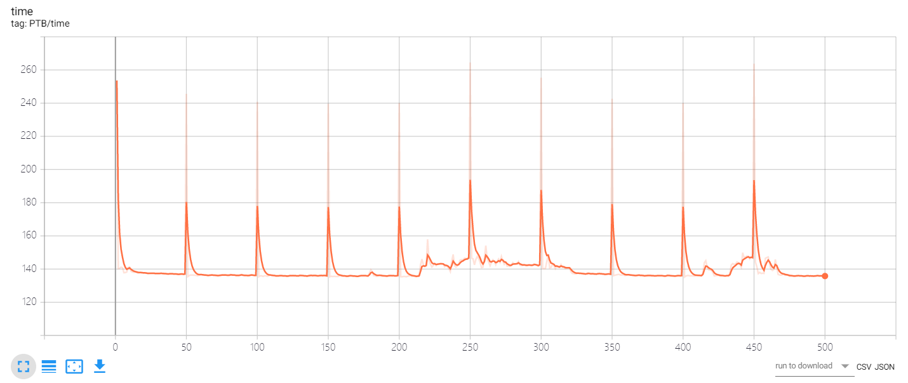  训练时间在每次CC时候时间上升 |
| valid BPC          | 每次CC后精度会下降，但是随着训练会恢复，但显然没有未CC时精度高 |

**思考：**

1. 不应该在第一个epoch进行CC：500个epoch中进行CC的有[1, 50, 100, 150, 200, 250, 300, 350, 400, 450]，但是从实验3可以看出网络在训练初期BPC下降比较快，在1st epoch CC之后显然失去了这个优势，所以为了达到比较好的效果，应该在训练前期采取全数据训练
2. CC之后权重数量不上升，需要确定是统计代码问题还是代码框架设置不更新0权重

### 实验5 ：Character level Penn Treebank (PTB) with LSTM <font color=red>with CC</font>

实验4中怀疑是第一轮CC不应该比较早导致了BPC比较大，所以将CC的epochs进行了修改继续实验4：

prune_epochs: [50, 94, 138, 183, 227, 272, 316, 361, 405, 450]

其他参数保持不变，直接看结果，num_weights和training time也基本上无变化，所以直接看valid BPC：

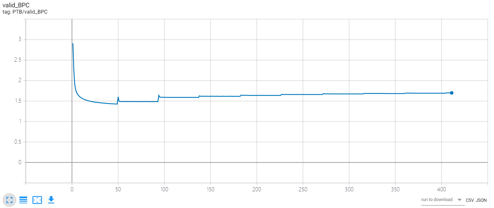

可以看到，显然BPC下降了很多，但是第一次CC之后再进行训练，BPC不再回落，产生疑问，<font color=green>这些数值不更新了（这里和实验4中num_weights都显示了好像被裁剪的数据训练时候不会恢复了。。。）</font>

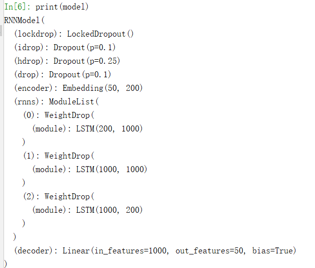

### 实验6：CPTB with CC：

#### 6.1 Different CC parameters on pretrained CPTB model:

==========================实验说明：=================================

* CC对象：三层LSTM中的HH和IH

* CC参数：

```
max_paths = [2,3,4]
for max_path in max_paths:
	over_laps = np.linspace(0, max_path, max_path*10).tolist()
```

* baseline: numweights

> Note:<font color=red>一定要在CC之前进行prune，否则会出现下面的情况，因为row density差不多，所以每次CC都差不多</font>
>
> | CC2                                                          | CC3                                                          |
> | ------------------------------------------------------------ | ------------------------------------------------------------ |
> |  |  |


#### 6.2 Conflicted permitted

* Hardware constraints

  * 允许`CCx`: 其中 `x∈{2,3,4}`  
  * 允许pc个permitted conflict：`pc<=1` for arbitrary x value
  * 每相邻的32个permitted conflicts sum: `pc_sum<=16`
  
* Algorithm design
  
  ```python
  # flat_idxs: the flatten weights index to be colcombined
  # cp_queue: permitted conflicted sum of previous contiguous 32 flat_idx. The maximum capacity is fixed to 32, and the maximum sum is limmitted to 16
  
  cp = Queue(length=32)
  mask = np.zeros(element_len(flat_idxs))  #The full length, init 0
  for flat_idx in flat_idxs:
      sorted_flat_idx = sort(flat_idx)  #sort the elements
      if cp.full():
          cp.pop()
      comparable = percent(△max(sorted_flat_idx)[-2:-1])<0.1
      pc_sum_permit = sum(cp)<15
      if comaprable and pc_sum_permit:
      	mask[index of the max two elements] = 1
          cp.push(1)
  	else:
          mask[index of maximum] = 1
          cp.push(0)
  ```

#### 6.3 Comparison of CC and CPCC

<font color=red>**CC: Column combining**</font> (e.g. CC4 means keep the maximum of four columns )

<font color=red>**CPCC: Conflict-permitted Column Combining**</font>

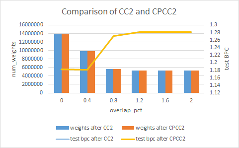


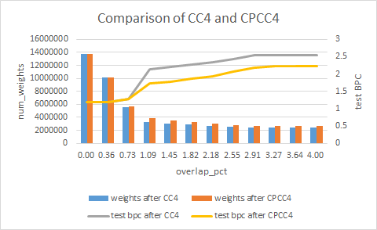


#### 6.4 Joint comparison of num_weights and test BPC between CC and CPCC

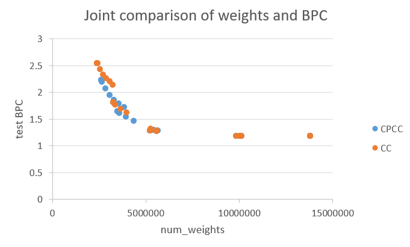

### 实验7：CPTB with quantilization

*   Dynamic Fixed Point：weight

  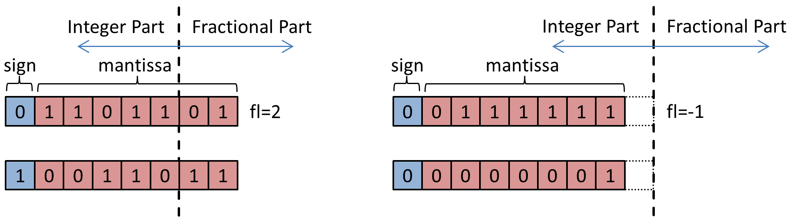

  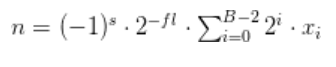

* Minifloat：feature

  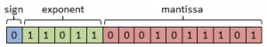

  

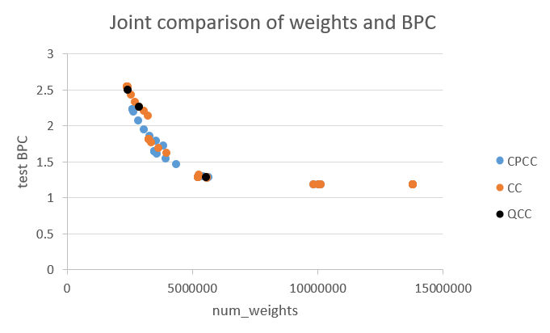

### 实验8：

* **Motivation:**

  fake prune(DARB)

* **Design：**

  max_paths:2-4

  prune rate

  overlap_pct

  

* 