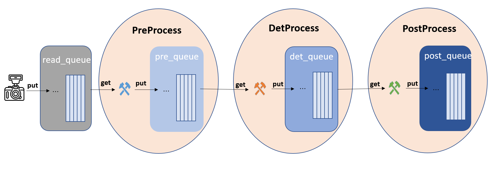
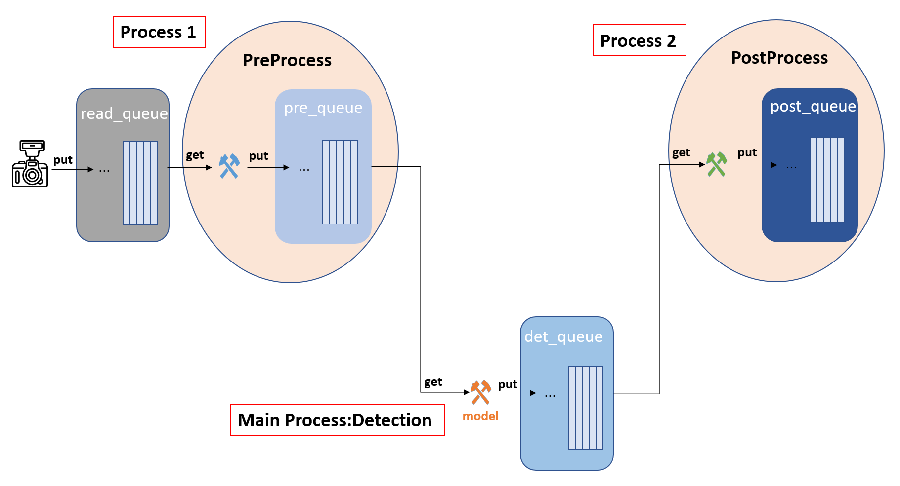
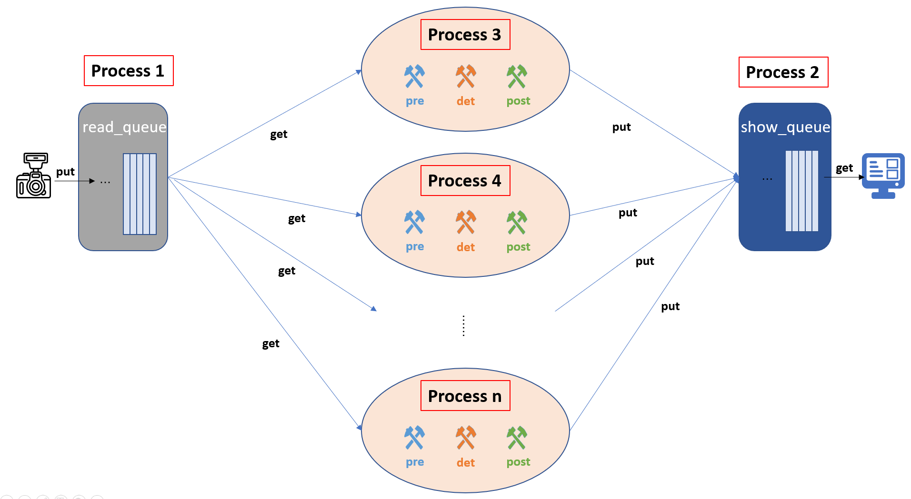
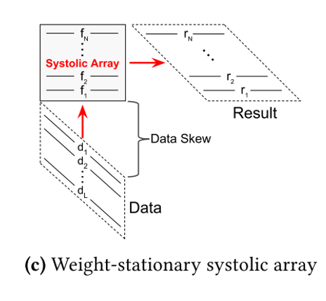
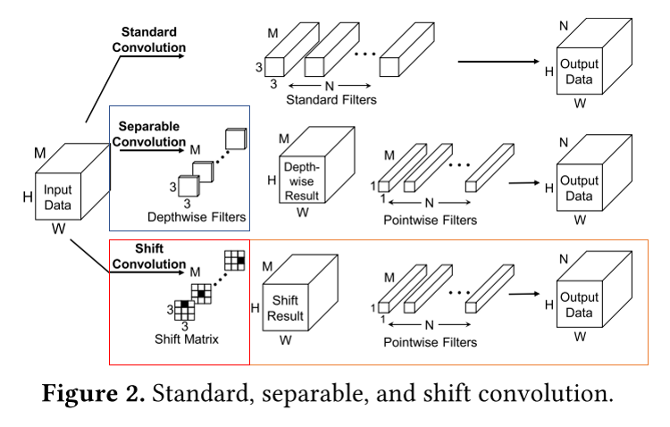

[TOC]

## 快速跳转：

[20200111](#1.1)

## 20200111

### Works

#### 1.横幅检测项目

* 需求：将从摄像头获取图像并进行横幅检测的代码从12fps加速至30fps

* 分析：简单测试可得前处理（preprocess），检测（detprocess）和后处理（postprocess）分别占用大概25ms，所以初步想法是**将三种操作通过三个线程进行pipeline处理。**

* 版本迭代过程与收获

  <table>
  	<tr>
          <td><b>版本1</b></td>
  	    <td>将三种操作写为三个类，每个类有自己的队列，典型流水线操作思想</td>  
  	</tr >
  	<tr >
  	    <td colspan="2">
              
          </td>
  	</tr>
       <tr>
          <td><b>问题</b></td>
  	    <td>python的多线程因为只有一个GIL调度，所以只是对CPU在时间上进行了再分配，有时并没有很好的加速效果</td>  
  	</tr >
      <tr>
          <td rowspan="3"><b>版本2-4</b></td>
          <td>1.改为多进程</td>
      </tr>
      <tr>
          <td>2.进程间通信改用专用的队列from multiprocessing import Queue</td> 
      </tr>
      <tr>
          <td>3.将类改为函数，因为多进程可以调用__main__但是不可以调用__class.main__函数</td> 
      </tr>
      <tr>
          <td><b>问题</b></td>
  	    <td>因为模型不能作为参数传给detprocess函数，所以对于每一张图片都要在detprocess函数中重新构建模型，极其浪费时间</td>
      </tr>
      <tr>
          <td><b>版本5</b></td>
  	    <td>将detprocess写进主进程函数，preprocess和postprocess都开新的进程</td>
      </tr>
      <tr>
          <td colspan="2"></td>
      </tr>
      <tr>
          <td><b>问题</b></td>
  	    <td>三个进程之间是图像队列的交互，而多进程之间通信使用队列交互是进行复制，所以极其浪费时间，不适合速度要求比较高的系统</td>
      <tr>
          <td><b>版本6</b></td>
  	    <td>改变整体思路，使用一个单独进程读，一个进程显示，一个可变数量进程进行处理</td>
      </tr>
      <tr>
          <td colspan="2"></td>
      </tr>

#### 2. Column combine

看论文，在CIFAR-10数据集上复现，看代码

!

### Plans

* Column combine代码及相关研究学习

### Paper

#### 1. Packing Sparse Convolutional Neural Networks for Efficient Systolic Array Implementations: Column Combining Under Joint Optimization《ASPLOS 2019》

还在看……

#### 2. Shift: A Zero FLOP, Zero Parameter Alternative to Spatial Convolutions《CVPR 2018》

其实就是把mobilenet中的Depthwise Filters换成了Shift Matrix。原因就是mobilenet虽然在理论上提高了计算复杂度，但是实际上1.失去了channel之间的联系，信息交融2.由于计算/存取比较小，对计算资源利用率低，shift convolution对不同的channel进行不同方向上的shift来加强了channel之间的联系，并且这种操作可以提高硬件利用率。