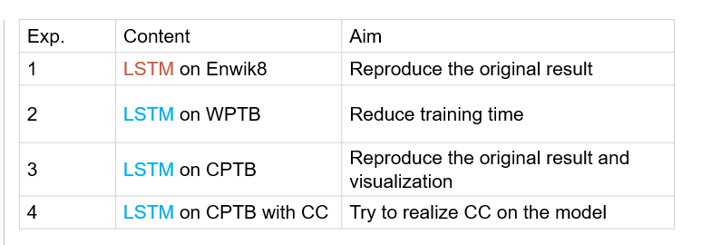
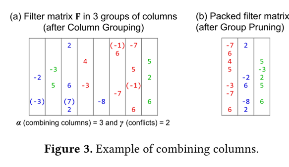
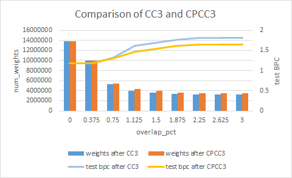
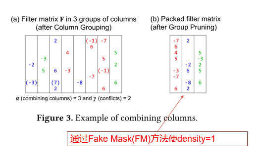
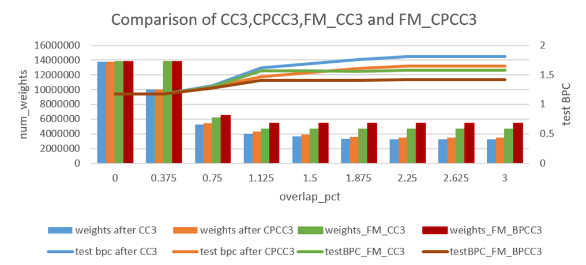

[TOC]

## 快速跳转：

[20200302](#3.1)

[20200309](#3.2)

[20200316](#3.3)

## 20200309

### 1. Papers

#### 1.1 BERT: Pre-training of Deep Bidirectional Transformers for Language Understanding

* **Info:**
  Google AI Language
  
* **Related domain：**

  * [【NLP】Attention原理和源码解析：](https://zhuanlan.zhihu.com/p/43493999)

  * [【NLP】Transformer详解](https://zhuanlan.zhihu.com/p/44121378)
    * [Sequence to Sequence学习简述](https://www.jianshu.com/p/9bf7178279dc)

  * [【NLP】语言模型和迁移学习](https://zhuanlan.zhihu.com/p/42618178)
  * [【NLP】Google BERT详解](https://zhuanlan.zhihu.com/p/46652512)
  * [李宏毅老师的一些课程](http://speech.ee.ntu.edu.tw/~tlkagk/courses_MLSD15_2.html)
  * [All the ways you can compress BERT](http://mitchgordon.me/machine/learning/2019/11/18/all-the-ways-to-compress-BERT.html?nsukey=eHJM%2BGUiYs6qXlZDlmFREcOz2MH5BWOVeeChDwj1Yk1EyUzBERPxA4JMdFCJM%2Bifjl8UHbEGbTF6M3X2fMeG9CYeRRN55Xbezm3Z%2BDx077StqhxJkFh3e5HF7%2Feju5vfpGF99EIIVa%2BovT5V7hIUWMuQDfkXa177Dds0F5h8G0odZvGebtfVE27t9xYSYOkEAFLW4bleyUC3QtjCuFBM9w%3D%3D)

* **Proposed methods：**

  还没看

* **My view**：

#### 1.2 An Analysis of Neural Language Modeling at Multiple Scales

- **Info:**
  未发表，缺创新，偏实验

- **Related domain：**

  - [QRNN](https://blog.csdn.net/u011961856/article/details/77431869)
  - [BPTT](https://blog.csdn.net/u014038273/article/details/83042185)

- **Proposed methods：**

  就是分别用LSTM和QRNN在三个数据集：character-level (Penn Tree- bank, enwik8) and word-level (WikiText-103) datasets上做实验，得到了比较好的结果。

  发现在word level上QRNN表现更好，character level上LSTM表现更好，但是QRNN也可以通过加深layers来达到差不多的performance。

  网络架构基本上是Encoder-LSTM(或者QRNN)-Decoder。其中Encoder和Decoder之间使用了tied weights

  本文还对网络中的一大堆参数做了评测，针对不同的数据集找出了几个最优的参数值，weight dropout, hidden dropout and embedding dropout等

- **My view**：

  就比较工程，看它是为了理解代码

#### 1.3 Automatic Timed Up-and-Go Sub-Task Segmentation for Parkinson’s Disease Patients Using Video-Based Activity Classification

* **Info:**

### 2. Works

## 20200316

### 1. Works

#### 1.1 CC: Column combining

Aim: To reduce the number of parameters, improve memory storage efficiency and reduce bandwidth requirements.

>1. U={0,1,2,3,4,5,6,7}   G=[{}]
>2. U={}   G=[{0,2,4},{1,7},{3,5,6}]

#### 1.2 CPCC: Conflict-permitted Column Combining

* **Joint comparison of num_weights and test BPC between CC and CPCC**

#### 1.3 FM_CC

