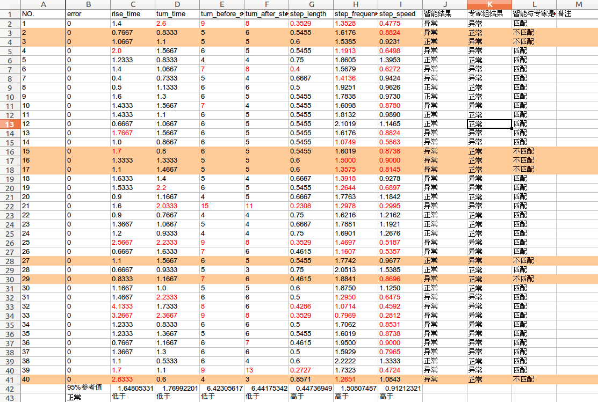
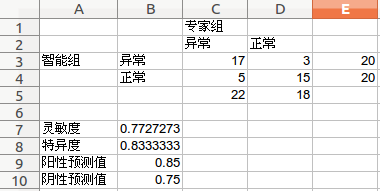
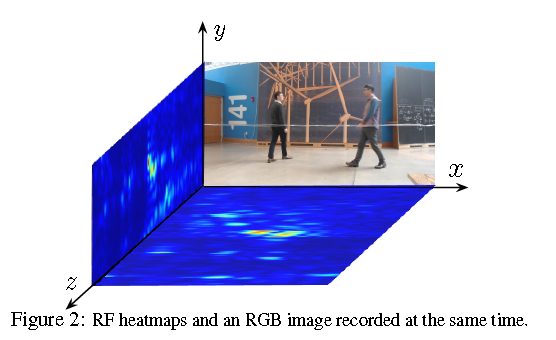
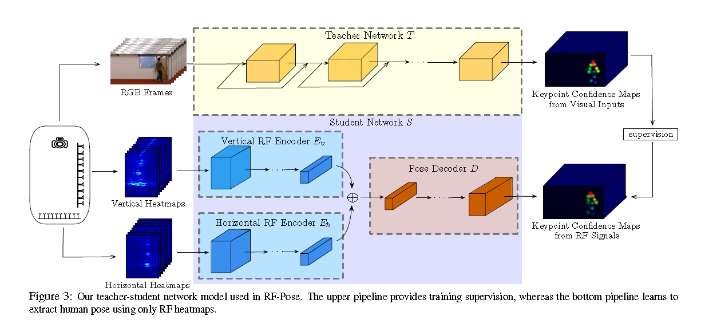
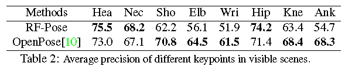
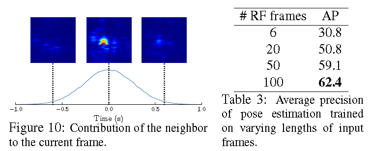
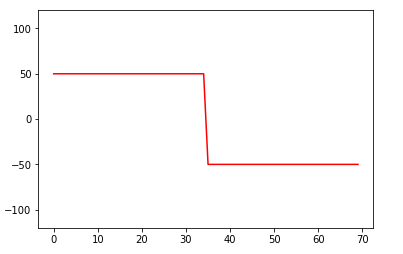
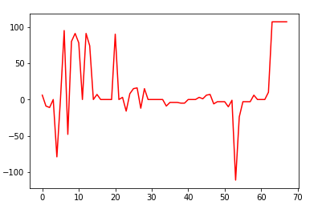

# Week Work Report:


# 20181031-20181109

完成：

* 40+26病例二分类判断.

  * 对40病例AI评分（按照人工95%界值）

    

  * 人工界值的灵敏度特异度

    

  * 对40病例AI评分（按照机器95%界值）

    

  * 机器界值的灵敏度特异度

  

  * 思考：
    * 1.指标的正确性已经很高（由唐医生对比人工数据和智能数据所知）
    * 2.但是二分类判断的准确度并不高。所以一个可能原因是**数据指标的界值划定不准**，另一个可能原因是**数据指标选择不准或者不全**
    * 3.针对第一个可能原因，我们人工看了各种界值，发现界值的标定总会带来结果的变化，但都不一定是趋向更好的一个变化。所以考虑**建立一个模型，能够从现有数据得到二分类结果**，因为样本量较少（40个），经陈佳禹建议，考虑用**决策树模型**（下周）。
    * 4.针对第二个可能原因，可以通过与医生的交流或者观察分类与视频中人的动作的相关性得到**更多的一些特征，从而进一步指导分类**。

  * 26病例二分类

* 语音识别工具包kaldi中yesno示例跟踪学习

  还没太懂，涉及到输入音频信号的编码方式，声道，输入音素、字典、词典等还需要知识补充

* densepose模型使用

  未完全实现

* 下周工作计划：

  1.尝试用决策树（或者其他模型例如SVN，贝叶斯）得到从数据到分类过程，同时继续和医生沟通，尝试找到更多特征

  2.看densepose论文以及尝试densepose模型实现

# 20181025-20181030

完成：

* AlphaPose应用
* eesen kaldi语音识别工具包建立

# 20181003-20181009

一个课上的PJ写了一个假期，效率及其低下……我觉得我应该利用这一晚上好好看看论文了。

### CVPR2018论文分析解读：

cvpr2018论文分析: https://zhuanlan.zhihu.com/p/35131736

#### 目标检测方向：

目标检测综述：https://www.zhihu.com/people/YaqiLYU/activities

论文整理(近五年): https://github.com/hoya012/deep_learning_object_detection#2014


CVPR2018:

#### video action方向：

概括： https://www.zhihu.com/question/266379600

必看：Non-local Nerual Networks

#### 语音识别方向：

好了，我又决定要看书了，好迷茫，好纠结……

# 20180913-20180919

* 给每个人服务器开账户
* 给外星人安装环境并且去运行程序
* 程序改进
* 实验室测试
* 中山医院测试
* 看一下word embedding

## 调研工研院


## VS code使用

决定弃坑spyder，实在太难用了，实用王承斌全力推荐的VS code。

* 学习vscode
  * 快捷键： [keyboard use](https://code.visualstudio.com/shortcuts/keyboard-shortcuts-windows.pdf)
  * 很好用的一个extension：dark one（icon theme），eslint（for debugging），markdown all in one
  * 常用快捷键：
    * f5:运行
    * ctrl+/多行注释
* 修改后台数据库
* 修改代码

## 系统搭建工作

* 实验室系统搭建，发现问题：
  * 客户端返回uuid无法正确对接（已解决）
  * 算法监控设备没有网络会报错，连接网络不能重新找到待处理数据（已解决）
  * 算法运行速度慢
    * 已用外星人GPU，速度提升了很多
    * 计划用实验室GPU
  * 算法准确度
    * 考察openpose
    * 考虑王承斌代码
    * 考虑densepose

[1536849284115](/work_record/1536849284115.png)


# 20180907-20180912

* 重装系统，貌似完成了，大家可以test一下
* 优化步态识别代码
  * 简单的异常处理
  * 多线程数据处理
  * watch-dog监控处理

* 下周工作：
  * 在实验室跑通流程得到数据
  * 医院布点病人测试
  * 看论文，改代码

# 20180831-20180906

## 周待做列表

- 服务器重装
- 读论文
  - Through-Wall Human Pose Estimation Using Radio Signals，CVPR2018（进行中）
  - Total Capture: A 3D Deformation Model for Tracking Faces, Hands, and Bodies,  CVPR2018(best student paper)（未开始）

## 重装系统bug打包

参与人员：时迎琰、赵梓豪、冯新宇、王艳红

* 组建raid时，检测不到下面两个硬盘卡中的硬盘，raid5不支持，好像是服务器主板不支持的原因—组建了raid10

* 重装系统时，用ubuntu-server-16.04.5，安装过程中出现错误—未解决，调研后换ubuntu-desktop-16.04.5。

  ```
  [!!]Install the GRUB boot loader on a hard disk
  
  Unable to install GRUB in /dev/md126p2
  Executing 'grub-install /dev/md126p2' failed.
  
  This is a fatal error.
  ```

* ubuntu-desktop-16.04.5安装成功，运行不成功。或者安装过程中出现上述错误

  * 已有尝试：raid10改为raid0重装，用冯新宇的诡异经验方法重装……，失败
  * 计划：用一块硬盘装，失败的话在自己电脑上装来排除安装盘问题

## 论文

| **Through-Wall Human Pose Estimation Using Radio Signals**   |
| ------------------------------------------------------------ |
| 下载地址：<http://openaccess.thecvf.com/content_cvpr_2018/CameraReady/2406.pdf> |

- **Author:  Mingmin Zhao**

- **Advisor: Dina Katabi** 

- **Conference: CVPR 2018**

- **demo：**

  <iframe width="920" height="518" src="https://www.youtube.com/embed/HgDdaMy8KNE" frameborder="0" allow="autoplay; encrypted-media" allowfullscreen></iframe>

  

- features：**

  - **cross-modal and multi-modal learning** ,无法对无线信号进行标注，所以通过同步的视频信号提取人体姿势信息来，再完成监督无线信号到姿势信息的训练。训练完成后，就可以直接由无线信号得到人体姿势信息。

    

  - 训练数据只有视线范围内能直接观察到人的数据，但训练完成后，即使人不在视线范围内也能被检测出来。

  - 相对于从图像得到人体姿势信息的优势是，在视线中没有人体时也能检测出姿势，比如在夜晚或者墙的另一边。

  - something bad: 

    * errors in RF-Pose happen when a person is occluded by a metallic structure which blocks RF signals, or when people are too close and hence the low resolution RF signal fails to track all of them.
    * the human body is opaque at the frequencies that traverse walls.
    * The effective distance depends on its transmission power.(40 feet in this work)
    * Only one activity: walking

- **网络结构**

  - Realtime multiperson 2D pose estimation using part affinity fields

  - 3D convolutional neural networks for human action recgnition

    Learning spatiotemporal features with 3D convolutional networks

    Temporal segment networks: Towards good practices for deep action recognition



- **效果：**

  

  | **OKS**: Object keypoint similarity（对象关键点相似性） |
  | :------------------------------------------------------ |
  |              |

  * **low OKS values (< 0.7)，RF-Pose win.**

    Vision-based solution generate skeletons is the scene has a poster of a person,or a human reflection in a glass window or mirror.

  * **low OKS values (< 0.7)，OpenPose win.**

    * low spatial resolution of RF signals

    * synchronization(同步性) between the RF heatmaps and the ground trueh images


  * RF-Pose is better at large reflective areas

    |  |
    | --------------------- |
    |  |

  * RF-Pose operating over a clip of a few seconds：

    | 100frames~3.3s，1 second away，too coarse.  |
    | ------------------------------------------- |
    |  |

- **Questions: **

  - vertical heatmap和horizontal heatmap怎么来的？

    - see another paper:[Capturing the Human Figure Through a Wall](http://rfcapture.csail.mit.edu/rfcapture-paper.pdf)

  - why RF signals in the WiFirange can reflect off the human body?

    - see techniques like FMCW

  - 100frames~3.3s，1 second away，too coarse.

    

- **不再深入**

  - 没有要求的wifi信号发送设备和收集设备以及设备布置方案，得不到测试集
  - occlusion在姿态识别中确实是一个大bug，但是在中山医院步态识别项目中不是
  - RF-Pose为了解决occusion损失太多，假设太多。比如准确率，比如多图片输入单图片输出（估计处理速度会很慢，快速的动作应该也不行，文中没提）
- **中文参考**：[读 CVPR-2018 Through-Wall Human Pose Estimation Using Radio Signals](https://blog.csdn.net/u013580397/article/details/80706626)

- **thinking**

  - 用X光视频或图片做输入（或训练）进行识别（和深度摄像头异曲同工，排除了视觉上的色系等的干扰）

    > 百度X光骨架识别：[吴恩达团队发起骨骼X光片识别挑战赛](https://stanfordmlgroup.github.io/competitions/mura/)，今年1月，吴恩达团队开源了MURA ，这是一个骨骼 X 光片的大型数据集，总共有 40561 份多视图放射线影像。4月左右，发起了一项骨骼X光片识别挑战赛，目前还在进行中……

## 下周要做工作：

- 装系统啊装系统
- 代码整理优化，找个服务器跑着，监督问题，多任务问题，异常处理问题
- 中山医院视频处理（周一前）

# 20180824-20180830
## 周待做列表
* 算法与服务器之间交接测试及完善(交接测试完成，算法需要完善意外处理程序)
* 步态系统社区测试（完成）
* 读论文
  * Through-Wall Human Pose Estimation Using Radio Signals，CVPR2018（进行中）
  * Total Capture: A 3D Deformation Model for Tracking Faces, Hands, and Bodies,  CVPR2018(best student paper)（未开始）
## 论文

| **Through-Wall Human Pose Estimation Using Radio Signals**   |
| ------------------------------------------------------------ |
| 下载地址：<http://openaccess.thecvf.com/content_cvpr_2018/CameraReady/2406.pdf> |

* Author:  **Mingmin Zhao**

* Advisor: **Dina Katabi** 

* demo：


  <iframe width="920" height="518" src="https://www.youtube.com/embed/HgDdaMy8KNE" frameborder="0" allow="autoplay; encrypted-media" allowfullscreen></iframe>

* features：

  * cross-modal and multi-modal learning 无法对无线信号进行标注，所以通过同步的视频信号提取人体姿势信息来，再完成监督无线信号到姿势信息的训练。训练完成后，就可以直接由无线信号得到人体姿势信息。

    

  * 训练数据只有视线范围内能直接观察到人的数据，但训练完成后，即使人不在视线范围内也能被检测出来。

  * 相对于从图像得到人体姿势信息的优势是，在视线中没有人体时也能检测出姿势，比如在夜晚或者墙的另一边。

* 网络结构

  * Realtime multiperson 2D pose estimation using part affinity fields

  * 3D convolutional neural networks for human action recgnition

    Learning spatiotemporal features with 3D convolutional networks

    Temporal segment networks: Towards good practices for deep action recognition


* 效果：

  

* 不再复现

  * 没有要求的wifi信号发送设备和收集设备以及设备布置方案，得不到测试集
  * 这个文章的创新其实我也用不着

* 中文参考：[读 CVPR-2018 Through-Wall Human Pose Estimation Using Radio Signals](https://blog.csdn.net/u013580397/article/details/80706626)

* Questions: 
  * vertical heatmap和horizontal heatmap怎么来的？
    * see another paper:[Capturing the Human Figure Through a Wall](http://rfcapture.csail.mit.edu/rfcapture-paper.pdf)
  * why RF signals in the WiFirange can reflect off the human body?
    * see techniques like FMCW

## 未明确时间工作

* GPU服务器重装系统
* 画钟七分法
* Openpose剩余复现工作
# 20180817-20180823
## 周代做列表
* 算法与web服务器之间的初步交接测试（算法已完成，等待web服务器接口测试）
* 算法与ftp服务器之间的初步交接测试（完成）

# 20180810-20180816

## 周待做列表
* Openpose源码复现（未完成）
* 服务器问题（未完成）
* 系统中山医院初步测试（完成）

# 20180803-20180809

## 周待做列表

* 目前整个系统已经基本跑通，接下来还需要做一些细化的事情

* 优化画钟识别的代码（部分完成）
  * 能处理拍摄的彩色图片（完成）
  * 批量处理功能去除（完成）
  * 目前的resize是直接截取中间部分（完成）
  * 受光线影响（mark，待评估）

* 优化步态识别的代码（完成）

  * 用深度视频进行轮廓识别

* svn上面的代码整理（完成）

  * [svn地址](https://118.178.19.58:8443/svn/zs-hospital)

* 寻找合适的核心代码（未完成）

  * OpenPose源码

    * Body-Foot Estimation

    >  

    - gpu环境搭建
      - [cuda测试](https://blog.csdn.net/u012235003/article/details/54575758)
        - failed: CUDA driver version is insufficient for CUDA runtime version(CUDA和cuDNN系统已经安装，所以不用重新安装……)
      - mark：安装cudnn时候安装pytorch因为gcc版本太低识别不了一个命令，下载了高版本的gcc在download里面还没有安装
      - 

# 20180727-20180802
## 周待做列表
* 更多更稳定视频的拍摄和前处理；(完成)
* 步宽检测失败原因排查；(完成)
* 重构python代码，尝试处理正面视频；(评估后认为暂时不需要)
* 将画钟代码应用到服务器；(完成)
* 尝试得到转身步数。(评估后认为暂时无法完成)
* 搭建系统。（完成）

### 步宽

* 摄像头精度：正常，至少能达到厘米量级

* opencv 的grayToBgr和BgrToGray函数转换可逆，并且opencv可以直接输出灰度视频

* 步宽测量不准确的主要原因在于关键点识别不准确

  * 尝试将关键点识别有效域扩大为11*11，阈值提高为50，downsampling倍数降为2，无效
  * 降低需求，延续上述操作，并且使用转身前所有帧左右脚深度平均值之差代替步宽，8个视频16组数据中2组无效。但是这种方法依赖于转身帧数测量的准确度。

* 步宽和深度对应关系：看SDK源代码得到**gray_pixel*10000/255mm**

  > [OpenNI2编程说明](http://blog.sina.com.cn/s/blog_4a628f030102v6k4.html)
  >
  > [CvMat，Mat和IplImage之间的转化和拷贝](https://www.cnblogs.com/Key-Ky/p/4150531.html)

* 

### 关键点识别精度

* 暂时无解

### 轮廓识别精度

* 轮廓识别精度好像会受到光照条件的影响，受到背景颜色的影响

* 调研opencv动态物体捕捉算法，尝试运用背景差法，帧差法，背景帧差法效果远好于帧差法，所以决定**在视频采集模块中加入背景帧采集按钮（增加了对操作者的要求）**，后期如果需求无法去除的话可以在实际系统中的上一步操作按钮中集成背景帧采集按钮。

  * 如果椅子固定不动，还可以摆脱椅子对轮廓识别的干扰
  * 背景帧直接输入视频第一帧
  * 成功
  * 遇到的问题：
    - 因为是通过帧像素点差，所以如果颜色比较接近，则容易产生问题，如实验中的腿和地板颜色接近带来的问题
    - 虽然背景帧没有问题，但是人的影子投射到墙上仍然会对实验产生影响

* 尝试将上述视频换为**深度视频**处理

  + 优点:
    + 除去了颜色对图像处理的影响

  + 缺点:

    + 墙角处噪点太重，刚好在人脚的部分------去除高斯滤波和形态学膨胀，取diff的最大contours
    + 人脚和地面接触部分的深度变化不大------将diff二值化处理的阈值降为10（39.2cm）（不能高于25.5（100cm））------**要求病人和背景墙之间距离大于此阈值**
    + 两个视频同时处理，降低处理速度-----**将步宽处理整合到主处理程序中（需要一段时间，暂放）**
* 效果图 

| color_contour | depth_contour |
|:--------------------|:--------------------|
|  {:width="400" height="300"} |  {:width="400" height="300"} |
| shadow，color | no feet |

### clock代码编译dll

* [python调用C语言](https://www.cnblogs.com/lovephysics/p/7237227.html)

* [python使用ctypes调用C/C++](https://blog.csdn.net/u012449363/article/details/75452374)

  -----------------发现思路跑偏---------------------

### clock在linux下运行

* [windows和linux下文件和文件夹互传](https://blog.csdn.net/jiandanokok/article/details/51387922)
* [linux下使用g++编译cpp工程](https://www.cnblogs.com/battlescars/p/cpp_linux_gcc.html)（实战）
* [gcc/g++编译的四个步骤](https://www.cnblogs.com/zjiaxing/p/5557549.html)（理解）
* [makefile的使用](https://blog.csdn.net/tototuzuoquan/article/details/38459119)
* [gcc/g++动静态库编写](http://www.cnblogs.com/zjiaxing/p/5557629.html)
* 其他
  * [vi命令](http://man.linuxde.net/vi)
  * [ubuntu16.04配置VNC远程桌面连接](https://www.cnblogs.com/EasonJim/p/7529156.html)
  * 
* 目前难点：
  * clock代码中用到了opencv的imgproc.hpp库函数，但是linux版本的opencv中没有imgproc库函数，将windows版本的库函数导入出错，卡住ing……
  * 尝试在服务器安装opencv，需要管理员权限，卡住……（创建环境，安装opencv）
  * 在anconda下创建环境安装了opencv，但是还是没用
* 失败可能原因分析：
  + 
* 打算用步态服务器sudo权限做


# 20180720-20180726
## 周待做列表
* 将clock代码封装成一个class，给冯新宇提供接口；
* 改步态识别的代码，搭建系统；
* 看自然语言处理的一些东西，了解什么叫词向量等。
## clock class封装
>参考：https://blog.csdn.net/dfdfdsfdfdfdf/article/details/52439651
>
>>vector作为参数的三种传参方式：https://www.cnblogs.com/xiaoxi666/p/6843211.html
## 改步态识别的代码
>要拍摄视频<br>
买三脚架<br>
得到步宽信息<br>
尝试正面视频的处理<br>

### 面临问题
* 步态识别所使用模型openpose不够精确，侧面识别和正面识别的精确度都不高
  + 可能因为视频的像素影响
  + 可能因为视频背景对轮廓识别的影响
* 深度摄像头得到的深度视频没有灰度-深度之间的对应关系
* 深度视频的精确度不高（像素点抖动等）
* 搭建系统的空间
### 需要做的工作
* 首先要忽略识别的精确度去做深度视频的深度提取、深度精确度考察
>对步宽的定义：人物在视频中部，且人物迈开步子时，两脚踝深度之差<br>
1.导出全视频过程中两脚踝深度信息<br>
由于没有灰度和深度之间的函数对应关系，所以暂时先导出两脚踝的灰度值进行对比。
但是经过对比，两脚踝的灰度并没有很大差别，所以利用深度摄像头侧面信息获得步宽信息的可行性有待考量。


可能原因:<br>
a) 摄像头精度问题（实验排除）<br>
b) gray to bgr和bgr to gray的可逆性问题<br>
c) 16UINT-8UINT的精度损失<br>
d）视频中人走路太快<br>
摄像头存疑问题:<br>
a) 黑色对识别有影响<br>

* 更多更稳定的视频的拍摄
* 尝试正面识别
* 精度评估
### 深度视频的应用

## 自然语言处理
### 基于的想法
传统：文字->向量
创新：拼音->向量
### 词嵌入、词向量（word embedding、word vector）
参考：[词嵌入](https://blog.csdn.net/ch1209498273/article/details/78323478)<br>
词嵌入是将词汇映射到实数向量的方法总称。将文本X{x1,x2,x3,x4,x5……xn}映射到多维向量空间Y{y1,y2,y3,y4,y5……yn }，这个映射的过程就叫做词嵌入。  
#### 词嵌入的三种方法：
>**1.Embedding Layer**<br>
Embedding Layer是与特定自然语言处理上的神经网络模型联合学习的单词嵌入。该嵌入方法将清理好的文本中的单词进行one hot编码（热编码），向量空间的大小或维度被指定为模型的一部分，例如50、100或300维。向量以小的随机数进行初始化。Embedding Layer用于神经网络的前端，并采用反向传播算法进行监督。<br>
>**2.Word2Vec/Doc2Vec**<br>
其核心思想就是基于上下文，先用向量代表各个词，然后通过一个预测目标函数学习这些向量的参数。Word2Vec 的网络主体是一种单隐层前馈神经网络，网络的输入和输出均为词向量。该算法给出了两种训练模型，CBOW (Continuous Bag-of-Words Model) 和 Skip-gram (Continuous Skip-gram Model)。<br>
>* CBOW将一个词所在的上下文中的词作为输入，而那个词本身作为输出，也就是说，看到一个上下文，希望大概能猜出这个词和它的意思。<br>
>* Skip-gram它的做法是，将一个词所在的上下文中的词作为输出，而那个词本身作为输入，也就是说，给出一个词，希望预测可能出现的上下文的词。
>
>Word2Vec只是简单地将一个单词转换为一个向量，而Doc2Vec不仅可以做到这一点，还可以将一个句子或是一个段落中的所有单词汇成一个向量。<br>
>**3.GloVe（Global Vectors for Word Representation）**<br>
GloVe是Pennington等人开发的用于有效学习词向量的算法，结合了LSA矩阵分解技术的全局统计与word2vec中的基于局部语境学习。<br>
LSA全称Latent semantic analysis，中文意思是隐含语义分析。<br>
#### 神经网络语言模型
>**1.Neural Network Language Model ，NNLM**<br>
>**2.Log-Bilinear Language Model， LBL**<br>
>**3.Recurrent Neural Network based Language Model，RNNLM**<br>
>**4.Collobert 和 Weston 在2008 年提出的 C&W 模型**<br>
>**5.Mikolov 等人提出了 CBOW（ Continuous Bagof-Words）和 Skip-gram 模型**<br>
#### 限制
单词嵌入主要限制之一是单词的可能含义被混合成单个表示（语义空间中的单个向量）。Sense embeddings 是这个问题的解决方案：单词的个体含义在空间中表示为不同的向量。
### 语音识别
参考：[语音识别](https://baike.baidu.com/item/%E8%AF%AD%E9%9F%B3%E8%AF%86%E5%88%AB/10927133?fr=aladdin)
#### 数据库
>MIT Media lab Speech Dataset（麻省理工学院媒体实验室语音数据集）<br>Pitch and Voicing Estimates for Aurora 2(Aurora2语音库的基因周期和声调估计）<br>Congressional speech data（国会语音数据）<br>Mandarin Speech Frame Data（普通话语音帧数据）<br>用于测试盲源分离算法的语音数据<br>
#### 隐式马尔科夫模型（HMM）
#### 语音信号处理
（1）时域分析：短时能量、短时平均幅度、短时过零率进行语音端点检测<br>
（2）端点检测：双门限起点检测算法 
#### CNN 在语音识别中的应用
[CNN 在语音识别中的应用](https://www.cnblogs.com/qcloud1001/p/7941158.html?utm_source=debugrun&utm_medium=referral)
（1）CLDNN：（CONVOLUTIONAL, LONG SHORT-TERM MEMORY,FULLY CONNECTED DEEP NEURAL NETWORKS）<br>
特征向量用的是40维的log梅尔特征。<br>
[梅尔特征](https://blog.csdn.net/xmdxcsj/article/details/51228791)
>MFCC(Mel-Frequency Cepstral Coefficients)：转化到梅尔频率，然后进行倒谱分析。梅尔刻度的滤波器组在**低频部分的分辨率高**，跟人耳的听觉特性是相符的，这也是梅尔刻度的物理意义所在。倒谱的含义是：对时域信号做傅里叶变换，然后取log，然后再进行反傅里叶变换。可以分为复倒谱、实倒谱和功率倒谱，我们用的是功率倒谱。频谱的峰值即为共振峰，它决定了信号频域的包络，是辨别声音的重要信息，所以进行倒谱分析目的就是获得频谱的**包络信息**。
（2）deep CNN:
GMM-HMM——>DNN-HMM
### 论言语发音与感知的互动机制
#### 发音器官和听音器官频率声能互补
#### 低频敏感区与元音格局
#### 音类扩散分布与感知区别增强
#### 说者协同发音与听者感知补偿
#### 音节中音类分布于演变的不均衡性于相关神经机制

=======
---


typora-copy-images-to: work_record
typora-root-url: ./
---

待完成事项置顶：

* GPU重装系统
* openpose在服务器上跑通
* 在服务器上搭建算法处理系统
* 优化步态算法
* 中山医院社区视频处理
* 看论文

# 20180831-20180906

## 周待做列表

- 服务器重装
- 读论文
  - Through-Wall Human Pose Estimation Using Radio Signals，CVPR2018（进行中）
  - Total Capture: A 3D Deformation Model for Tracking Faces, Hands, and Bodies,  CVPR2018(best student paper)（未开始）

## 重装系统bug打包

参与人员：时迎琰、赵梓豪、冯新宇、王艳红

* 组建raid时，检测不到下面两个硬盘卡中的硬盘，raid5不支持，好像是服务器主板不支持的原因—组建了raid10

* 重装系统时，用ubuntu-server-16.04.5，安装过程中出现错误—未解决，调研后换ubuntu-desktop-16.04.5。

  ```
  [!!]Install the GRUB boot loader on a hard disk
  
  Unable to install GRUB in /dev/md126p2
  Executing 'grub-install /dev/md126p2' failed.
  
  This is a fatal error.
  ```

* ubuntu-desktop-16.04.5安装成功，运行不成功。或者安装过程中出现上述错误

  * 已有尝试：raid10改为raid0重装，用冯新宇的诡异经验方法重装……，失败
  * 计划：用一块硬盘装，失败的话在自己电脑上装来排除安装盘问题

## 论文

| **Through-Wall Human Pose Estimation Using Radio Signals**   |
| ------------------------------------------------------------ |
| 下载地址：<http://openaccess.thecvf.com/content_cvpr_2018/CameraReady/2406.pdf> |

- **Author:  Mingmin Zhao**

- **Advisor: Dina Katabi** 

- **Conference: CVPR 2018**

- **demo：**

  <iframe width="920" height="518" src="https://www.youtube.com/embed/HgDdaMy8KNE" frameborder="0" allow="autoplay; encrypted-media" allowfullscreen></iframe>

  

- features：**

  - **cross-modal and multi-modal learning** ,无法对无线信号进行标注，所以通过同步的视频信号提取人体姿势信息来，再完成监督无线信号到姿势信息的训练。训练完成后，就可以直接由无线信号得到人体姿势信息。

    

  - 训练数据只有视线范围内能直接观察到人的数据，但训练完成后，即使人不在视线范围内也能被检测出来。

  - 相对于从图像得到人体姿势信息的优势是，在视线中没有人体时也能检测出姿势，比如在夜晚或者墙的另一边。

  - something bad: 

    * errors in RF-Pose happen when a person is occluded by a metallic structure which blocks RF signals, or when people are too close and hence the low resolution RF signal fails to track all of them.
    * the human body is opaque at the frequencies that traverse walls.
    * The effective distance depends on its transmission power.(40 feet in this work)
    * Only one activity: walking

- **网络结构**

  - Realtime multiperson 2D pose estimation using part affinity fields

  - 3D convolutional neural networks for human action recgnition

    Learning spatiotemporal features with 3D convolutional networks

    Temporal segment networks: Towards good practices for deep action recognition


- **效果：**

  

  | **OKS**: Object keypoint similarity（对象关键点相似性） |
  | :------------------------------------------------------ |
  |              |

  * **low OKS values (< 0.7)，RF-Pose win.**

    Vision-based solution generate skeletons is the scene has a poster of a person,or a human reflection in a glass window or mirror.

  * **low OKS values (< 0.7)，OpenPose win.**

    * low spatial resolution of RF signals

    * synchronization(同步性) between the RF heatmaps and the ground trueh images


  * RF-Pose is better at large reflective areas

    |  |
    | --------------------- |
    |  |

  * RF-Pose operating over a clip of a few seconds：

    | 100frames~3.3s，1 second away，too coarse.  |
    | ------------------------------------------- |
    |  |

- **Questions: **

  - vertical heatmap和horizontal heatmap怎么来的？

    - see another paper:[Capturing the Human Figure Through a Wall](http://rfcapture.csail.mit.edu/rfcapture-paper.pdf)

  - why RF signals in the WiFirange can reflect off the human body?

    - see techniques like FMCW

  - 100frames~3.3s，1 second away，too coarse.

    

- **不再深入**

  - 没有要求的wifi信号发送设备和收集设备以及设备布置方案，得不到测试集
  - occlusion在姿态识别中确实是一个大bug，但是在中山医院步态识别项目中不是
  - RF-Pose为了解决occusion损失太多，假设太多。比如准确率，比如多图片输入单图片输出（估计处理速度会很慢，快速的动作应该也不行，文中没提）
- **中文参考**：[读 CVPR-2018 Through-Wall Human Pose Estimation Using Radio Signals](https://blog.csdn.net/u013580397/article/details/80706626)

- **thinking**

  - 用X光视频或图片做输入（或训练）进行识别（和深度摄像头异曲同工，排除了视觉上的色系等的干扰）

    > 百度X光骨架识别：[吴恩达团队发起骨骼X光片识别挑战赛](https://stanfordmlgroup.github.io/competitions/mura/)，今年1月，吴恩达团队开源了MURA ，这是一个骨骼 X 光片的大型数据集，总共有 40561 份多视图放射线影像。4月左右，发起了一项骨骼X光片识别挑战赛，目前还在进行中……

## 下周要做工作：

- 装系统啊装系统
- 代码整理优化，找个服务器跑着，监督问题，多任务问题，异常处理问题
- 中山医院视频处理（周一前）

# 20180824-20180830
## 周待做列表
* 算法与服务器之间交接测试及完善(交接测试完成，算法需要完善意外处理程序)
* 步态系统社区测试（完成）
* 读论文
  * Through-Wall Human Pose Estimation Using Radio Signals，CVPR2018（进行中）
  * Total Capture: A 3D Deformation Model for Tracking Faces, Hands, and Bodies,  CVPR2018(best student paper)（未开始）
## 论文

| **Through-Wall Human Pose Estimation Using Radio Signals**   |
| ------------------------------------------------------------ |
| 下载地址：<http://openaccess.thecvf.com/content_cvpr_2018/CameraReady/2406.pdf> |

* Author:  **Mingmin Zhao**

* Advisor: **Dina Katabi** 

* demo：


  <iframe width="920" height="518" src="https://www.youtube.com/embed/HgDdaMy8KNE" frameborder="0" allow="autoplay; encrypted-media" allowfullscreen></iframe>

* features：

  * cross-modal and multi-modal learning 无法对无线信号进行标注，所以通过同步的视频信号提取人体姿势信息来，再完成监督无线信号到姿势信息的训练。训练完成后，就可以直接由无线信号得到人体姿势信息。

    

  * 训练数据只有视线范围内能直接观察到人的数据，但训练完成后，即使人不在视线范围内也能被检测出来。

  * 相对于从图像得到人体姿势信息的优势是，在视线中没有人体时也能检测出姿势，比如在夜晚或者墙的另一边。

* 网络结构

  * Realtime multiperson 2D pose estimation using part affinity fields

  * 3D convolutional neural networks for human action recgnition

    Learning spatiotemporal features with 3D convolutional networks

    Temporal segment networks: Towards good practices for deep action recognition


* 效果：

  

* 不再复现

  * 没有要求的wifi信号发送设备和收集设备以及设备布置方案，得不到测试集
  * 这个文章的创新其实我也用不着

* 中文参考：[读 CVPR-2018 Through-Wall Human Pose Estimation Using Radio Signals](https://blog.csdn.net/u013580397/article/details/80706626)

* Questions: 
  * vertical heatmap和horizontal heatmap怎么来的？
    * see another paper:[Capturing the Human Figure Through a Wall](http://rfcapture.csail.mit.edu/rfcapture-paper.pdf)
  * why RF signals in the WiFirange can reflect off the human body?
    * see techniques like FMCW

## 未明确时间工作

* GPU服务器重装系统
* 画钟七分法
* Openpose剩余复现工作
# 20180817-20180823
## 周代做列表
* 算法与web服务器之间的初步交接测试（算法已完成，等待web服务器接口测试）
* 算法与ftp服务器之间的初步交接测试（完成）

# 20180810-20180816

## 周待做列表
* Openpose源码复现（未完成）
* 服务器问题（未完成）
* 系统中山医院初步测试（完成）

# 20180803-20180809

## 周待做列表

* 目前整个系统已经基本跑通，接下来还需要做一些细化的事情

* 优化画钟识别的代码（部分完成）
  * 能处理拍摄的彩色图片（完成）
  * 批量处理功能去除（完成）
  * 目前的resize是直接截取中间部分（完成）
  * 受光线影响（mark，待评估）

* 优化步态识别的代码（完成）

  * 用深度视频进行轮廓识别

* svn上面的代码整理（完成）

  * [svn地址](https://118.178.19.58:8443/svn/zs-hospital)

* 寻找合适的核心代码（未完成）

  * OpenPose源码

    * Body-Foot Estimation

    >  

    - gpu环境搭建
      - [cuda测试](https://blog.csdn.net/u012235003/article/details/54575758)
        - failed: CUDA driver version is insufficient for CUDA runtime version(CUDA和cuDNN系统已经安装，所以不用重新安装……)
      - mark：安装cudnn时候安装pytorch因为gcc版本太低识别不了一个命令，下载了高版本的gcc在download里面还没有安装
      - 

# 20180727-20180802
## 周待做列表
* 更多更稳定视频的拍摄和前处理；(完成)
* 步宽检测失败原因排查；(完成)
* 重构python代码，尝试处理正面视频；(评估后认为暂时不需要)
* 将画钟代码应用到服务器；(完成)
* 尝试得到转身步数。(评估后认为暂时无法完成)
* 搭建系统。（完成）

### 步宽

* 摄像头精度：正常，至少能达到厘米量级

* opencv 的grayToBgr和BgrToGray函数转换可逆，并且opencv可以直接输出灰度视频

* 步宽测量不准确的主要原因在于关键点识别不准确

  * 尝试将关键点识别有效域扩大为11*11，阈值提高为50，downsampling倍数降为2，无效
  * 降低需求，延续上述操作，并且使用转身前所有帧左右脚深度平均值之差代替步宽，8个视频16组数据中2组无效。但是这种方法依赖于转身帧数测量的准确度。

* 步宽和深度对应关系：看SDK源代码得到**gray_pixel*10000/255mm**

  > [OpenNI2编程说明](http://blog.sina.com.cn/s/blog_4a628f030102v6k4.html)
  >
  > [CvMat，Mat和IplImage之间的转化和拷贝](https://www.cnblogs.com/Key-Ky/p/4150531.html)

* 

### 关键点识别精度

* 暂时无解

### 轮廓识别精度

* 轮廓识别精度好像会受到光照条件的影响，受到背景颜色的影响

* 调研opencv动态物体捕捉算法，尝试运用背景差法，帧差法，背景帧差法效果远好于帧差法，所以决定**在视频采集模块中加入背景帧采集按钮（增加了对操作者的要求）**，后期如果需求无法去除的话可以在实际系统中的上一步操作按钮中集成背景帧采集按钮。

  * 如果椅子固定不动，还可以摆脱椅子对轮廓识别的干扰
  * 背景帧直接输入视频第一帧
  * 成功
  * 遇到的问题：
    - 因为是通过帧像素点差，所以如果颜色比较接近，则容易产生问题，如实验中的腿和地板颜色接近带来的问题
    - 虽然背景帧没有问题，但是人的影子投射到墙上仍然会对实验产生影响

* 尝试将上述视频换为**深度视频**处理

  + 优点:
    + 除去了颜色对图像处理的影响

  + 缺点:

    + 墙角处噪点太重，刚好在人脚的部分------去除高斯滤波和形态学膨胀，取diff的最大contours
    + 人脚和地面接触部分的深度变化不大------将diff二值化处理的阈值降为10（39.2cm）（不能高于25.5（100cm））------**要求病人和背景墙之间距离大于此阈值**
    + 两个视频同时处理，降低处理速度-----**将步宽处理整合到主处理程序中（需要一段时间，暂放）**
* 效果图 

| color_contour | depth_contour |
|:--------------------|:--------------------|
|  {:width="400" height="300"} |  {:width="400" height="300"} |
| shadow，color | no feet |

### clock代码编译dll

* [python调用C语言](https://www.cnblogs.com/lovephysics/p/7237227.html)

* [python使用ctypes调用C/C++](https://blog.csdn.net/u012449363/article/details/75452374)

  -----------------发现思路跑偏---------------------

### clock在linux下运行

* [windows和linux下文件和文件夹互传](https://blog.csdn.net/jiandanokok/article/details/51387922)
* [linux下使用g++编译cpp工程](https://www.cnblogs.com/battlescars/p/cpp_linux_gcc.html)（实战）
* [gcc/g++编译的四个步骤](https://www.cnblogs.com/zjiaxing/p/5557549.html)（理解）
* [makefile的使用](https://blog.csdn.net/tototuzuoquan/article/details/38459119)
* [gcc/g++动静态库编写](http://www.cnblogs.com/zjiaxing/p/5557629.html)
* 其他
  * [vi命令](http://man.linuxde.net/vi)
  * [ubuntu16.04配置VNC远程桌面连接](https://www.cnblogs.com/EasonJim/p/7529156.html)
  * 
* 目前难点：
  * clock代码中用到了opencv的imgproc.hpp库函数，但是linux版本的opencv中没有imgproc库函数，将windows版本的库函数导入出错，卡住ing……
  * 尝试在服务器安装opencv，需要管理员权限，卡住……（创建环境，安装opencv）
  * 在anconda下创建环境安装了opencv，但是还是没用
* 失败可能原因分析：
  + 
* 打算用步态服务器sudo权限做


# 20180720-20180726
## 周待做列表
* 将clock代码封装成一个class，给冯新宇提供接口；
* 改步态识别的代码，搭建系统；
* 看自然语言处理的一些东西，了解什么叫词向量等。
## clock class封装
>参考：https://blog.csdn.net/dfdfdsfdfdfdf/article/details/52439651
>
>>vector作为参数的三种传参方式：https://www.cnblogs.com/xiaoxi666/p/6843211.html
## 改步态识别的代码
>要拍摄视频<br>
买三脚架<br>
得到步宽信息<br>
尝试正面视频的处理<br>

### 面临问题
* 步态识别所使用模型openpose不够精确，侧面识别和正面识别的精确度都不高
  + 可能因为视频的像素影响
  + 可能因为视频背景对轮廓识别的影响
* 深度摄像头得到的深度视频没有灰度-深度之间的对应关系
* 深度视频的精确度不高（像素点抖动等）
* 搭建系统的空间
### 需要做的工作
* 首先要忽略识别的精确度去做深度视频的深度提取、深度精确度考察
>对步宽的定义：人物在视频中部，且人物迈开步子时，两脚踝深度之差<br>
1.导出全视频过程中两脚踝深度信息<br>
由于没有灰度和深度之间的函数对应关系，所以暂时先导出两脚踝的灰度值进行对比。
但是经过对比，两脚踝的灰度并没有很大差别，所以利用深度摄像头侧面信息获得步宽信息的可行性有待考量。


可能原因:<br>
a) 摄像头精度问题（实验排除）<br>
b) gray to bgr和bgr to gray的可逆性问题<br>
c) 16UINT-8UINT的精度损失<br>
d）视频中人走路太快<br>
摄像头存疑问题:<br>
a) 黑色对识别有影响<br>

* 更多更稳定的视频的拍摄
* 尝试正面识别
* 精度评估
### 深度视频的应用

## 自然语言处理
### 基于的想法
传统：文字->向量
创新：拼音->向量
### 词嵌入、词向量（word embedding、word vector）
参考：[词嵌入](https://blog.csdn.net/ch1209498273/article/details/78323478)<br>
词嵌入是将词汇映射到实数向量的方法总称。将文本X{x1,x2,x3,x4,x5……xn}映射到多维向量空间Y{y1,y2,y3,y4,y5……yn }，这个映射的过程就叫做词嵌入。  
#### 词嵌入的三种方法：
>**1.Embedding Layer**<br>
Embedding Layer是与特定自然语言处理上的神经网络模型联合学习的单词嵌入。该嵌入方法将清理好的文本中的单词进行one hot编码（热编码），向量空间的大小或维度被指定为模型的一部分，例如50、100或300维。向量以小的随机数进行初始化。Embedding Layer用于神经网络的前端，并采用反向传播算法进行监督。<br>
>**2.Word2Vec/Doc2Vec**<br>
其核心思想就是基于上下文，先用向量代表各个词，然后通过一个预测目标函数学习这些向量的参数。Word2Vec 的网络主体是一种单隐层前馈神经网络，网络的输入和输出均为词向量。该算法给出了两种训练模型，CBOW (Continuous Bag-of-Words Model) 和 Skip-gram (Continuous Skip-gram Model)。<br>
>* CBOW将一个词所在的上下文中的词作为输入，而那个词本身作为输出，也就是说，看到一个上下文，希望大概能猜出这个词和它的意思。<br>
>* Skip-gram它的做法是，将一个词所在的上下文中的词作为输出，而那个词本身作为输入，也就是说，给出一个词，希望预测可能出现的上下文的词。
>
>Word2Vec只是简单地将一个单词转换为一个向量，而Doc2Vec不仅可以做到这一点，还可以将一个句子或是一个段落中的所有单词汇成一个向量。<br>
>**3.GloVe（Global Vectors for Word Representation）**<br>
GloVe是Pennington等人开发的用于有效学习词向量的算法，结合了LSA矩阵分解技术的全局统计与word2vec中的基于局部语境学习。<br>
LSA全称Latent semantic analysis，中文意思是隐含语义分析。<br>
#### 神经网络语言模型
>**1.Neural Network Language Model ，NNLM**<br>
>**2.Log-Bilinear Language Model， LBL**<br>
>**3.Recurrent Neural Network based Language Model，RNNLM**<br>
>**4.Collobert 和 Weston 在2008 年提出的 C&W 模型**<br>
>**5.Mikolov 等人提出了 CBOW（ Continuous Bagof-Words）和 Skip-gram 模型**<br>
#### 限制
单词嵌入主要限制之一是单词的可能含义被混合成单个表示（语义空间中的单个向量）。Sense embeddings 是这个问题的解决方案：单词的个体含义在空间中表示为不同的向量。
### 语音识别
参考：[语音识别](https://baike.baidu.com/item/%E8%AF%AD%E9%9F%B3%E8%AF%86%E5%88%AB/10927133?fr=aladdin)
#### 数据库
>MIT Media lab Speech Dataset（麻省理工学院媒体实验室语音数据集）<br>Pitch and Voicing Estimates for Aurora 2(Aurora2语音库的基因周期和声调估计）<br>Congressional speech data（国会语音数据）<br>Mandarin Speech Frame Data（普通话语音帧数据）<br>用于测试盲源分离算法的语音数据<br>
#### 隐式马尔科夫模型（HMM）
#### 语音信号处理
（1）时域分析：短时能量、短时平均幅度、短时过零率进行语音端点检测<br>
（2）端点检测：双门限起点检测算法 
#### CNN 在语音识别中的应用
[CNN 在语音识别中的应用](https://www.cnblogs.com/qcloud1001/p/7941158.html?utm_source=debugrun&utm_medium=referral)
（1）CLDNN：（CONVOLUTIONAL, LONG SHORT-TERM MEMORY,FULLY CONNECTED DEEP NEURAL NETWORKS）<br>
特征向量用的是40维的log梅尔特征。<br>
[梅尔特征](https://blog.csdn.net/xmdxcsj/article/details/51228791)
>MFCC(Mel-Frequency Cepstral Coefficients)：转化到梅尔频率，然后进行倒谱分析。梅尔刻度的滤波器组在**低频部分的分辨率高**，跟人耳的听觉特性是相符的，这也是梅尔刻度的物理意义所在。倒谱的含义是：对时域信号做傅里叶变换，然后取log，然后再进行反傅里叶变换。可以分为复倒谱、实倒谱和功率倒谱，我们用的是功率倒谱。频谱的峰值即为共振峰，它决定了信号频域的包络，是辨别声音的重要信息，所以进行倒谱分析目的就是获得频谱的**包络信息**。
（2）deep CNN:
GMM-HMM——>DNN-HMM
### 论言语发音与感知的互动机制
#### 发音器官和听音器官频率声能互补
#### 低频敏感区与元音格局
#### 音类扩散分布与感知区别增强
#### 说者协同发音与听者感知补偿
#### 音节中音类分布于演变的不均衡性于相关神经机制

>>>>>>> 45a8b86cd0f3a71b13a642fcded947ab575d6bdb
=======
---
typora-root-url: ./
typora-copy-images-to: work_record
---

**待完成事项置顶：**
# 20181101-20181107
待完成：
* 修改代码出步态诊断二分法结果
* 40例步态检测
* 与专家组对比并进行调整

# 20181025-20181031
完成：eesen和Kaldi编译，但是examples还没跑通，在看Kaldi的超长教程

# 20181010-20181016

最近已做：

看书，看课程内容和pj

下周工作：

看书和完成一些课程的PJ

# 20181003-20181009

一个课上的PJ写了一个假期，效率及其低下……我觉得我应该利用这一晚上好好看看论文了。

### CVPR2018论文分析解读：

cvpr2018论文分析: https://zhuanlan.zhihu.com/p/35131736

#### 目标检测方向：

目标检测综述：https://www.zhihu.com/people/YaqiLYU/activities

论文整理(近五年): https://github.com/hoya012/deep_learning_object_detection#2014


CVPR2018:

#### video action方向：

概括： https://www.zhihu.com/question/266379600

必看：Non-local Nerual Networks

#### 语音识别方向：

好了，我又决定要看书了，好迷茫，好纠结……

# 20180926-20181002

再次不知道干了些啥

# 20180920-20180926

我也不知道我干了些啥……

# 20180913-20180919

* 给每个人服务器开账户
* 给外星人安装环境并且去运行程序
* 程序改进
* 实验室测试
* 中山医院测试
* 看一下word embedding

## 调研工研院


## VS code使用

决定弃坑spyder，实在太难用了，实用王承斌全力推荐的VS code。

* 学习vscode
  * 快捷键： [keyboard use](https://code.visualstudio.com/shortcuts/keyboard-shortcuts-windows.pdf)
  * 很好用的一个extension：dark one（icon theme），eslint（for debugging），markdown all in one
  * 常用快捷键：
    * f5:运行
    * ctrl+/多行注释
* 修改后台数据库
* 修改代码

## 系统搭建工作

* 实验室系统搭建，发现问题：
  * 客户端返回uuid无法正确对接（已解决）
  * 算法监控设备没有网络会报错，连接网络不能重新找到待处理数据（已解决）
  * 算法运行速度慢
    * 已用外星人GPU，速度提升了很多
    * 计划用实验室GPU
  * 算法准确度
    * 考察openpose
    * 考虑王承斌代码
    * 考虑densepose

[1536849284115](/work_record/1536849284115.png)


# 20180907-20180912

* 重装系统，貌似完成了，大家可以test一下
* 优化步态识别代码
  * 简单的异常处理
  * 多线程数据处理
  * watch-dog监控处理

* 下周工作：
  * 在实验室跑通流程得到数据
  * 医院布点病人测试
  * 看论文，改代码

# 20180831-20180906

## 周待做列表

- 服务器重装
- 读论文
  - Through-Wall Human Pose Estimation Using Radio Signals，CVPR2018（进行中）
  - Total Capture: A 3D Deformation Model for Tracking Faces, Hands, and Bodies,  CVPR2018(best student paper)（未开始）

## 重装系统bug打包

参与人员：时迎琰、赵梓豪、冯新宇、王艳红

* 组建raid时，检测不到下面两个硬盘卡中的硬盘，raid5不支持，好像是服务器主板不支持的原因—组建了raid10

* 重装系统时，用ubuntu-server-16.04.5，安装过程中出现错误—未解决，调研后换ubuntu-desktop-16.04.5。

  ```
  [!!]Install the GRUB boot loader on a hard disk
  
  Unable to install GRUB in /dev/md126p2
  Executing 'grub-install /dev/md126p2' failed.
  
  This is a fatal error.
  ```

* ubuntu-desktop-16.04.5安装成功，运行不成功。或者安装过程中出现上述错误

  * 已有尝试：raid10改为raid0重装，用冯新宇的诡异经验方法重装……，失败
  * 计划：用一块硬盘装，失败的话在自己电脑上装来排除安装盘问题

## 论文

| **Through-Wall Human Pose Estimation Using Radio Signals**   |
| ------------------------------------------------------------ |
| 下载地址：<http://openaccess.thecvf.com/content_cvpr_2018/CameraReady/2406.pdf> |

- **Author:  Mingmin Zhao**

- **Advisor: Dina Katabi** 

- **Conference: CVPR 2018**

- **demo：**

  <iframe width="920" height="518" src="https://www.youtube.com/embed/HgDdaMy8KNE" frameborder="0" allow="autoplay; encrypted-media" allowfullscreen></iframe>

  

- features：**

  - **cross-modal and multi-modal learning** ,无法对无线信号进行标注，所以通过同步的视频信号提取人体姿势信息来，再完成监督无线信号到姿势信息的训练。训练完成后，就可以直接由无线信号得到人体姿势信息。

    

  - 训练数据只有视线范围内能直接观察到人的数据，但训练完成后，即使人不在视线范围内也能被检测出来。

  - 相对于从图像得到人体姿势信息的优势是，在视线中没有人体时也能检测出姿势，比如在夜晚或者墙的另一边。

  - something bad: 

    * errors in RF-Pose happen when a person is occluded by a metallic structure which blocks RF signals, or when people are too close and hence the low resolution RF signal fails to track all of them.
    * the human body is opaque at the frequencies that traverse walls.
    * The effective distance depends on its transmission power.(40 feet in this work)
    * Only one activity: walking

- **网络结构**

  - Realtime multiperson 2D pose estimation using part affinity fields

  - 3D convolutional neural networks for human action recgnition

    Learning spatiotemporal features with 3D convolutional networks

    Temporal segment networks: Towards good practices for deep action recognition


- **效果：**

  

  | **OKS**: Object keypoint similarity（对象关键点相似性） |
  | :------------------------------------------------------ |
  |              |

  * **low OKS values (< 0.7)，RF-Pose win.**

    Vision-based solution generate skeletons is the scene has a poster of a person,or a human reflection in a glass window or mirror.

  * **low OKS values (< 0.7)，OpenPose win.**

    * low spatial resolution of RF signals

    * synchronization(同步性) between the RF heatmaps and the ground trueh images


  * RF-Pose is better at large reflective areas

    |  |
    | --------------------- |
    |  |

  * RF-Pose operating over a clip of a few seconds：

    | 100frames~3.3s，1 second away，too coarse.  |
    | ------------------------------------------- |
    |  |

- **Questions: **

  - vertical heatmap和horizontal heatmap怎么来的？

    - see another paper:[Capturing the Human Figure Through a Wall](http://rfcapture.csail.mit.edu/rfcapture-paper.pdf)

  - why RF signals in the WiFirange can reflect off the human body?

    - see techniques like FMCW

  - 100frames~3.3s，1 second away，too coarse.

    

- **不再深入**

  - 没有要求的wifi信号发送设备和收集设备以及设备布置方案，得不到测试集
  - occlusion在姿态识别中确实是一个大bug，但是在中山医院步态识别项目中不是
  - RF-Pose为了解决occusion损失太多，假设太多。比如准确率，比如多图片输入单图片输出（估计处理速度会很慢，快速的动作应该也不行，文中没提）
- **中文参考**：[读 CVPR-2018 Through-Wall Human Pose Estimation Using Radio Signals](https://blog.csdn.net/u013580397/article/details/80706626)

- **thinking**

  - 用X光视频或图片做输入（或训练）进行识别（和深度摄像头异曲同工，排除了视觉上的色系等的干扰）

    > 百度X光骨架识别：[吴恩达团队发起骨骼X光片识别挑战赛](https://stanfordmlgroup.github.io/competitions/mura/)，今年1月，吴恩达团队开源了MURA ，这是一个骨骼 X 光片的大型数据集，总共有 40561 份多视图放射线影像。4月左右，发起了一项骨骼X光片识别挑战赛，目前还在进行中……

## 下周要做工作：

- 装系统啊装系统
- 代码整理优化，找个服务器跑着，监督问题，多任务问题，异常处理问题
- 中山医院视频处理（周一前）

# 20180824-20180830
## 周待做列表
* 算法与服务器之间交接测试及完善(交接测试完成，算法需要完善意外处理程序)
* 步态系统社区测试（完成）
* 读论文
  * Through-Wall Human Pose Estimation Using Radio Signals，CVPR2018（进行中）
  * Total Capture: A 3D Deformation Model for Tracking Faces, Hands, and Bodies,  CVPR2018(best student paper)（未开始）
## 论文

| **Through-Wall Human Pose Estimation Using Radio Signals**   |
| ------------------------------------------------------------ |
| 下载地址：<http://openaccess.thecvf.com/content_cvpr_2018/CameraReady/2406.pdf> |

* Author:  **Mingmin Zhao**

* Advisor: **Dina Katabi** 

* demo：


  <iframe width="920" height="518" src="https://www.youtube.com/embed/HgDdaMy8KNE" frameborder="0" allow="autoplay; encrypted-media" allowfullscreen></iframe>

* features：

  * cross-modal and multi-modal learning 无法对无线信号进行标注，所以通过同步的视频信号提取人体姿势信息来，再完成监督无线信号到姿势信息的训练。训练完成后，就可以直接由无线信号得到人体姿势信息。

    

  * 训练数据只有视线范围内能直接观察到人的数据，但训练完成后，即使人不在视线范围内也能被检测出来。

  * 相对于从图像得到人体姿势信息的优势是，在视线中没有人体时也能检测出姿势，比如在夜晚或者墙的另一边。

* 网络结构

  * Realtime multiperson 2D pose estimation using part affinity fields

  * 3D convolutional neural networks for human action recgnition

    Learning spatiotemporal features with 3D convolutional networks

    Temporal segment networks: Towards good practices for deep action recognition


* 效果：

  

* 不再复现

  * 没有要求的wifi信号发送设备和收集设备以及设备布置方案，得不到测试集
  * 这个文章的创新其实我也用不着

* 中文参考：[读 CVPR-2018 Through-Wall Human Pose Estimation Using Radio Signals](https://blog.csdn.net/u013580397/article/details/80706626)

* Questions: 
  * vertical heatmap和horizontal heatmap怎么来的？
    * see another paper:[Capturing the Human Figure Through a Wall](http://rfcapture.csail.mit.edu/rfcapture-paper.pdf)
  * why RF signals in the WiFirange can reflect off the human body?
    * see techniques like FMCW

## 未明确时间工作

* GPU服务器重装系统
* 画钟七分法
* Openpose剩余复现工作
# 20180817-20180823
## 周代做列表
* 算法与web服务器之间的初步交接测试（算法已完成，等待web服务器接口测试）
* 算法与ftp服务器之间的初步交接测试（完成）

# 20180810-20180816

## 周待做列表
* Openpose源码复现（未完成）
* 服务器问题（未完成）
* 系统中山医院初步测试（完成）

# 20180803-20180809

## 周待做列表

* 目前整个系统已经基本跑通，接下来还需要做一些细化的事情

* 优化画钟识别的代码（部分完成）
  * 能处理拍摄的彩色图片（完成）
  * 批量处理功能去除（完成）
  * 目前的resize是直接截取中间部分（完成）
  * 受光线影响（mark，待评估）

* 优化步态识别的代码（完成）

  * 用深度视频进行轮廓识别

* svn上面的代码整理（完成）

  * [svn地址](https://118.178.19.58:8443/svn/zs-hospital)

* 寻找合适的核心代码（未完成）

  * OpenPose源码

    * Body-Foot Estimation

    >  

    - gpu环境搭建
      - [cuda测试](https://blog.csdn.net/u012235003/article/details/54575758)
        - failed: CUDA driver version is insufficient for CUDA runtime version(CUDA和cuDNN系统已经安装，所以不用重新安装……)
      - mark：安装cudnn时候安装pytorch因为gcc版本太低识别不了一个命令，下载了高版本的gcc在download里面还没有安装
      - 

# 20180727-20180802
## 周待做列表
* 更多更稳定视频的拍摄和前处理；(完成)
* 步宽检测失败原因排查；(完成)
* 重构python代码，尝试处理正面视频；(评估后认为暂时不需要)
* 将画钟代码应用到服务器；(完成)
* 尝试得到转身步数。(评估后认为暂时无法完成)
* 搭建系统。（完成）

### 步宽

* 摄像头精度：正常，至少能达到厘米量级

* opencv 的grayToBgr和BgrToGray函数转换可逆，并且opencv可以直接输出灰度视频

* 步宽测量不准确的主要原因在于关键点识别不准确

  * 尝试将关键点识别有效域扩大为11*11，阈值提高为50，downsampling倍数降为2，无效
  * 降低需求，延续上述操作，并且使用转身前所有帧左右脚深度平均值之差代替步宽，8个视频16组数据中2组无效。但是这种方法依赖于转身帧数测量的准确度。

* 步宽和深度对应关系：看SDK源代码得到**gray_pixel*10000/255mm**

  > [OpenNI2编程说明](http://blog.sina.com.cn/s/blog_4a628f030102v6k4.html)
  >
  > [CvMat，Mat和IplImage之间的转化和拷贝](https://www.cnblogs.com/Key-Ky/p/4150531.html)

* 

### 关键点识别精度

* 暂时无解

### 轮廓识别精度

* 轮廓识别精度好像会受到光照条件的影响，受到背景颜色的影响

* 调研opencv动态物体捕捉算法，尝试运用背景差法，帧差法，背景帧差法效果远好于帧差法，所以决定**在视频采集模块中加入背景帧采集按钮（增加了对操作者的要求）**，后期如果需求无法去除的话可以在实际系统中的上一步操作按钮中集成背景帧采集按钮。

  * 如果椅子固定不动，还可以摆脱椅子对轮廓识别的干扰
  * 背景帧直接输入视频第一帧
  * 成功
  * 遇到的问题：
    - 因为是通过帧像素点差，所以如果颜色比较接近，则容易产生问题，如实验中的腿和地板颜色接近带来的问题
    - 虽然背景帧没有问题，但是人的影子投射到墙上仍然会对实验产生影响

* 尝试将上述视频换为**深度视频**处理

  + 优点:
    + 除去了颜色对图像处理的影响

  + 缺点:

    + 墙角处噪点太重，刚好在人脚的部分------去除高斯滤波和形态学膨胀，取diff的最大contours
    + 人脚和地面接触部分的深度变化不大------将diff二值化处理的阈值降为10（39.2cm）（不能高于25.5（100cm））------**要求病人和背景墙之间距离大于此阈值**
    + 两个视频同时处理，降低处理速度-----**将步宽处理整合到主处理程序中（需要一段时间，暂放）**
* 效果图 

| color_contour | depth_contour |
|:--------------------|:--------------------|
|  {:width="400" height="300"} |  {:width="400" height="300"} |
| shadow，color | no feet |

### clock代码编译dll

* [python调用C语言](https://www.cnblogs.com/lovephysics/p/7237227.html)

* [python使用ctypes调用C/C++](https://blog.csdn.net/u012449363/article/details/75452374)

  -----------------发现思路跑偏---------------------

### clock在linux下运行

* [windows和linux下文件和文件夹互传](https://blog.csdn.net/jiandanokok/article/details/51387922)
* [linux下使用g++编译cpp工程](https://www.cnblogs.com/battlescars/p/cpp_linux_gcc.html)（实战）
* [gcc/g++编译的四个步骤](https://www.cnblogs.com/zjiaxing/p/5557549.html)（理解）
* [makefile的使用](https://blog.csdn.net/tototuzuoquan/article/details/38459119)
* [gcc/g++动静态库编写](http://www.cnblogs.com/zjiaxing/p/5557629.html)
* 其他
  * [vi命令](http://man.linuxde.net/vi)
  * [ubuntu16.04配置VNC远程桌面连接](https://www.cnblogs.com/EasonJim/p/7529156.html)
  * 
* 目前难点：
  * clock代码中用到了opencv的imgproc.hpp库函数，但是linux版本的opencv中没有imgproc库函数，将windows版本的库函数导入出错，卡住ing……
  * 尝试在服务器安装opencv，需要管理员权限，卡住……（创建环境，安装opencv）
  * 在anconda下创建环境安装了opencv，但是还是没用
* 失败可能原因分析：
  + 
* 打算用步态服务器sudo权限做


# 20180720-20180726
## 周待做列表
* 将clock代码封装成一个class，给冯新宇提供接口；
* 改步态识别的代码，搭建系统；
* 看自然语言处理的一些东西，了解什么叫词向量等。
## clock class封装
>参考：https://blog.csdn.net/dfdfdsfdfdfdf/article/details/52439651
>
>>vector作为参数的三种传参方式：https://www.cnblogs.com/xiaoxi666/p/6843211.html
## 改步态识别的代码
>要拍摄视频<br>
买三脚架<br>
得到步宽信息<br>
尝试正面视频的处理<br>

### 面临问题
* 步态识别所使用模型openpose不够精确，侧面识别和正面识别的精确度都不高
  + 可能因为视频的像素影响
  + 可能因为视频背景对轮廓识别的影响
* 深度摄像头得到的深度视频没有灰度-深度之间的对应关系
* 深度视频的精确度不高（像素点抖动等）
* 搭建系统的空间
### 需要做的工作
* 首先要忽略识别的精确度去做深度视频的深度提取、深度精确度考察
>对步宽的定义：人物在视频中部，且人物迈开步子时，两脚踝深度之差<br>
1.导出全视频过程中两脚踝深度信息<br>
由于没有灰度和深度之间的函数对应关系，所以暂时先导出两脚踝的灰度值进行对比。
但是经过对比，两脚踝的灰度并没有很大差别，所以利用深度摄像头侧面信息获得步宽信息的可行性有待考量。


可能原因:<br>
a) 摄像头精度问题（实验排除）<br>
b) gray to bgr和bgr to gray的可逆性问题<br>
c) 16UINT-8UINT的精度损失<br>
d）视频中人走路太快<br>
摄像头存疑问题:<br>
a) 黑色对识别有影响<br>

* 更多更稳定的视频的拍摄
* 尝试正面识别
* 精度评估
### 深度视频的应用

## 自然语言处理
### 基于的想法
传统：文字->向量
创新：拼音->向量
### 词嵌入、词向量（word embedding、word vector）
参考：[词嵌入](https://blog.csdn.net/ch1209498273/article/details/78323478)<br>
词嵌入是将词汇映射到实数向量的方法总称。将文本X{x1,x2,x3,x4,x5……xn}映射到多维向量空间Y{y1,y2,y3,y4,y5……yn }，这个映射的过程就叫做词嵌入。  
#### 词嵌入的三种方法：
>**1.Embedding Layer**<br>
Embedding Layer是与特定自然语言处理上的神经网络模型联合学习的单词嵌入。该嵌入方法将清理好的文本中的单词进行one hot编码（热编码），向量空间的大小或维度被指定为模型的一部分，例如50、100或300维。向量以小的随机数进行初始化。Embedding Layer用于神经网络的前端，并采用反向传播算法进行监督。<br>
>**2.Word2Vec/Doc2Vec**<br>
其核心思想就是基于上下文，先用向量代表各个词，然后通过一个预测目标函数学习这些向量的参数。Word2Vec 的网络主体是一种单隐层前馈神经网络，网络的输入和输出均为词向量。该算法给出了两种训练模型，CBOW (Continuous Bag-of-Words Model) 和 Skip-gram (Continuous Skip-gram Model)。<br>
>* CBOW将一个词所在的上下文中的词作为输入，而那个词本身作为输出，也就是说，看到一个上下文，希望大概能猜出这个词和它的意思。<br>
>* Skip-gram它的做法是，将一个词所在的上下文中的词作为输出，而那个词本身作为输入，也就是说，给出一个词，希望预测可能出现的上下文的词。
>
>Word2Vec只是简单地将一个单词转换为一个向量，而Doc2Vec不仅可以做到这一点，还可以将一个句子或是一个段落中的所有单词汇成一个向量。<br>
>**3.GloVe（Global Vectors for Word Representation）**<br>
GloVe是Pennington等人开发的用于有效学习词向量的算法，结合了LSA矩阵分解技术的全局统计与word2vec中的基于局部语境学习。<br>
LSA全称Latent semantic analysis，中文意思是隐含语义分析。<br>
#### 神经网络语言模型
>**1.Neural Network Language Model ，NNLM**<br>
>**2.Log-Bilinear Language Model， LBL**<br>
>**3.Recurrent Neural Network based Language Model，RNNLM**<br>
>**4.Collobert 和 Weston 在2008 年提出的 C&W 模型**<br>
>**5.Mikolov 等人提出了 CBOW（ Continuous Bagof-Words）和 Skip-gram 模型**<br>
#### 限制
单词嵌入主要限制之一是单词的可能含义被混合成单个表示（语义空间中的单个向量）。Sense embeddings 是这个问题的解决方案：单词的个体含义在空间中表示为不同的向量。
### 语音识别
参考：[语音识别](https://baike.baidu.com/item/%E8%AF%AD%E9%9F%B3%E8%AF%86%E5%88%AB/10927133?fr=aladdin)
#### 数据库
>MIT Media lab Speech Dataset（麻省理工学院媒体实验室语音数据集）<br>Pitch and Voicing Estimates for Aurora 2(Aurora2语音库的基因周期和声调估计）<br>Congressional speech data（国会语音数据）<br>Mandarin Speech Frame Data（普通话语音帧数据）<br>用于测试盲源分离算法的语音数据<br>
#### 隐式马尔科夫模型（HMM）
#### 语音信号处理
（1）时域分析：短时能量、短时平均幅度、短时过零率进行语音端点检测<br>
（2）端点检测：双门限起点检测算法 
#### CNN 在语音识别中的应用
[CNN 在语音识别中的应用](https://www.cnblogs.com/qcloud1001/p/7941158.html?utm_source=debugrun&utm_medium=referral)
（1）CLDNN：（CONVOLUTIONAL, LONG SHORT-TERM MEMORY,FULLY CONNECTED DEEP NEURAL NETWORKS）<br>
特征向量用的是40维的log梅尔特征。<br>
[梅尔特征](https://blog.csdn.net/xmdxcsj/article/details/51228791)
>MFCC(Mel-Frequency Cepstral Coefficients)：转化到梅尔频率，然后进行倒谱分析。梅尔刻度的滤波器组在**低频部分的分辨率高**，跟人耳的听觉特性是相符的，这也是梅尔刻度的物理意义所在。倒谱的含义是：对时域信号做傅里叶变换，然后取log，然后再进行反傅里叶变换。可以分为复倒谱、实倒谱和功率倒谱，我们用的是功率倒谱。频谱的峰值即为共振峰，它决定了信号频域的包络，是辨别声音的重要信息，所以进行倒谱分析目的就是获得频谱的**包络信息**。
（2）deep CNN:
GMM-HMM——>DNN-HMM
### 论言语发音与感知的互动机制
#### 发音器官和听音器官频率声能互补
#### 低频敏感区与元音格局
#### 音类扩散分布与感知区别增强
#### 说者协同发音与听者感知补偿
#### 音节中音类分布于演变的不均衡性于相关神经机制

=======
---


typora-copy-images-to: work_record
typora-root-url: ./
---

待完成事项置顶：

* GPU重装系统
* openpose在服务器上跑通
* 在服务器上搭建算法处理系统
* 优化步态算法
* 中山医院社区视频处理
* 看论文

# 20180831-20180906

## 周待做列表

- 服务器重装
- 读论文
  - Through-Wall Human Pose Estimation Using Radio Signals，CVPR2018（进行中）
  - Total Capture: A 3D Deformation Model for Tracking Faces, Hands, and Bodies,  CVPR2018(best student paper)（未开始）

## 重装系统bug打包

参与人员：时迎琰、赵梓豪、冯新宇、王艳红

* 组建raid时，检测不到下面两个硬盘卡中的硬盘，raid5不支持，好像是服务器主板不支持的原因—组建了raid10

* 重装系统时，用ubuntu-server-16.04.5，安装过程中出现错误—未解决，调研后换ubuntu-desktop-16.04.5。

  ```
  [!!]Install the GRUB boot loader on a hard disk
  
  Unable to install GRUB in /dev/md126p2
  Executing 'grub-install /dev/md126p2' failed.
  
  This is a fatal error.
  ```

* ubuntu-desktop-16.04.5安装成功，运行不成功。或者安装过程中出现上述错误

  * 已有尝试：raid10改为raid0重装，用冯新宇的诡异经验方法重装……，失败
  * 计划：用一块硬盘装，失败的话在自己电脑上装来排除安装盘问题

## 论文

| **Through-Wall Human Pose Estimation Using Radio Signals**   |
| ------------------------------------------------------------ |
| 下载地址：<http://openaccess.thecvf.com/content_cvpr_2018/CameraReady/2406.pdf> |

- **Author:  Mingmin Zhao**

- **Advisor: Dina Katabi** 

- **Conference: CVPR 2018**

- **demo：**

  <iframe width="920" height="518" src="https://www.youtube.com/embed/HgDdaMy8KNE" frameborder="0" allow="autoplay; encrypted-media" allowfullscreen></iframe>

  

- features：**

  - **cross-modal and multi-modal learning** ,无法对无线信号进行标注，所以通过同步的视频信号提取人体姿势信息来，再完成监督无线信号到姿势信息的训练。训练完成后，就可以直接由无线信号得到人体姿势信息。

    

  - 训练数据只有视线范围内能直接观察到人的数据，但训练完成后，即使人不在视线范围内也能被检测出来。

  - 相对于从图像得到人体姿势信息的优势是，在视线中没有人体时也能检测出姿势，比如在夜晚或者墙的另一边。

  - something bad: 

    * errors in RF-Pose happen when a person is occluded by a metallic structure which blocks RF signals, or when people are too close and hence the low resolution RF signal fails to track all of them.
    * the human body is opaque at the frequencies that traverse walls.
    * The effective distance depends on its transmission power.(40 feet in this work)
    * Only one activity: walking

- **网络结构**

  - Realtime multiperson 2D pose estimation using part affinity fields

  - 3D convolutional neural networks for human action recgnition

    Learning spatiotemporal features with 3D convolutional networks

    Temporal segment networks: Towards good practices for deep action recognition


- **效果：**

  

  | **OKS**: Object keypoint similarity（对象关键点相似性） |
  | :------------------------------------------------------ |
  |              |

  * **low OKS values (< 0.7)，RF-Pose win.**

    Vision-based solution generate skeletons is the scene has a poster of a person,or a human reflection in a glass window or mirror.

  * **low OKS values (< 0.7)，OpenPose win.**

    * low spatial resolution of RF signals

    * synchronization(同步性) between the RF heatmaps and the ground trueh images


  * RF-Pose is better at large reflective areas

    |  |
    | --------------------- |
    |  |

  * RF-Pose operating over a clip of a few seconds：

    | 100frames~3.3s，1 second away，too coarse.  |
    | ------------------------------------------- |
    |  |

- **Questions: **

  - vertical heatmap和horizontal heatmap怎么来的？

    - see another paper:[Capturing the Human Figure Through a Wall](http://rfcapture.csail.mit.edu/rfcapture-paper.pdf)

  - why RF signals in the WiFirange can reflect off the human body?

    - see techniques like FMCW

  - 100frames~3.3s，1 second away，too coarse.

    

- **不再深入**

  - 没有要求的wifi信号发送设备和收集设备以及设备布置方案，得不到测试集
  - occlusion在姿态识别中确实是一个大bug，但是在中山医院步态识别项目中不是
  - RF-Pose为了解决occusion损失太多，假设太多。比如准确率，比如多图片输入单图片输出（估计处理速度会很慢，快速的动作应该也不行，文中没提）
- **中文参考**：[读 CVPR-2018 Through-Wall Human Pose Estimation Using Radio Signals](https://blog.csdn.net/u013580397/article/details/80706626)

- **thinking**

  - 用X光视频或图片做输入（或训练）进行识别（和深度摄像头异曲同工，排除了视觉上的色系等的干扰）

    > 百度X光骨架识别：[吴恩达团队发起骨骼X光片识别挑战赛](https://stanfordmlgroup.github.io/competitions/mura/)，今年1月，吴恩达团队开源了MURA ，这是一个骨骼 X 光片的大型数据集，总共有 40561 份多视图放射线影像。4月左右，发起了一项骨骼X光片识别挑战赛，目前还在进行中……

## 下周要做工作：

- 装系统啊装系统
- 代码整理优化，找个服务器跑着，监督问题，多任务问题，异常处理问题
- 中山医院视频处理（周一前）

# 20180824-20180830
## 周待做列表
* 算法与服务器之间交接测试及完善(交接测试完成，算法需要完善意外处理程序)
* 步态系统社区测试（完成）
* 读论文
  * Through-Wall Human Pose Estimation Using Radio Signals，CVPR2018（进行中）
  * Total Capture: A 3D Deformation Model for Tracking Faces, Hands, and Bodies,  CVPR2018(best student paper)（未开始）
## 论文

| **Through-Wall Human Pose Estimation Using Radio Signals**   |
| ------------------------------------------------------------ |
| 下载地址：<http://openaccess.thecvf.com/content_cvpr_2018/CameraReady/2406.pdf> |

* Author:  **Mingmin Zhao**

* Advisor: **Dina Katabi** 

* demo：


  <iframe width="920" height="518" src="https://www.youtube.com/embed/HgDdaMy8KNE" frameborder="0" allow="autoplay; encrypted-media" allowfullscreen></iframe>

* features：

  * cross-modal and multi-modal learning 无法对无线信号进行标注，所以通过同步的视频信号提取人体姿势信息来，再完成监督无线信号到姿势信息的训练。训练完成后，就可以直接由无线信号得到人体姿势信息。

    

  * 训练数据只有视线范围内能直接观察到人的数据，但训练完成后，即使人不在视线范围内也能被检测出来。

  * 相对于从图像得到人体姿势信息的优势是，在视线中没有人体时也能检测出姿势，比如在夜晚或者墙的另一边。

* 网络结构

  * Realtime multiperson 2D pose estimation using part affinity fields

  * 3D convolutional neural networks for human action recgnition

    Learning spatiotemporal features with 3D convolutional networks

    Temporal segment networks: Towards good practices for deep action recognition


* 效果：

  

* 不再复现

  * 没有要求的wifi信号发送设备和收集设备以及设备布置方案，得不到测试集
  * 这个文章的创新其实我也用不着

* 中文参考：[读 CVPR-2018 Through-Wall Human Pose Estimation Using Radio Signals](https://blog.csdn.net/u013580397/article/details/80706626)

* Questions: 
  * vertical heatmap和horizontal heatmap怎么来的？
    * see another paper:[Capturing the Human Figure Through a Wall](http://rfcapture.csail.mit.edu/rfcapture-paper.pdf)
  * why RF signals in the WiFirange can reflect off the human body?
    * see techniques like FMCW

## 未明确时间工作

* GPU服务器重装系统
* 画钟七分法
* Openpose剩余复现工作
# 20180817-20180823
## 周代做列表
* 算法与web服务器之间的初步交接测试（算法已完成，等待web服务器接口测试）
* 算法与ftp服务器之间的初步交接测试（完成）

# 20180810-20180816

## 周待做列表
* Openpose源码复现（未完成）
* 服务器问题（未完成）
* 系统中山医院初步测试（完成）

# 20180803-20180809

## 周待做列表

* 目前整个系统已经基本跑通，接下来还需要做一些细化的事情

* 优化画钟识别的代码（部分完成）
  * 能处理拍摄的彩色图片（完成）
  * 批量处理功能去除（完成）
  * 目前的resize是直接截取中间部分（完成）
  * 受光线影响（mark，待评估）

* 优化步态识别的代码（完成）

  * 用深度视频进行轮廓识别

* svn上面的代码整理（完成）

  * [svn地址](https://118.178.19.58:8443/svn/zs-hospital)

* 寻找合适的核心代码（未完成）

  * OpenPose源码

    * Body-Foot Estimation

    >  

    - gpu环境搭建
      - [cuda测试](https://blog.csdn.net/u012235003/article/details/54575758)
        - failed: CUDA driver version is insufficient for CUDA runtime version(CUDA和cuDNN系统已经安装，所以不用重新安装……)
      - mark：安装cudnn时候安装pytorch因为gcc版本太低识别不了一个命令，下载了高版本的gcc在download里面还没有安装
      - 

# 20180727-20180802
## 周待做列表
* 更多更稳定视频的拍摄和前处理；(完成)
* 步宽检测失败原因排查；(完成)
* 重构python代码，尝试处理正面视频；(评估后认为暂时不需要)
* 将画钟代码应用到服务器；(完成)
* 尝试得到转身步数。(评估后认为暂时无法完成)
* 搭建系统。（完成）

### 步宽

* 摄像头精度：正常，至少能达到厘米量级

* opencv 的grayToBgr和BgrToGray函数转换可逆，并且opencv可以直接输出灰度视频

* 步宽测量不准确的主要原因在于关键点识别不准确

  * 尝试将关键点识别有效域扩大为11*11，阈值提高为50，downsampling倍数降为2，无效
  * 降低需求，延续上述操作，并且使用转身前所有帧左右脚深度平均值之差代替步宽，8个视频16组数据中2组无效。但是这种方法依赖于转身帧数测量的准确度。

* 步宽和深度对应关系：看SDK源代码得到**gray_pixel*10000/255mm**

  > [OpenNI2编程说明](http://blog.sina.com.cn/s/blog_4a628f030102v6k4.html)
  >
  > [CvMat，Mat和IplImage之间的转化和拷贝](https://www.cnblogs.com/Key-Ky/p/4150531.html)

* 

### 关键点识别精度

* 暂时无解

### 轮廓识别精度

* 轮廓识别精度好像会受到光照条件的影响，受到背景颜色的影响

* 调研opencv动态物体捕捉算法，尝试运用背景差法，帧差法，背景帧差法效果远好于帧差法，所以决定**在视频采集模块中加入背景帧采集按钮（增加了对操作者的要求）**，后期如果需求无法去除的话可以在实际系统中的上一步操作按钮中集成背景帧采集按钮。

  * 如果椅子固定不动，还可以摆脱椅子对轮廓识别的干扰
  * 背景帧直接输入视频第一帧
  * 成功
  * 遇到的问题：
    - 因为是通过帧像素点差，所以如果颜色比较接近，则容易产生问题，如实验中的腿和地板颜色接近带来的问题
    - 虽然背景帧没有问题，但是人的影子投射到墙上仍然会对实验产生影响

* 尝试将上述视频换为**深度视频**处理

  + 优点:
    + 除去了颜色对图像处理的影响

  + 缺点:

    + 墙角处噪点太重，刚好在人脚的部分------去除高斯滤波和形态学膨胀，取diff的最大contours
    + 人脚和地面接触部分的深度变化不大------将diff二值化处理的阈值降为10（39.2cm）（不能高于25.5（100cm））------**要求病人和背景墙之间距离大于此阈值**
    + 两个视频同时处理，降低处理速度-----**将步宽处理整合到主处理程序中（需要一段时间，暂放）**
* 效果图 

| color_contour | depth_contour |
|:--------------------|:--------------------|
|  {:width="400" height="300"} |  {:width="400" height="300"} |
| shadow，color | no feet |

### clock代码编译dll

* [python调用C语言](https://www.cnblogs.com/lovephysics/p/7237227.html)

* [python使用ctypes调用C/C++](https://blog.csdn.net/u012449363/article/details/75452374)

  -----------------发现思路跑偏---------------------

### clock在linux下运行

* [windows和linux下文件和文件夹互传](https://blog.csdn.net/jiandanokok/article/details/51387922)
* [linux下使用g++编译cpp工程](https://www.cnblogs.com/battlescars/p/cpp_linux_gcc.html)（实战）
* [gcc/g++编译的四个步骤](https://www.cnblogs.com/zjiaxing/p/5557549.html)（理解）
* [makefile的使用](https://blog.csdn.net/tototuzuoquan/article/details/38459119)
* [gcc/g++动静态库编写](http://www.cnblogs.com/zjiaxing/p/5557629.html)
* 其他
  * [vi命令](http://man.linuxde.net/vi)
  * [ubuntu16.04配置VNC远程桌面连接](https://www.cnblogs.com/EasonJim/p/7529156.html)
  * 
* 目前难点：
  * clock代码中用到了opencv的imgproc.hpp库函数，但是linux版本的opencv中没有imgproc库函数，将windows版本的库函数导入出错，卡住ing……
  * 尝试在服务器安装opencv，需要管理员权限，卡住……（创建环境，安装opencv）
  * 在anconda下创建环境安装了opencv，但是还是没用
* 失败可能原因分析：
  + 
* 打算用步态服务器sudo权限做


# 20180720-20180726
## 周待做列表
* 将clock代码封装成一个class，给冯新宇提供接口；
* 改步态识别的代码，搭建系统；
* 看自然语言处理的一些东西，了解什么叫词向量等。
## clock class封装
>参考：https://blog.csdn.net/dfdfdsfdfdfdf/article/details/52439651
>
>>vector作为参数的三种传参方式：https://www.cnblogs.com/xiaoxi666/p/6843211.html
## 改步态识别的代码
>要拍摄视频<br>
买三脚架<br>
得到步宽信息<br>
尝试正面视频的处理<br>

### 面临问题
* 步态识别所使用模型openpose不够精确，侧面识别和正面识别的精确度都不高
  + 可能因为视频的像素影响
  + 可能因为视频背景对轮廓识别的影响
* 深度摄像头得到的深度视频没有灰度-深度之间的对应关系
* 深度视频的精确度不高（像素点抖动等）
* 搭建系统的空间
### 需要做的工作
* 首先要忽略识别的精确度去做深度视频的深度提取、深度精确度考察
>对步宽的定义：人物在视频中部，且人物迈开步子时，两脚踝深度之差<br>
1.导出全视频过程中两脚踝深度信息<br>
由于没有灰度和深度之间的函数对应关系，所以暂时先导出两脚踝的灰度值进行对比。
但是经过对比，两脚踝的灰度并没有很大差别，所以利用深度摄像头侧面信息获得步宽信息的可行性有待考量。


可能原因:<br>
a) 摄像头精度问题（实验排除）<br>
b) gray to bgr和bgr to gray的可逆性问题<br>
c) 16UINT-8UINT的精度损失<br>
d）视频中人走路太快<br>
摄像头存疑问题:<br>
a) 黑色对识别有影响<br>

* 更多更稳定的视频的拍摄
* 尝试正面识别
* 精度评估
### 深度视频的应用

## 自然语言处理
### 基于的想法
传统：文字->向量
创新：拼音->向量
### 词嵌入、词向量（word embedding、word vector）
参考：[词嵌入](https://blog.csdn.net/ch1209498273/article/details/78323478)<br>
词嵌入是将词汇映射到实数向量的方法总称。将文本X{x1,x2,x3,x4,x5……xn}映射到多维向量空间Y{y1,y2,y3,y4,y5……yn }，这个映射的过程就叫做词嵌入。  
#### 词嵌入的三种方法：
>**1.Embedding Layer**<br>
Embedding Layer是与特定自然语言处理上的神经网络模型联合学习的单词嵌入。该嵌入方法将清理好的文本中的单词进行one hot编码（热编码），向量空间的大小或维度被指定为模型的一部分，例如50、100或300维。向量以小的随机数进行初始化。Embedding Layer用于神经网络的前端，并采用反向传播算法进行监督。<br>
>**2.Word2Vec/Doc2Vec**<br>
其核心思想就是基于上下文，先用向量代表各个词，然后通过一个预测目标函数学习这些向量的参数。Word2Vec 的网络主体是一种单隐层前馈神经网络，网络的输入和输出均为词向量。该算法给出了两种训练模型，CBOW (Continuous Bag-of-Words Model) 和 Skip-gram (Continuous Skip-gram Model)。<br>
>* CBOW将一个词所在的上下文中的词作为输入，而那个词本身作为输出，也就是说，看到一个上下文，希望大概能猜出这个词和它的意思。<br>
>* Skip-gram它的做法是，将一个词所在的上下文中的词作为输出，而那个词本身作为输入，也就是说，给出一个词，希望预测可能出现的上下文的词。
>
>Word2Vec只是简单地将一个单词转换为一个向量，而Doc2Vec不仅可以做到这一点，还可以将一个句子或是一个段落中的所有单词汇成一个向量。<br>
>**3.GloVe（Global Vectors for Word Representation）**<br>
GloVe是Pennington等人开发的用于有效学习词向量的算法，结合了LSA矩阵分解技术的全局统计与word2vec中的基于局部语境学习。<br>
LSA全称Latent semantic analysis，中文意思是隐含语义分析。<br>
#### 神经网络语言模型
>**1.Neural Network Language Model ，NNLM**<br>
>**2.Log-Bilinear Language Model， LBL**<br>
>**3.Recurrent Neural Network based Language Model，RNNLM**<br>
>**4.Collobert 和 Weston 在2008 年提出的 C&W 模型**<br>
>**5.Mikolov 等人提出了 CBOW（ Continuous Bagof-Words）和 Skip-gram 模型**<br>
#### 限制
单词嵌入主要限制之一是单词的可能含义被混合成单个表示（语义空间中的单个向量）。Sense embeddings 是这个问题的解决方案：单词的个体含义在空间中表示为不同的向量。
### 语音识别
参考：[语音识别](https://baike.baidu.com/item/%E8%AF%AD%E9%9F%B3%E8%AF%86%E5%88%AB/10927133?fr=aladdin)
#### 数据库
>MIT Media lab Speech Dataset（麻省理工学院媒体实验室语音数据集）<br>Pitch and Voicing Estimates for Aurora 2(Aurora2语音库的基因周期和声调估计）<br>Congressional speech data（国会语音数据）<br>Mandarin Speech Frame Data（普通话语音帧数据）<br>用于测试盲源分离算法的语音数据<br>
#### 隐式马尔科夫模型（HMM）
#### 语音信号处理
（1）时域分析：短时能量、短时平均幅度、短时过零率进行语音端点检测<br>
（2）端点检测：双门限起点检测算法 
#### CNN 在语音识别中的应用
[CNN 在语音识别中的应用](https://www.cnblogs.com/qcloud1001/p/7941158.html?utm_source=debugrun&utm_medium=referral)
（1）CLDNN：（CONVOLUTIONAL, LONG SHORT-TERM MEMORY,FULLY CONNECTED DEEP NEURAL NETWORKS）<br>
特征向量用的是40维的log梅尔特征。<br>
[梅尔特征](https://blog.csdn.net/xmdxcsj/article/details/51228791)
>MFCC(Mel-Frequency Cepstral Coefficients)：转化到梅尔频率，然后进行倒谱分析。梅尔刻度的滤波器组在**低频部分的分辨率高**，跟人耳的听觉特性是相符的，这也是梅尔刻度的物理意义所在。倒谱的含义是：对时域信号做傅里叶变换，然后取log，然后再进行反傅里叶变换。可以分为复倒谱、实倒谱和功率倒谱，我们用的是功率倒谱。频谱的峰值即为共振峰，它决定了信号频域的包络，是辨别声音的重要信息，所以进行倒谱分析目的就是获得频谱的**包络信息**。
（2）deep CNN:
GMM-HMM——>DNN-HMM
### 论言语发音与感知的互动机制
#### 发音器官和听音器官频率声能互补
#### 低频敏感区与元音格局
#### 音类扩散分布与感知区别增强
#### 说者协同发音与听者感知补偿
#### 音节中音类分布于演变的不均衡性于相关神经机制

>>>>>>> 45a8b86cd0f3a71b13a642fcded947ab575d6bdb
>>>>>>> b6445ac832d5b49948dc24168f6b43b626b44e75
