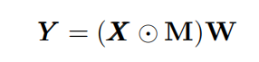
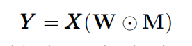
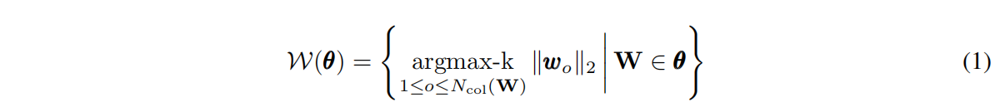
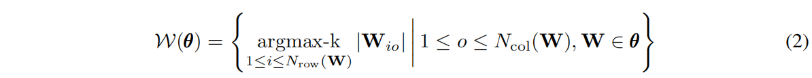

# 20190922

## paper summary：

论文题目：Targeted Dropout

论文链接：https://openreview.net/pdf?id=HkghWScuoQ

### 一、该论文拟解决的问题：

神经网络因为其有大量参数而显得极为灵活，这对于学习过程而言非常有优势，但同时也意味着模型有大量冗余。这些参数冗余令压缩神经网络，且还不会存在大幅度性能损失成为可能。在Targeted Dropout之前的dropout，它会随机删除一些神经元或权重以获得不同的【架构】。Targeted Dropout的提出，是想解决原本dropout可能丢失关键信息神经元的问题。

### 二、方法：

Targeted Dropout想结合Unit Dropout与Weight Dropout两种思想，对于具有输入张量X、权重矩阵W、输出张量Y和Mask M服从于分布 Bernoulli(α)的全连接层有：

- Unit Dropout:在每一次更新中都会随机删除单元或神经元，因此它能降低单元之间的相互依赖关系，并防止过拟合。

  

​                                                        

- Weight Dropout:在每一次更新中都会随机删除权重矩阵中的权值。直观而言，删除权重表示去除层级间的连接，并强迫神经网络在不同的训练更新步中适应不同的连接关系。

  

基于数量级的剪枝，该方法将 k 个最大的权重数量级视为最重要的连接。我们一般可以使用 argmax-k 以返回所有元素中最大的 k 个元素（权重或单元）。

- 单元剪枝，考虑权重矩阵列向量的 L2 范数：

- 权重剪枝 [10]，若 top-k 表示相同卷积核中最大的 k 个权值，考虑权重矩阵中每一个元素的 L1 范数：

其中权重剪枝一般能保留更多的模型准确度，而单元剪枝能节省更多的计算力。

简单的介绍了上面的一些方法，下面是Targeted Dropout具体实现方法：

- 考虑一个由θ参数化的神经网络，且希望按照Unit Dropout和Weight Dropout定义的方法对W进行剪枝。因此，希望找到最优参数θ* ，它能令损失函数 ε(W(θ* )) 尽可能小的同时，令|W(θ* )|≤k，即希望保留神经网络中最高数量级的k个权重。一个确定性的实现可以选择最小的|θ|−k个元素，并删除它们。但是如果这些较小的值在训练中变得更重要，那么它们的数值应该是增加的。因此，通过利用targeting proportion γ和删除概率α，将随机性引入到了这个过程中。其中targeting proportion表示会选择最小的γ|θ|个权重作为Dropout的候选权值，并且随后以删除概率α独立地去除候选集合中的权值。这意味着在Targeted Dropout中每次权重更新所保留的单元数为(1−γ*α)|θ|。Targeted Dropout降低了重要子网络对不重要子网络的依赖性，因此降低了对已训练神经网络进行剪枝的性能损失。

### 三、思考

- 在看本篇论文需要有一些的数学基础，比如张量运算（Unit Dropou和tWeight Dropout中的公式，这边的知识需要补起来）；以及剪枝公式那边需要再去了解一下。
