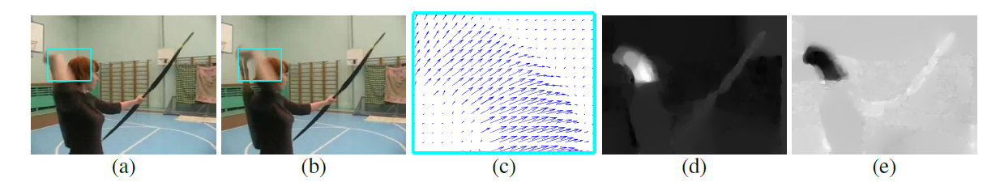
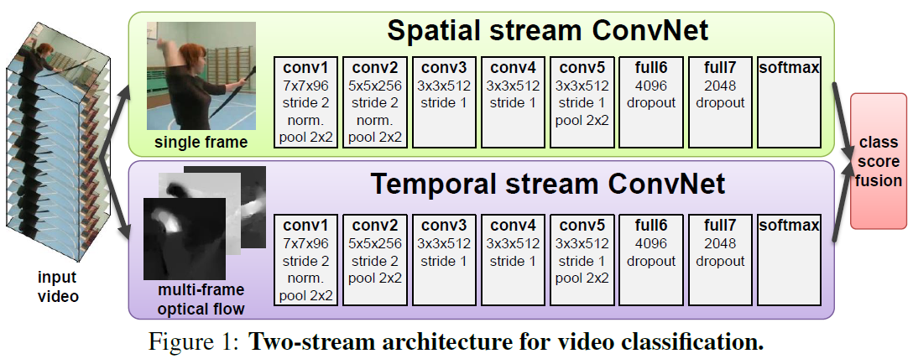
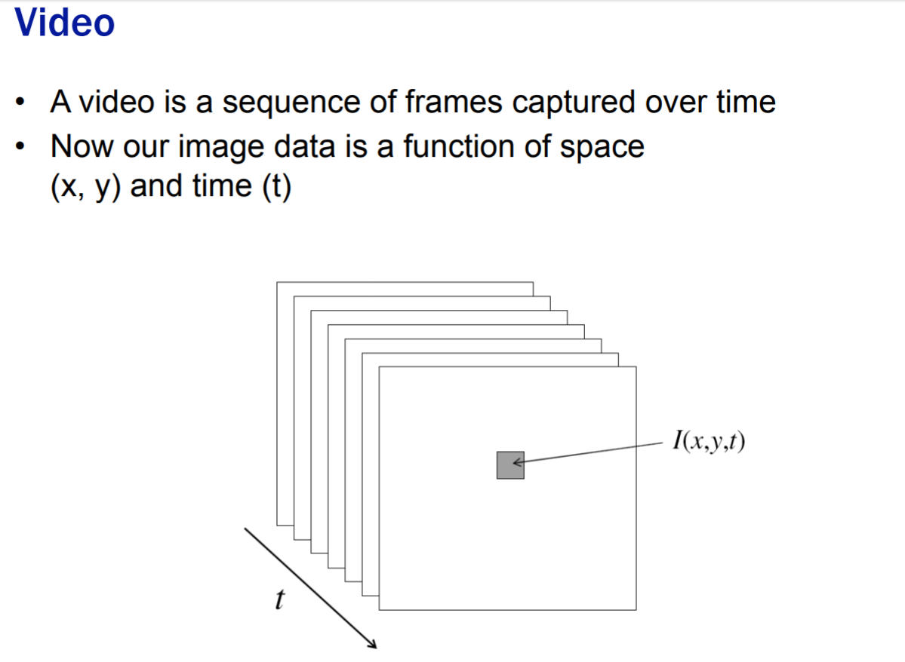

# Weekly Report

August 23, 2018

Yingyan Shi

shiyingyan12@qq.com

Brain Chip Research Center, Fudan University

***

[TOC]

# Motion and Optical Flow

**Optical flow** refers to the visible motion of an object in an image, and **the apparent 'flow' of pixels** in an image. It is the result of 3D motion being projected on a 2D image plane.

Separately computing on the horizontal and vertical components of optical flow:

- horizontal component d~x~  
- vertical component d~y~

(d)(e): higher intensity corresponds to positive values, lower intensity to negative values.

**Disadvantage：** 
Real motion may or may not give rise to optical flow. For example consider a sphere which is uniformly illuminated is rotating about the axis parallel to image plane. It won't give any apparent information of motion of pixel flow in the image, and the sphere will appear still.

Similarly, a static object may give rise to optical flow in some cases. For example consider the same sphere, but this time it is stationary. Suppose the light source moves constantly, it will give rise to optical flow on the image.

# Two-Stream Convolutional Networks for Action Recognition in Videos

Visual Geometry Group, University of Oxford

NIPS 2014

## Idea 

To generalize the best performing hand-crafted features within a data-driven learning framework.

## Challenge

To capture the complementary information on **appearance** from still frames and **motion** between frames.

## Related Work

A large family of video action recognition methods is based on shallow high-dimensional encodings of local spatio-temporal features.

1. Histogram of Oriented Gradients (HOG)
2. Histogram of Optical Flow (HOF)
3. Bags of  Features (BoF), encoding features above
4. SVM classifier
5. Motion Boundary Histogram (MBH), following dense point trajectories computed using optical flow

## Contribution

1. Propose a two-stream ConvNet architecture which incorporates spatial and temporal networks. (Figure 1) **decoupled**
2. Hand-crafted features are fed into ConvNet: Multi-frame dense optical flow.
3. **Multi-task learning:**  trained on two different action classification datasets,  UCF-101 and HMDB-51. Additional tasks act as a regularizer, and allows for the exploration of additional training data. 
   1. two SoftMax layers on the top of the last fully-connected layer: one computes HMDB51 classification scores, the other the UCF-101 scores.
   2. Each of the layers is equipped with its own loss function.

## Training

1. Mini-batch size 256, uniformly across all video classes, from each of which a single frame is randomly selected.
2. learning rate setting: initially **10^-2^**. When training a ConvNet **from scratch**, the rate is changed to **10^-3^** after **50k** iterations, then to **10^-4^ ** after **70k**  iterations, and training is stopped after **80k**  iterations. In the **fine-tuning** scenario, the rate is changed to **10^-3^**  after **14k**  iterations, and training stopped after **20k** iterations.
3. Pretraining the spatial ConvNet on ImageNet ILSVRC-2012.
4. Multi-GPU training, implemented by **Caffe** toolbox modified significantly, splitting each SGD batch across several GPUs.
5. Optical flow is computed by the **OpenCV** toolbox. But to reduce computation time during training, pre-compute the flow and rescale linearly it to a [0, 255] range 

# Environment Building

Ubuntu16.04 + Anaconda3 + PyCharm2018 + OpenCV3 *uncompleted*

# Appendices

Euclidean space ( or Cartesian space)

Projective space

http://www.docin.com/p-1647179297.html

Homogeneous Coordinates

http://www.songho.ca/math/homogeneous/homogeneous.html

