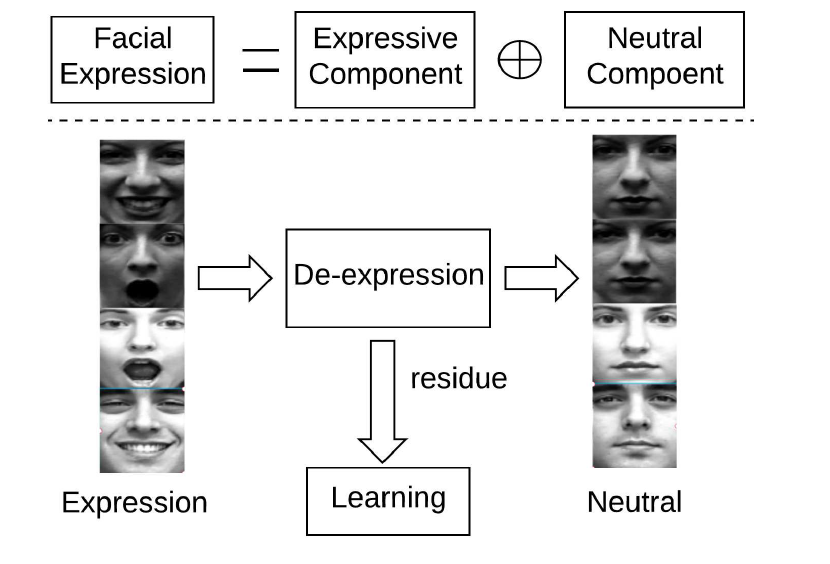
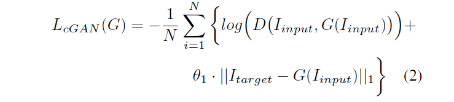
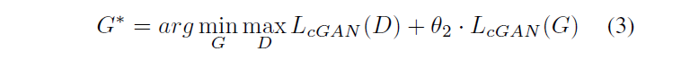
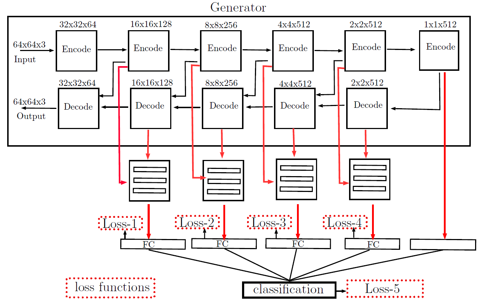
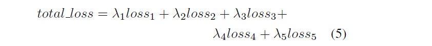
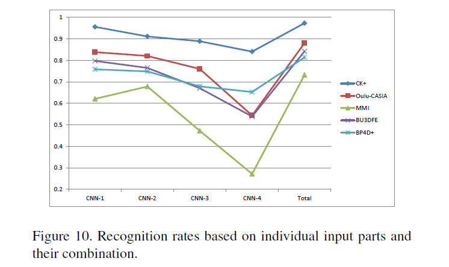
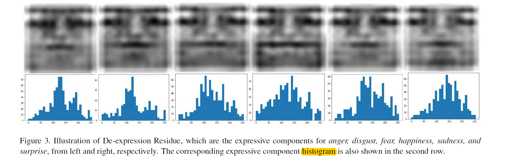
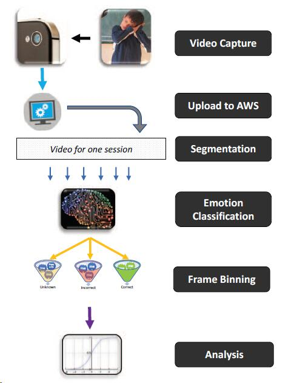
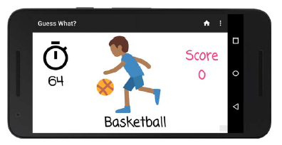

# Weekly Report

August 30, 2018

Yingyan Shi

shiyingyan12@qq.com

Brain Chip Research Center, Fudan University

***

[TOC]

# Generative Adversarial Networks

Online course by Hung-yi Lee, 2018

Video link: https://www.bilibili.com/video/av24011528?from=search&seid=2423494053064598440

Course slides and notes located in `BCRC-ASAGroup/YingyanShi/GAN` 

# Facial Expression Recognition by De-expression Residue Learning

State University of New York at Binghamton

CVPR 2018

source code not provided

novel idea: Expression = Expressive + Neutral (baseline)

using 7 different datasets for pretraining and fine-tuning

语焉不详 ambiguous somewhere, e.g. local CNN architecture and loss function

## Idea

Expression = Neutral + Expressive

Method name: DeRL (De-expression Residue Learning)

1. Learning the neural face generation by **cGANs**.
2. Learning from the **intermediate layers** of the generator to classify expressive component.

The expressive component that has been filtered out is still "deposited" in the generative model which also mitigates the influence of individual identity.

The objective for Discriminator:

The objective for Generator:

L2 loss is prone to over-blurring the output image.

The final objective:

All intermediate layers that have the same size are **concatenated** and input into a **local** CNN model for facial expression classification. 

## Framework 

The total loss function:

Settings based on individual local CNN performance:		λ1=**0.7**	λ2=**0.5**	λ3=0.3	λ4=0.2	λ5=1.0

Illustration of De-expression Residue

## Implementation Details

1. **face alignment:** three landmark points (the center of eyes, and the chin) or TSM for face detection and landmark localization.
2. **resize:** crop and resize the aligned face region to the size of 70x70
3. **data augmentation：** 11x larger than the original
   1. five 64x64 patches are **cropped-out** from five locations of each image (center and four corners, respectively). 
   2. Each image patch is **rotated** by [-15, -12, -9, -6, -3, 0, 3, 6, 9, 12, 15] degree respectively. 
   3. **Horizontally flipping** is also applied.
4. **Pre-training** on the BU-4DEF, which has expressive image sequences from neutral to peak expression, ending with neutral again, **fine-tuning** on CK+, Oulu-CASIA, MMI, BU_3DFE, and BP4D+ datasets.
5. Adam optimizer with a batch size of 150, momentum of 0.9 and dropout of 0.5 for fc layers. 
6. 200 epochs to train the generative models and 50 epochs for classification models.
7. Implemented using TensorFlow on the GeForce GTX 1080 platform.

Our future work will incorporate the expressive components with temporal information for addressing the
issues of AU detection, as well as 3D face analysis with a variety of head poses and subtle facial changes.

Deep Models的设计主要有两条线，一条是设计更加优秀的网络结构（例如从AlexNet到CliqueNet）；另一条是设计更好的Loss Function（比如Face Verification中的一大批Loss），其目的依然是为了让intra-class更加的compact，而inter-class更加地可区分，从而提升分类精度。

#  A Gamified Mobile System for Crowdsourcing Video for Autism Research

Stanford University

2018 IEEE International Conference on Healthcare Informatics (ICHI)

4-7 June 2018, New York, USA 

Google h5 index: 16

## Motivation

Most children with Autism Spectrum Disorder (ASD), struggle to make eye contact, recognize facial expressions, and engage in social interactions with their family and peers. 

A mobile charades-style game, Guess What?, introduced to evoke, record and analyze facial expressions of children playing with it.

## Contribution

1. Building a applied system framework for autism research, based on home video using phone game.

## Detail

Children act out various images shown on the phone while being recorded by their parents, who attempt to guess the prompt. The parent labels the video by tilting the phone after they have correctly identified what their child is expressing, at which time another prompt is presented until time is up.

The percentage of frames within a video in which the face tracker fails can be used as a general heuristic for a lack of facial engagement by the child during the game.

Facial-expression recognition algorithm: “A practical approach to real-time neutral feature subtraction for facial expression recognition", in 2016 IEEE Winter Conference on Applications of Computer Vision (WACV).

# A Practical Approach to Real-Time Neural Feature Subtraction for Facial Expression Recognition

Stanford University

2016 IEEE Winter Conference on Applications of Computer Vision (WACV)

