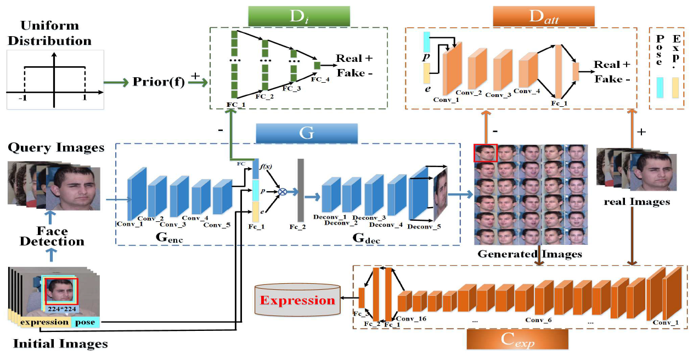

# Weekly Report

September 12, 2018

Yingyan Shi

shiyingyan12@qq.com

Brain Chip Research Center, Fudan University

*****

## Supporting Vector Machine

周志华《机器学习》Chapter 6 支持向量机

从零构建支持向量机（SVM） location：`BCRC-ASAGroup/YingyanShi/SVM`

* Convex Optimization    *hard to understand*

## Joint Pose and Expression Modeling for Facial Expression Recognition

CVPR 2018

Jiangsu University

National Laboratory of Pattern Recognition, Institute of Automation, Chinese Academy of Sciences

