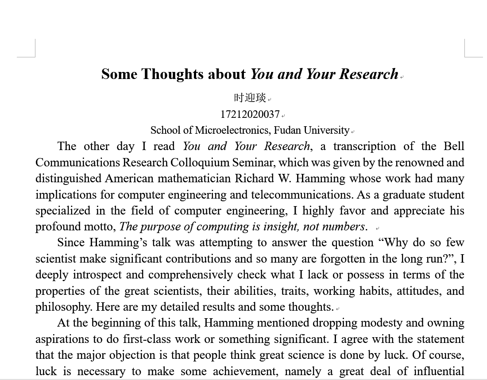

# Weekly Report

October 31, 2018

Yingyan Shi

shiyingyan12@qq.com

Brain Chip Research Center, Fudan University

*****

## What has done last week？

1. English writing (course assignment): *Some Thoughts about You and Your Research* (1200 words)
2. Preparation for presentation within the group: Key points extracted from You and Your Research
3. Preparation for presentation required by the course this Saturday: A highly flexible and sensitive piezo resistive sensor based on MXene with greatly changed interlayer distances

