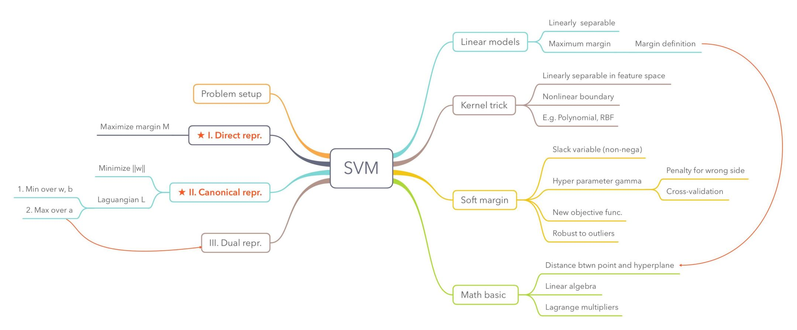
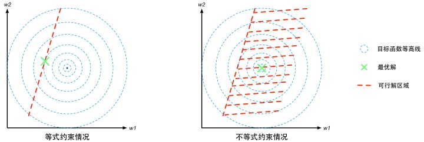
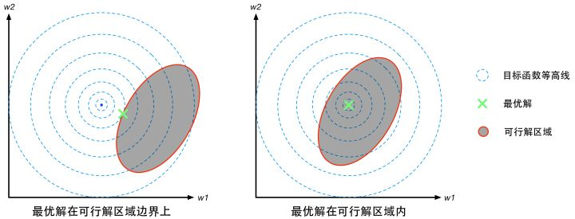
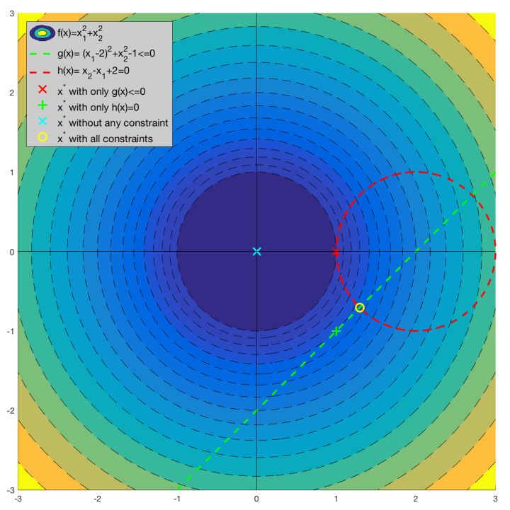
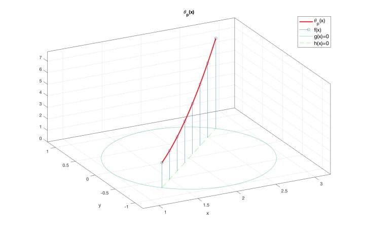

# Weekly Report

November 7, 2018

Yingyan Shi

shiyingyan12@qq.com

Brain Chip Research Center, Fudan University

*****

[TOC]

# Machine Learning Workshop

## Support Vector Machines

**Prologue:**  Ideas in Machine Learning have a "winner takes all" quality. When an idea takes off, it dominates the field so completely that one tends to believe it is the only idea worth pursuing. Today, Deep Learning is cool. A few years back learning algorithms like Random Forests and Support Vector Machines (SVMs) were just as cool. These traditional methods have some benefits over Deep Learning in certain application domains. They sometimes need less data to train on and it takes minutes (instead of hours or days) to train. Fast training time means you can perform more experiments and bring a product to market faster. A good machine learning engineer is not married to a specific technique. They learn a bag of tools and apply the right tool for the right problem. (Source: https://www.learnopencv.com/support-vector-machines-svm/)

周志华《机器学习》Chapter6 支持向量机

SVM Mind-Map:

1. The left side shows basic representations and topic for one SVM problem.
2. The right side shows extensions for general SVM.

Source: https://leightonzhang.com/2016/08/26/things-to-know-about-support-vector-machine-svm/

**Epilogue:** It is quite troublesome for its math derivation from intuition to a tractable solution, but a off-the-shelf model.

## Optimization with Constraints

### Lagrange Multipliers

### Illustrations

## References

1. 零基础学SVM—Support Vector Machine(一) - 知乎  https://zhuanlan.zhihu.com/p/24638007
2. 零基础学SVM—Support Vector Machine(二) - 知乎  https://zhuanlan.zhihu.com/p/29865057
3. 用一张图理解SVM的脉络  https://mp.weixin.qq.com/s/qVhRQr92gBkUjXGymkXGZw
4. Things to know about support vector machine (SVM) – Leighton Zhang  https://leightonzhang.com/2016/08/26/things-to-know-about-support-vector-machine-svm/ 

**BCRC Workshop on Machine Learning**

第一弹：纯白板手推SVM

Speaker：时迎琰

Time：Group meeting on November 10, 2018

Duration:  1 hour

Warm up for *Double Eleven Day*