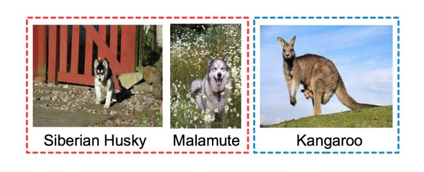
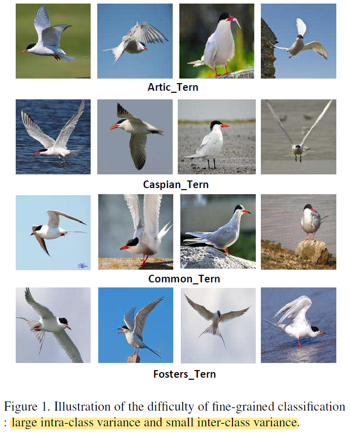
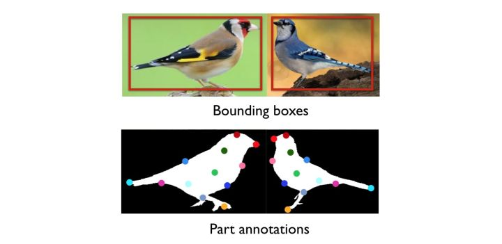
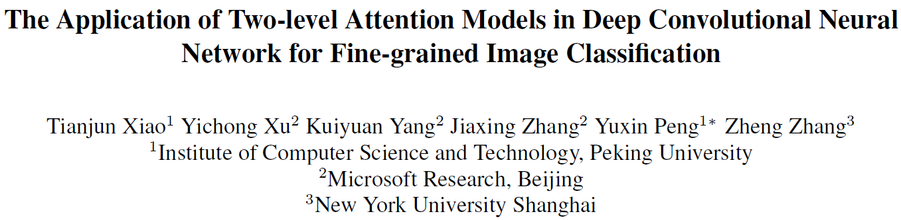
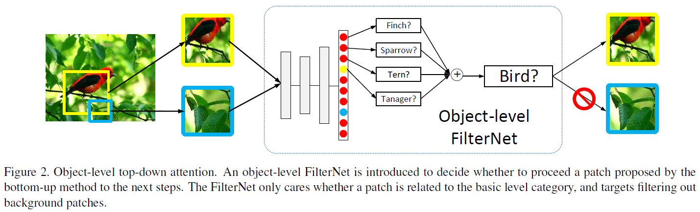
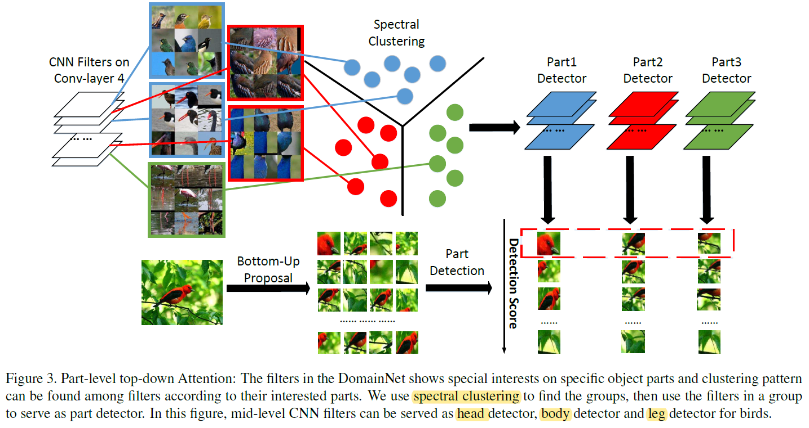
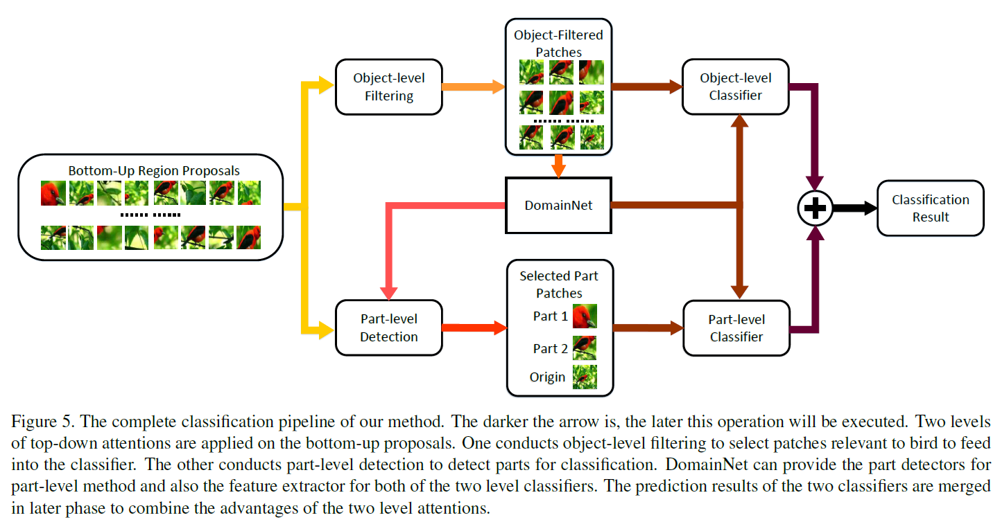
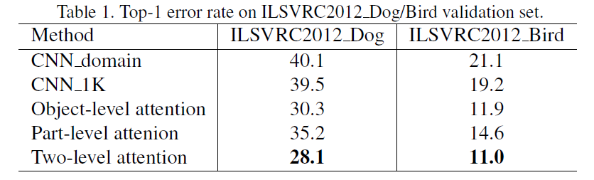

# Weekly Report

November 14, 2018

Yingyan Shi

shiyingyan12@qq.com

Brain Chip Research Center, Fudan University

-----

[TOC]

## Flags

Paper submission deadline

**IJCAI 2019：** **Feb 25 2019**  (IJCAI 2018: received 3470, accepted 710, ratio **20.5%**)

**ICCV 2019： ** **Mar 1 2019**   (ICCV 2017: received 2143, accepted 621, ratio **29%**)

*DDL is the first productivity.*

## Fine-grained image analysis

细粒度图像分析任务相对通用图像（general/generic images）任务的区别和难点在于其图像所属类别的粒度更为**精细**。

正因为同类别物种的不同子类往往仅在耳朵形状、毛色等细微处存在差异，可谓“差之毫厘，谬以千里”。不止对计算机，对普通人来说，细粒度图像任务的难度和挑战无疑也更为巨大。鸟类，狗，车等子类分类和检索，哪怕是属于同一子类的图像本身也具有形态、姿势、颜色、背景等巨大差异。

### Taxonomy

Fine-grained image analysis

1. Fine-grained image classification
   1. strong supervision constraints
   2. **weak supervision constraints (related to my research)**
2. Fine-grained image retrieval
   1. text-based
   2. image-based

### Fine-grained image classification with strong supervision constraints

所谓“强监督细粒度图像分类模型”是指，在模型训练时，为了获得更好的分类精度，除了图像的类别标签外，还使用了物体标注框（object bounding box）和部位标注点（part annotation）等额外的人工标注信息。

### Fine-grained image classification with weak  supervision constraints

标注信息的获取代价十分昂贵，在一定程度上也局限了这类算法的实际应用。因此，目前细粒度图像分类的一个明显趋势是，希望在模型训练时仅使用图像级别标注信息，而不再使用额外的part annotation信息时，也能取得与强监督分类模型可比的分类精度。这便是“基于弱监督信息的细粒度分类模型”。

**CVPR 2015**

1. Object-level Attention 物体级
2. Part-level Attention 部件级

Datasets: 

1. ILSVRC2012_Dog (153,773 images of 118 breeds)
2. ILSVRC2012_Bird (79,491 images of 59 types)

**Steps:**

1. 首先利用selective search从图像中提取出很多patches(这些patches包含潜在的目标), 但这些patches中有很多patch是噪声(例如在一个鸟的细粒度分类中产生了树枝等背景的patch) 
2. 去除第1步产生的noisy patches： 
  利用预训练(利用ImageNet中鸟的子类训练)的CNN网络(文章称为FilterNet)筛选出包含正样本的patch。 
3. 利用FilterNet挑选出的patch训练一个CNN网络(本文称之为DomainNet) 
4. object-level attention: 
  对于一幅图像，利用步骤1提取出很多patch后，首先经过步骤2的FilterNet去除树枝树叶等noisy patch,从而挑选出包含鸟的patch，这些patch经过DomainNet后计算出最后一层(SoftMax层)的平均类别分布 
5. Part-Level Attention: 
  DomainNet的隐藏层的神经元呈现一种聚类的模式(clustering pattern)，例如第4个卷积层的某些神经元对鸟的头部有响应，另外的某些神经元对鸟的腿部有响应。**conclusion by observation** 
  将DomainNet的第4个卷积层的filters(其实是第4个卷积层不同的channel)根据相似性做谱聚类(spectral clustering)，将第4个卷基层的filters分为k类。 
  本文取k=3，这3类可以检测不同的parts(如分别检测鸟的头部，腿，腹部)。分别挑选出这3个类最大得分所对应的的patch，这些patch即为有区分的part。将这些parts调整大小后输入到DomainNet得到激活值。将不同parts的激活值和原图像的激活值连接起来，训练一个SVM分类器。 
6. 计算最终得分 
  final score = object score + α * part score 
  object_score是第4步object attention的SoftMax层的输出，part_score是第5步SVM的决策值。

具体实现：将最后SoftMax层输出中所有属于父类的分数相加（例如把所有品种的鸟的得分相加），并设定一个阈值threshold=0.9，去除不包含鸟的patch，会得到大约40个包含object的patches。

Empirically，we observe clustering pattern in the in we observe clustering pattern in the internal hidden representations inside the DomainNet.
Recently, there have been convincing evidence that features derived by CNN can deliver superior performance over hand-crafted ones.
There are groups of neurons respond to bird head, and others to bird body, despite the fact they may correspond to different poses. In hindsight, this is not at all surprising, given that these features indeed “stand out” and “speak for” a category.

*final_score = object_score + 0.5 \* part_score*

细粒度图像分析任务在过去的十年里一直是计算机视觉中的热门研究领域，尤其在深度学习繁荣的近几年，方法和问题可谓“常做常新”。不过随着深度学习方法研究的深入，在传统细粒度图像分析问题上，如**鸟类、狗、车型**等子类分类和检索，尤其分类问题的准确率，可以说是到了瓶颈期**bottleneck**。虽然时常会有不少细粒度图像分类工作问世，但每年也大概只能将分类准确率提升1个百分点左右（在经典的**鸟类**分类上，目前强监督分类模型为**87.3%**左右，弱监督模型为**84.1**%左右）。这便催生了细粒度图像分析任务的不同设定，如基于网络数据的细粒度图像分类、基于wiki知识获取的细粒度图像分类等等。

同时，更加广义的“细粒度图像分析”研究也越来越多。常见的行人重检测（person Re-ID）、人脸判别（face verification）、示例级别检索（instance retrieval）等问题都可以用传统细粒度图像分析的思路去解决，也期待更加优秀的相关工作出现。

## Reference

「见微知著」——细粒度图像分析进展综述 - 知乎  https://zhuanlan.zhihu.com/p/24738319

Paper layout:
1. Title
2. Author
3. Abstract
4. Introduction
5. Related work
6. Proposed method
7. Experiment results
8. Conclusion
9. Acknowledgment
10. Reference

**Computational thinking** is the thought processes involved in formulating a problem and expressing its solutions in such a way that a computer human or machine can effectively carry out.

An iterative process based on three stages:

1. **Abstraction:** Problem formulation
2. **Automation:** Solution expression
3. **Analysis:** Solution execution and evaluation