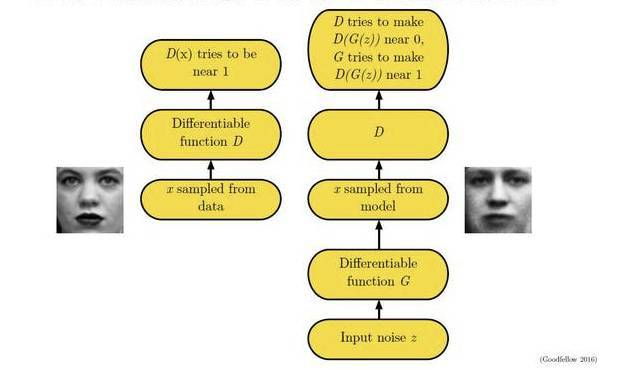
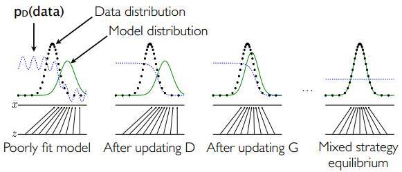

# Weekly Report

Nov 21, 2018

Yingyan Shi

shiyingyan12@qq.com

Brain Chip Research Center, Fudan University

-----

[TOC]

## Course reading materials

1. *On Reading Academic Literature (Strategically)* by Dr. Anthony Bernier, 6 pages

2. *How to Read a Paper* by S. Keshav, 3 pages, School of Computer Science, University of Waterloo

Both of those two articles are interesting and stimulating, contributing directly to my academic and scholarly material reading greatly, which deserve recommendation consequently.

Key points:

1. Central Question
2. Answer (thesis)
3. Reading Backwards (the concluding section and the introduction)
4. the Three-Pass Approach
   1. a general idea
      1. carefully read the title, abstract, and introduction
      2. read the section and sub-section headings, but ignore everything else
      3. read the conclusions
      4. glance over the references, mentally ticking off the ones you've already read
   2. paper's content
      1. ignore details such as proofs
      2. jot down the key points
      3. make comments in the margin
      4. common mistakes will separate rushed, shoddy work from the truly excellent
   3. in-depth understanding
      1. attempt to virtually re-implement the paper
      2. reconstruct the entire identity of the paper from memory.
      3. identify its strong and weak points

More details in the article.   `Yingyan Shi/1121/How_to_read_a_paper.pdf`

## GAN lecture

首先，先介绍一下生成模型（**generative model**），它在机器学习的历史上一直占有举足轻重的地位。当我们拥有大量的数据，例如图像、语音、文本等，如果生成模型可以帮助我们模拟这些高维数据的分布，那么对很多应用将大有裨益。

针对数据量缺乏的场景，生成模型则可以帮助生成数据，提高数据数量，从而利用**半监督学习**提升学习效率。语言模型（language model）是生成模型被广泛使用的例子之一，通过合理建模，语言模型不仅可以帮助生成语言通顺的句子，还在机器翻译、聊天对话等研究领域有着广泛的辅助应用。

Vanilla Generative Adversary Networks by 王承斌

**Implementation by PyTorch:**

Code directory:  `Yingyan Shi/1121/GAN.py ` (detailedly annotated)

Source:   https://github.com/yunjey/pytorch-tutorial/tree/master/tutorial/03-advanced/generative_adversarial_network/ 

**Illustration**

