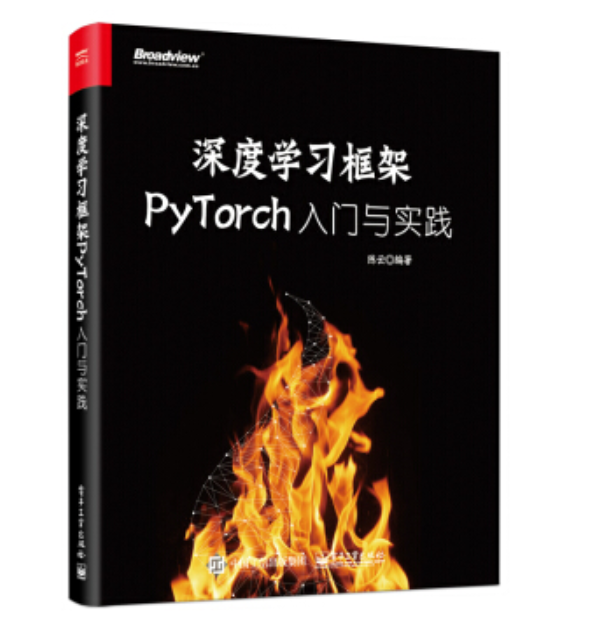
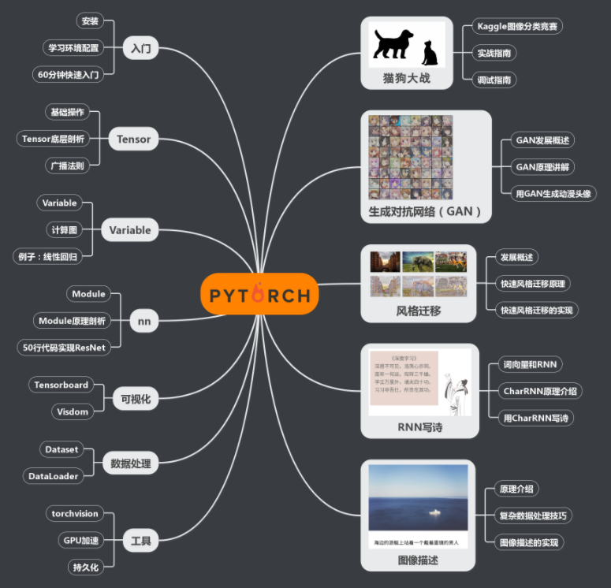

# Weekly Report

Dec 5, 2018

Yingyan Shi

shiyingyan12@qq.com

Brain Chip Research Center, Fudan University

-----

[TOC]

## Building a general experimental platform with PyTorch

Building well-organized project for my research experiments.

 `desktop:  home/yingyan/General_Platform/`

PyTorch v0.41

Python 3.6

## PyTorch book

书籍《深度学习框架PyTorch：入门与实践》的对应代码v0.41

https://codeload.github.com/chenyuntc/pytorch-book/zip/master

## Calculus on Computational Graphs: Backpropagation

http://colah.github.io/posts/2015-08-Backprop/

