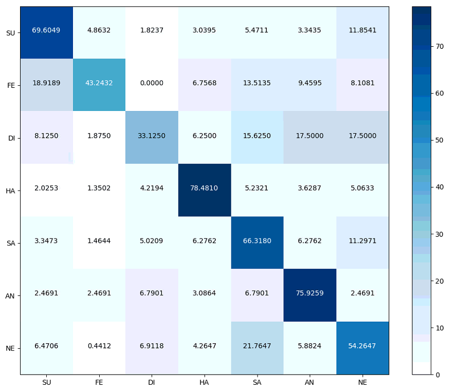
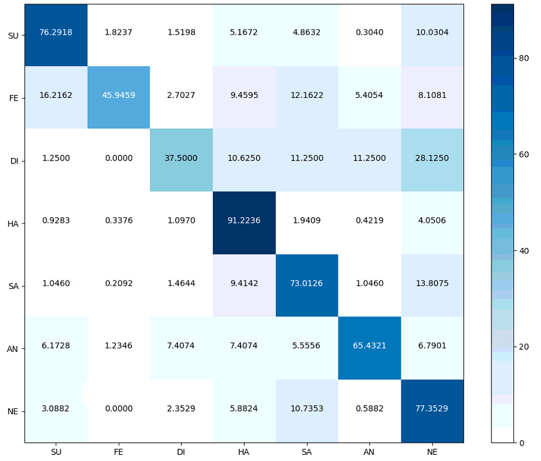

February 10, 2020

**Guidelines:**

Pose-invariant, subject-independent, expression-discriminative representation learning

**Experiments:**

1. baseline: directly regress 3DMM expression coefficients

2. multi-task learning: jointly regress 3DMM expression coefficients and 2D facial landmarks

**Optimization:**

3DMM coefficients adaptively weighted, triplet loss/ contrastive loss, face recognition

Choose the appropriate **architecture** (ResNet 50 / face analysis network / which layers to share) and **hyper-parameters** to demonstrate the effectiveness of Multi-Task Learning, i.e. each component contributes to the overall performance.

**Goal:**

ACM Multimedia Conference 2020

- Regular Papers Submission (Abstract)  21 Mar 2020

- Regular Papers Submission  28 Mar 2020
