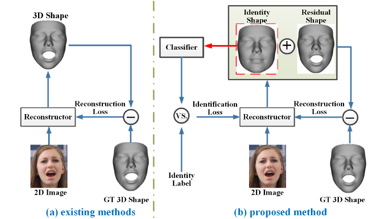
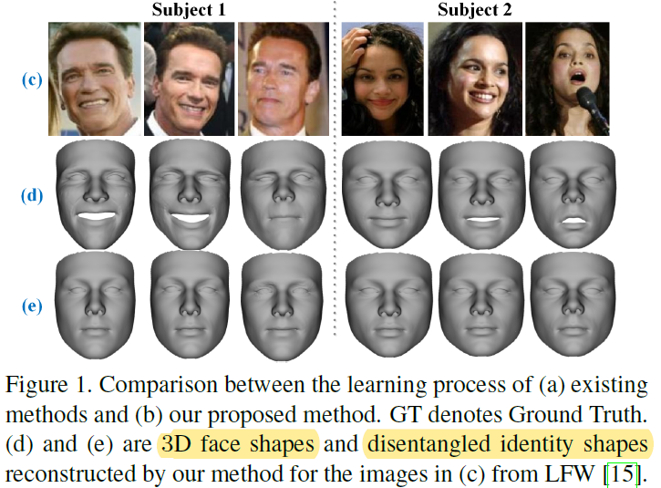
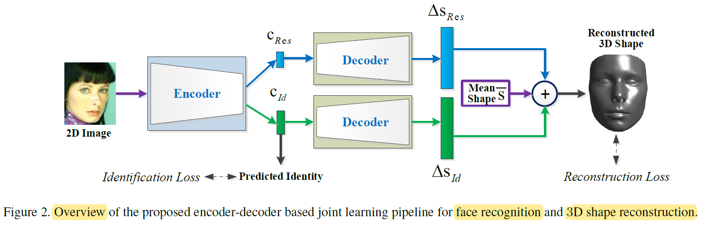
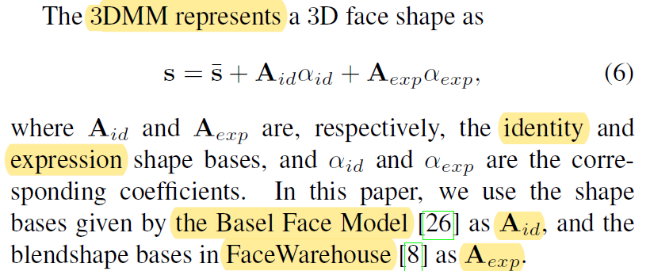
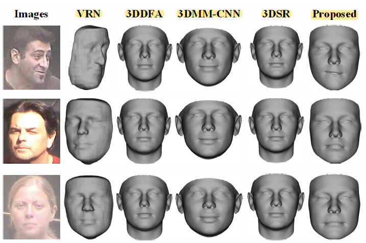
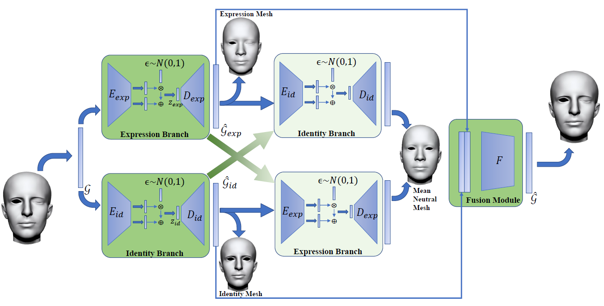
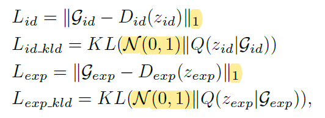
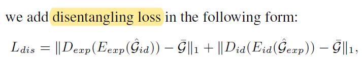
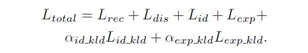
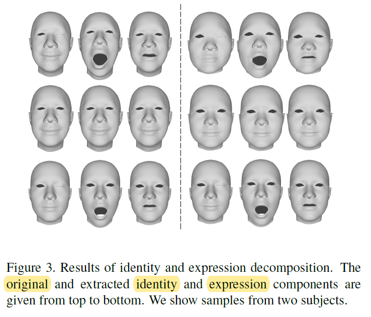

February 17, 2020

**Disentangling Features in 3D Face Shapes for Joint Face Reconstruction and Recognition**

CVPR 2018

Michigan State University

Simultaneously accomplish:

1. reconstructing accurate 3D face shapes
2. learning discriminative shape features for face recognition

Disentangle 3D face shape:

1. the identity-sensitive features
2. the identity-irrelevant features (residual shape features)

$$
S = \bar{S} + \Delta S_{id} + \Delta S_{res}
$$

Training Process:

* Phase I: Encoder (SOTA face recognition network), using 3DMM coefficients as ground truth

* Phase II: Decoder (two-layer MLP), recovering 29,495 vertices for 3D face point clouds

* Phase III:  Encoder + Decoder **end-to-end training**
  $$
  Loss = \lambda L_{rec} + L_{id}
  \\
  L_{rec}: the\ Euclidean\ loss
  \\
  L_{id}: the \ softmax \ loss
  $$

Expand the limited capacity of 3DMM linear combination of predefined bases.

----

**Disentangled Representation Learning for 3D Face Shape**

CVPR 2019

USTC

3D face shape (mesh ***M***):

1. identity part (identity mesh ***M~id~***)
2. expression part (expression mesh ***M~exp~***)

Training process:

1. Phase I: decomposition network
2. Phase II: fusion networks
3. Phase III: entire work, end-to-end training

the identity part containing no expression information, the expression part no identity information

Dataset: FaceWareHouse (150 identities and 47 expressions for each identity)

