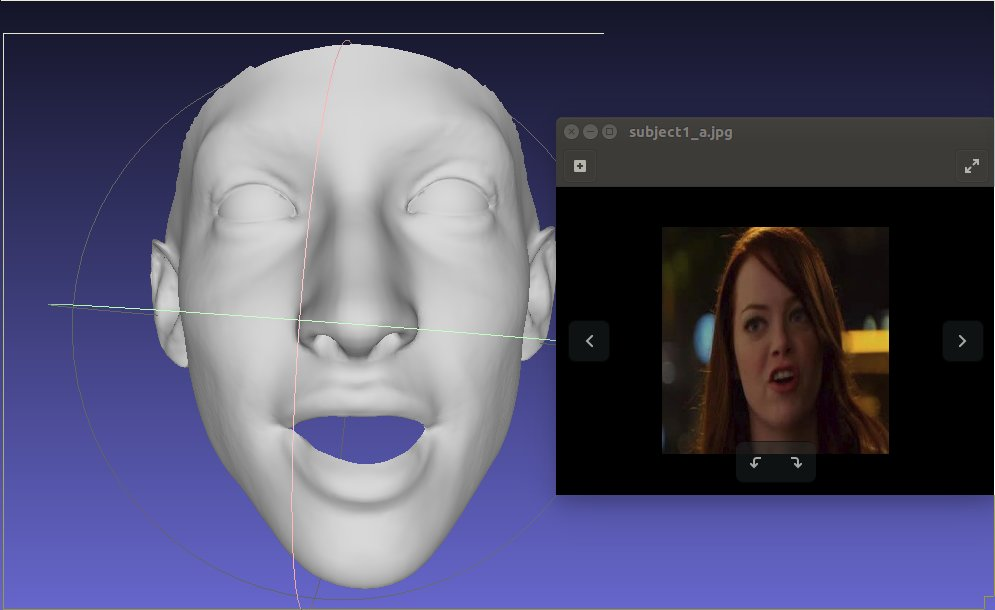
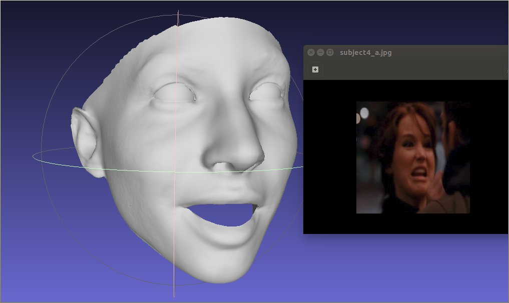
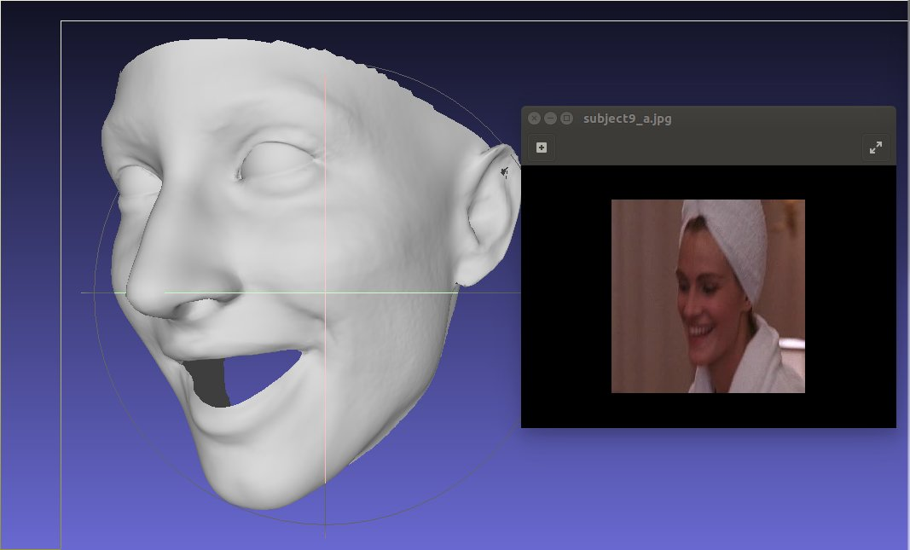
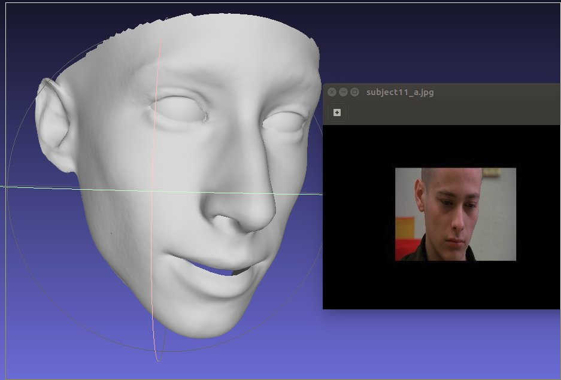

3DMM_projects

-----

**ExpNet: Landmark-Free, Deep, 3D Facial Expressions**

Test result:

1. Pose estimation: accurate
2. Shape & expression: appearing slightly generic and not discriminative 

Observation: Leave space to explore, incorporating 3D information, to achieve 3D-aided 2D FER.

**Existing related open-source projects:**  

1. Institute for Robotics and Intelligent Systems, USC
   1. ShapeNet: Regressing Robust and Discriminative 3D Morphable Models with a very Deep Neural Network, CVPR 2017
   2. FacePoseNet: Making a Case for Landmark-Free Face Alignment, ICCVW 2017
   3. Extreme 3D Face Reconstruction: Seeing Through Occlusions, arXiv 2017
   4. ExpNet: Landmark-Free, Deep, 3D Facial Expressions, FG 2018
2. Center for Biometrics and Security Research, CASIA
   1. High-Fidelity Pose and Expression Normalization for Face Recognition in the Wild, CVPR 2015 (√)
   2. Face Alignment Across Large Poses: A 3D Solution, CVPR 2016 (√)
3. OpenFace:  an open source facial behavior analysis toolkit, WACV 2016 (√)

Basel Face Model: A 3D face model for pose and illumination invariant face recognition, 2009 (√)

3D Image meshing and rotation using facial landmarks as constraints (√)

Obtain 3DMM shape & expression parameters of the dataset (ongoing)

Experimental framework to be built soon.

