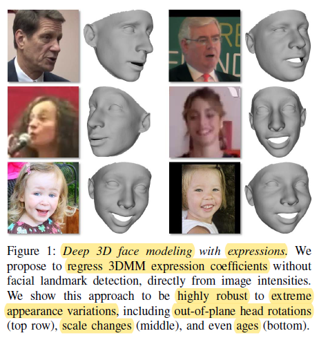
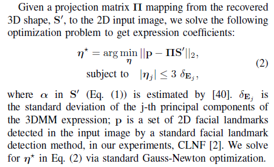
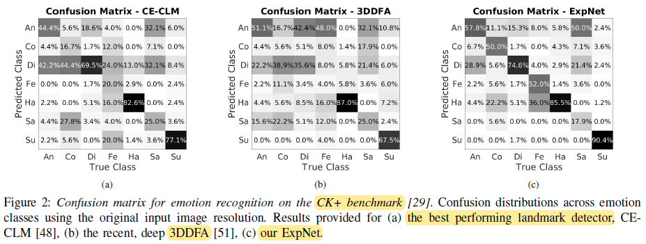
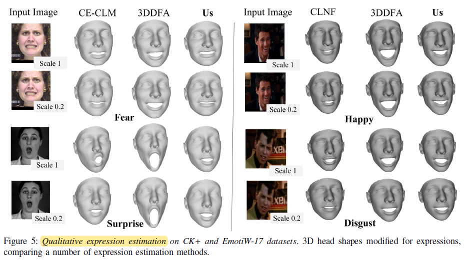

# ExpNet: Landmark-Free，Deep，3D Facial Expressions

University of Southern California

International Conference of Automatic Face & Gesture Recognition 2018  (FG 2018)

## Motivation

regress a 29D vector of 3D expression coefficients directly from image intensities.

## Representing 3D Faces and Expressions

$$
S'= \hat{s} + S\alpha + E\eta
$$

***S'***: 3D Morphable Model representation

***s^***: the average 3D face shape

**Shape variations**: a linear combination of shape coefficients ***α*** with 99 principal components ***S*** 

**Expression deformation**: a linear combination of expression coefficients ***η*** and 29 expression components ***E***

The vectors ***α*** and ***η*** control the intensity of deformations provided by the principal components.

## Generating 3D Expression Data

Code to obtain training label not available https://github.com/fengju514/Expression-Net

ResNet-101 architecture, L2 reconstruction loss

## Conclusion

The estimated 3DMM parameters were nearly as discriminative as opaque deep features extracted by deep networks trained specifically for recognition.

## Exploring Space

MTL framework:

1. 3D-aided facial expression recognition robust to pose variations (large pose)
2. 3DMM expression parameters discriminative 
3. Head pose estimation
4. 2D & 3D face alignment
5. Adaptive, hierarchical, attention, heatmap, auxiliary loss

## Reference

**Pose-Invariant 3D Face Alignment**
ICCV 2015
**Pose-Invariant Face Alignment with a Single CNN**
ICCV 2017
**Pose-Invariant Face Alignment via CNN-based Dense 3D Model Fitting**
IJCV 2017

------

**Joint Face Alignment and 3D Face Reconstruction**
ECCV 2016
**Joint Face Alignment and 3D Face Reconstruction with Application to Face Recognition**
TPAMI 2018

----

**3D Face Morphable Models “In-the-Wild”**
CVPR 2017
**3D Reconstruction of "In-the-Wild" Faces in Images and Videos** 
TPAMI 2018

-----

**Pose-Aware Face Recognition in the Wild**
CVPR 2016
**Learning Pose-Aware Models for Pose-Invariant Face Recognition in the Wild**
TPAMI 2018

----

**Regressing Robust and Discriminative 3D Morphable Models with a very deep Neural Networks**
CVPR 2017

**FacePoseNet: Making a Case for Landmark-Free Face Alignment**
ICCV Workshops 2017

**Extreme 3D Face Reconstruction: Seeing Through Occlusions**
arXiv 2017

------

**Joint 3D Face Reconstruction and Dense Alignment with Position Map Regression Network**
ECCV 2018
SJTU

----

**Large Pose 3D Face Reconstruction from a Single Image via Direct Volumetric CNN Regression**
ICCV 2017
The University of Nottingham, UK

-----

**Learning to Regress 3D Face Shape and Expression from an Image without 3D Supervision**
CVPR 2019

-----

**3D-aided face recognition robust to expression and pose variations**
CVPR 2014

-----

**3D-2D face recognition with pose and illumination normalization**

Computer Vision and Image Understanding 2017