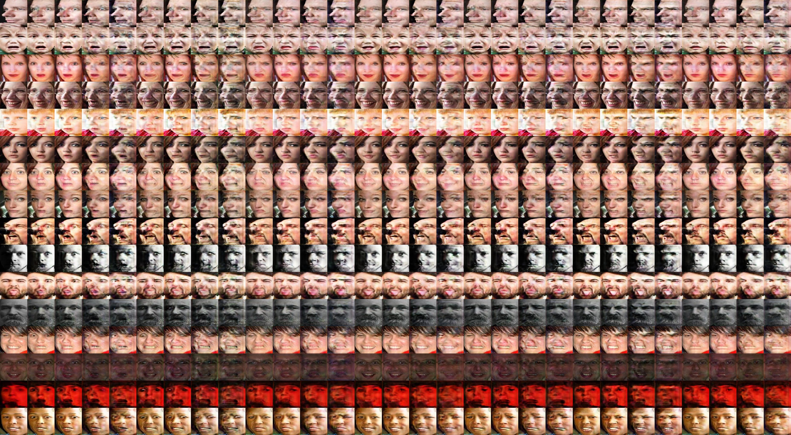
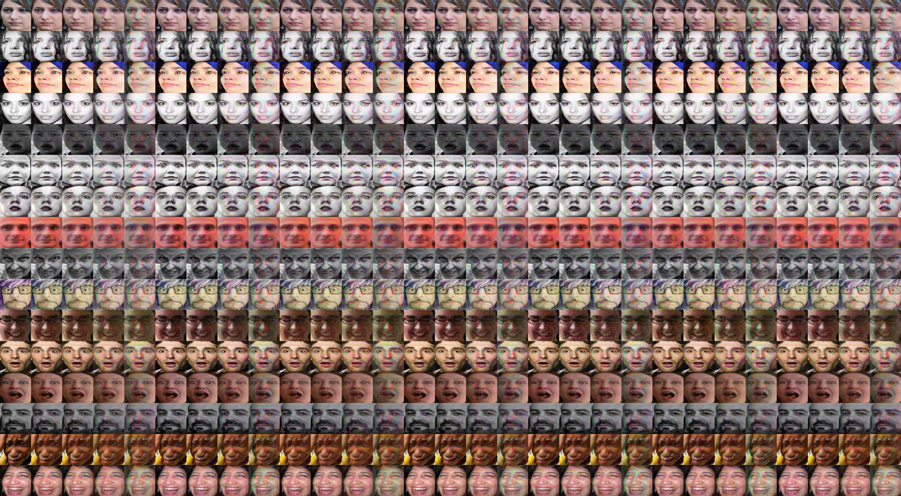
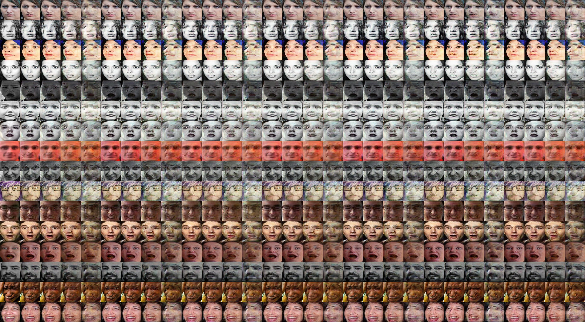
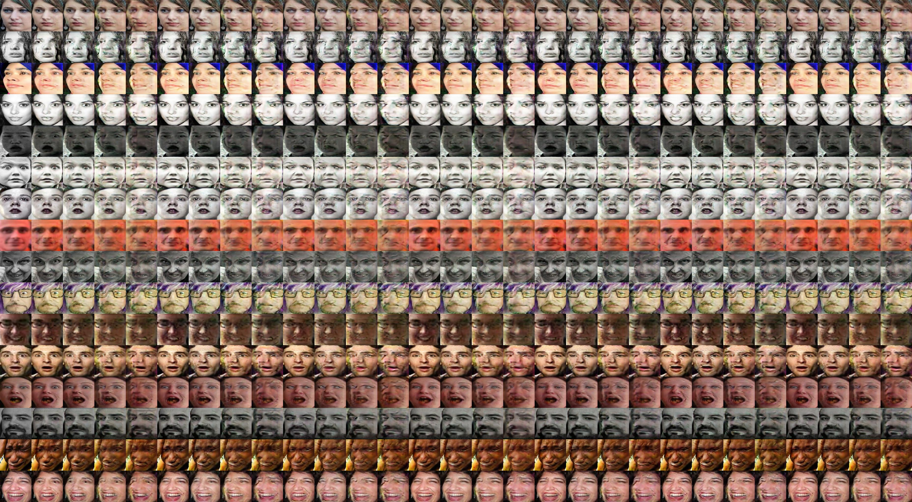
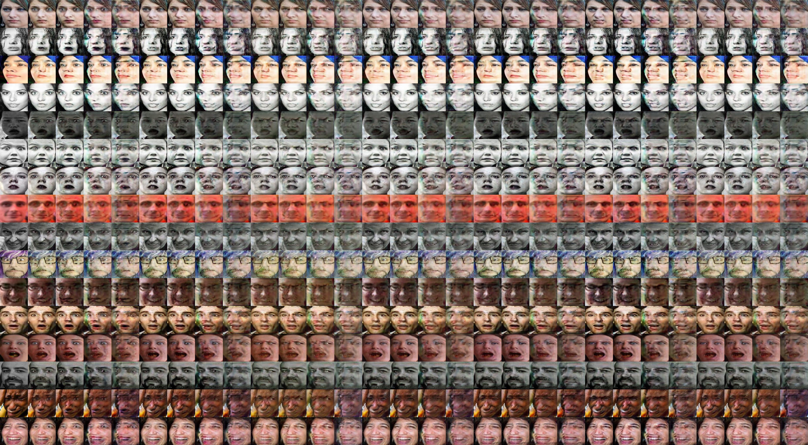
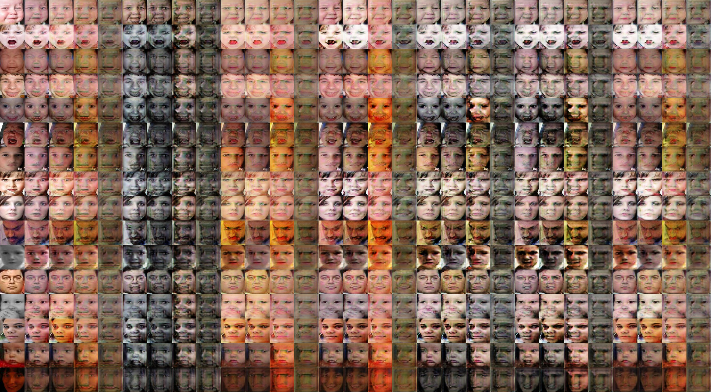
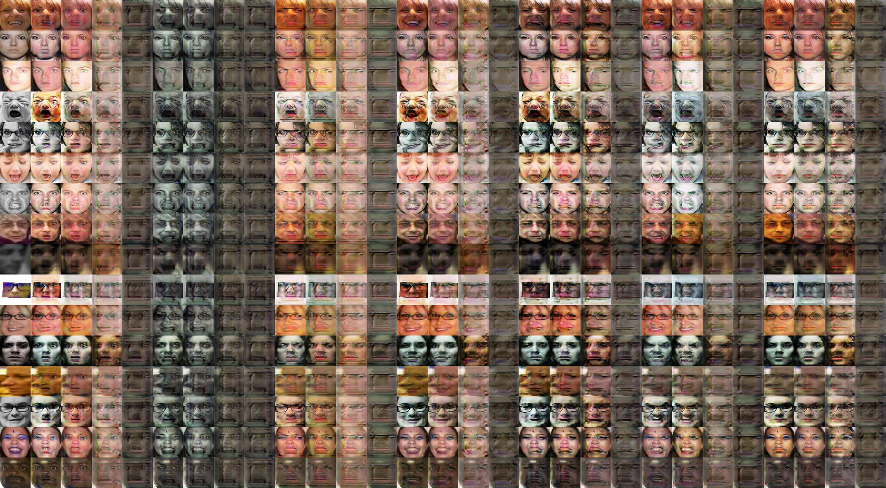

# In-the-wild facial expression synthesis and recognition

Yingyan Shi

yyshi17@fudan.edu.cn

School of Microelectronics, Fudan University

-----

[TOC]

## 0. Challenge

* larger pose
* sharper result
* breakthrough: modify generator architecture (asymmetry)
* the more photo-realistic , the more reliable the feature is, which is crucial to pose-invariant facial expression recognition

## 1. Vanilla StarGAN

* a G
* a D for pose and expression labels plus real/fake
* Adversarial loss (WGAN-gp)
* Reconstruction loss (L1)
* Cross entropy loss for Pose
* Cross entropy loss for Expression

## 2. Full components

* a G

* a D

* a Cexp (ResNet 34)

* Adversarial loss (WGAN-gp)

* Identity preserving loss

* Reconstruction loss (L1)

* Total variation regularization

* Pose label loss

* Class-weighted loss

## 3. Classifier for expression label

* a G
* a D for pose label plus real/fake
* a Classifier for expression ResNet18, 34, 50
* Adversarial loss (WGAN-gp)
* Reconstruction loss (L1)
* Cross Entropy loss for Pose
* Cross Entropy loss for Expression

### ResNet 18 as Classifier

### ResNet 34 as Classifier

### ResNet 50 as Classifier

## 4. Light-CNN loss

* Vanilla StarGAN
* Identity preserving loss 
* Total variation regularization
* Pose and expression classification coefficients 10 others 1

## 5. Class-weighted loss

* Vanilla StarGAN
* Identity preserving loss
* Total variation regularization
* Class-weighted cross entropy loss [10, 7, 5, 3, 1]

