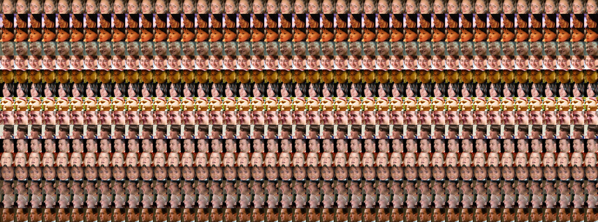
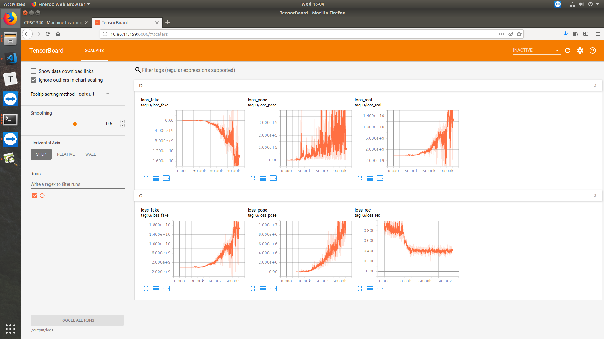

[TOC]

# Pipeline

1. Pose synthesis arbitrarily
2. Pose and Expression jointly finetuning
3. Facial expression recognition
4. Face recognition

# AFW

Supervised learning only using AFW for synthesizing multi-pose face images with retaining the identity.

All the pose continuous labels are binned into [0, 15], [15, 30], ..., [75, 90].

## lab 1

Loss :

* Adversarial loss

* Paired: L1 loss

* Pose Cross Entropy loss

100,000 steps

Batch size 16

No change at all.

1. loss increases ! ! !
2. large loss value ! ! !

