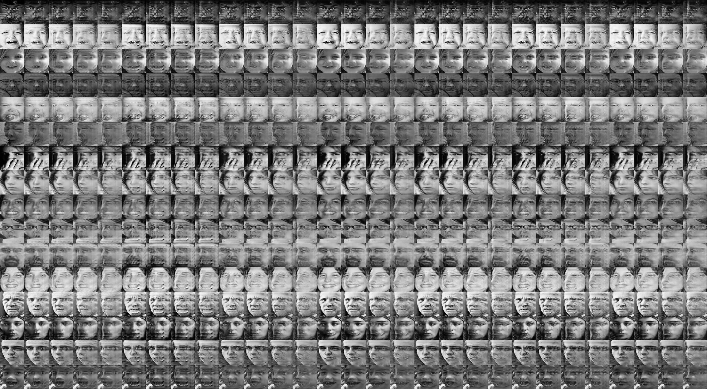
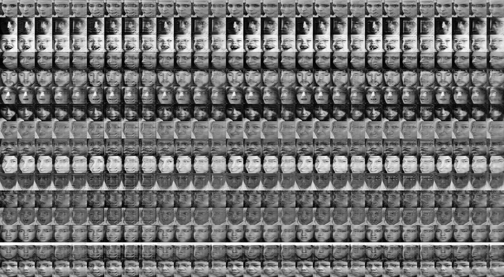

Yingyan Shi

shiyingyan12@qq.com

August 7, 2019

Institute of Brain-inspired Circuits and Systems

-----

# Result of Generator

Various facial expressions are distinct and discernable, while checkerboard artifacts exist.

# Next steps

Following the framework for expression recognition in the benchmark.

* Use the Expression Classifier of adversarial training as **feature extractor** to obtain 2000-dim feature vectors
* Use SVM  (LibSVM) to classify those feature vectors, compared to Fully Connected Layer and to the baseline 74%.
* Cross-database validation: RAF -> SFEW (baseline: 51%)

