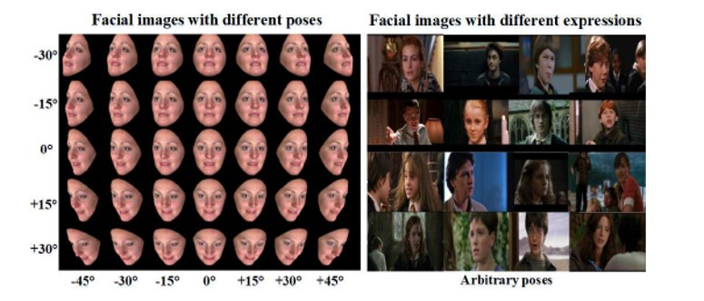
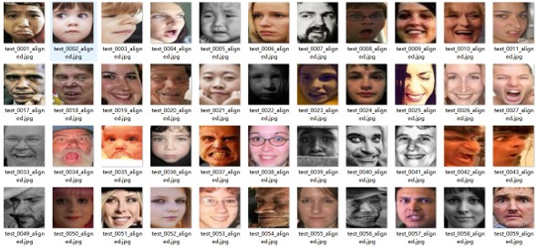
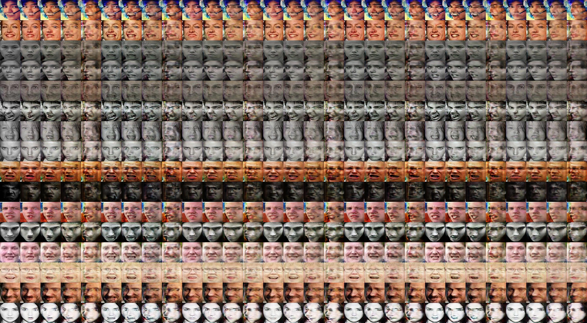

Yingyan Shi

June 18, 2019

-------

[TOC]

# 1. Goal

**To complement and complete the data manifold and improve the robustness of FER systems**,

we aim to generate **in-the-wild multi-view and multi-expression facial image of one person**,

similarly to those settings in the laboratory-controlled conditions.

First to implement such idea.

# 2. Challenge

Lack of such facial images in the wild.

non-linearly coupling：head posture & facial expression.

Two datasets：

* RAF labeled with  seven facial expression types.
* AFW containing profile faces of one person.

# 3. Methodology

A generator conditioned by facial expression label and head posture label.

Trained alternatively using RAF and AFW.

Hyper-parameters:

* Total iteration: 200,000 steps
* Period T: 10 steps
* Dataset ratio: 2 : 8
* Loss weight
* learning rate 

# 4. Result

Currently best Generator：

* Large-pose facial images tend to blur.

# 5. Writing

* Introduction (basically complete)

* Related work (half complete)

# 6. Miscellaneous

TA's work.