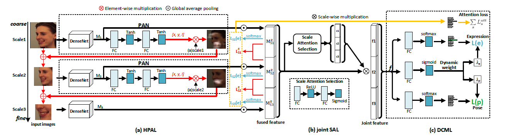
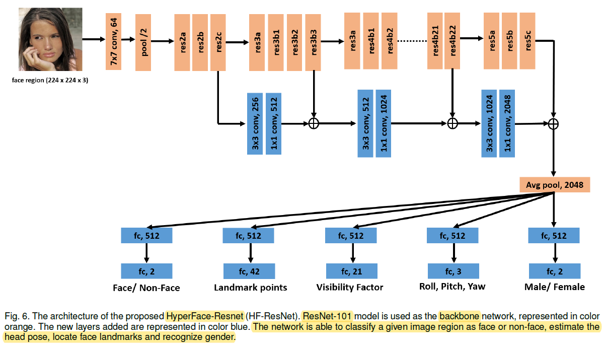
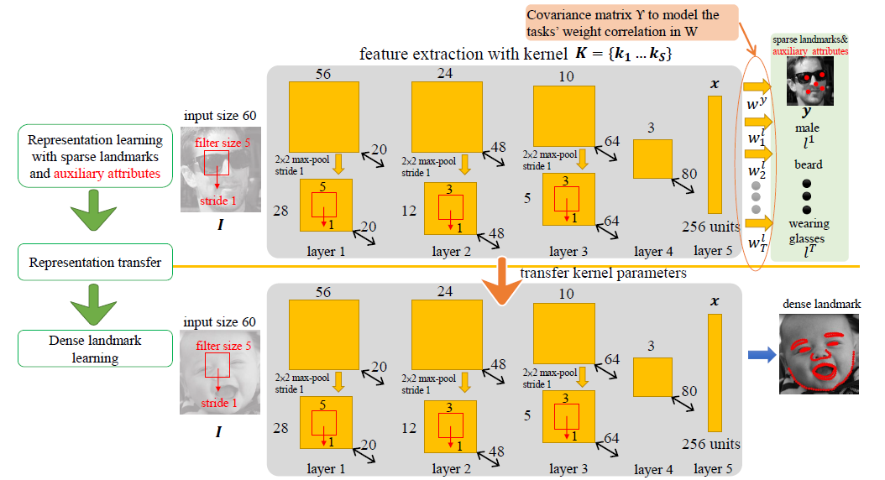
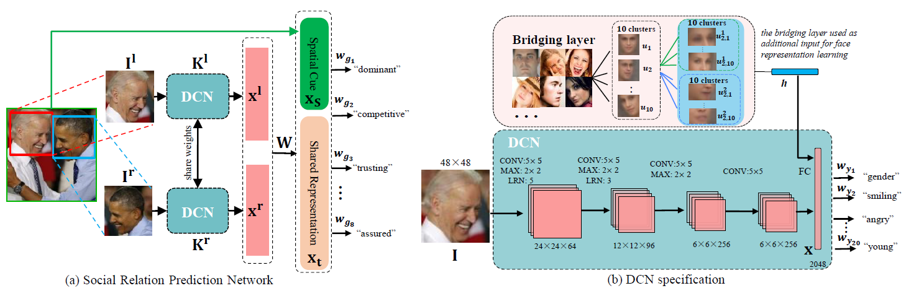

Yingyan Shi

October 17, 2019

-----

**HyperFace: A Deep Multi-Task Learning Framework for Face Detection, landmark Localization, Pose Estimation, and Gender Recognition**

TPAMI 2016

University of Maryland, Rutgers University

exploit the synergy among them

Backbone:

* AlexNet
* ResNet101

We fuse the geometrically rich features from the lower layers and semantically strong features from the deeper layers of ResNet, such that multi-task learning can leverage from their synergy.

**Facial Landmark Detection by Deep Multi-task Learning**

ECCV 2014

http://mmlab.ie.cuhk.edu.hk/projects/TCDCN.html

**Learning Deep Representation for Face Alignment with Auxiliary Attributes**

TPAMI 2016

CUHK

different attribute inference tasks have different learning difficulties and convergence rates

employs dynamic task coefficients adaptively and dynamically adjusted based on training and
validation errors achieved so far in the learning process

* Pretraining stage: 22 facial attributes and 5 landmarks locations
* fine-tuning stage: dense landmark points, e.g. 68 points in 300W dataset

**Learning Social Relation Traits from Face Images**

ICCV 2015

http://mmlab.ie.cuhk.edu.hk/projects/socialrelation/index.html

**From Facial Expression Recognition to Interpersonal Relation Prediction**

IJCV 2018

CUHK

learns a rich face representation to capture gender, expression, head pose, and age-related attributes

Siamese-based framework

a bridging layer based on the local correspondence to cope with the different dataset distributions

* In the top layer, the faces are divided into 10 clusters by K-means using the landmark locations from the SDM face alignment algorithm
* In the second layer, for each node, we perform K-means using the locations of landmarks in the upper and lower face region, and obtain 10 clusters respectively.
* Then the mean HOG feature of the faces in each cluster is regarded as the corresponding template. 
* Given a new sample, the descriptor h is obtained by concatenating its L2-distance to each template.

纹理相似的人脸应该提取出相似的representation，故而不同数据集的样本加上h这个特征描述，进而线性映射到属性分类空间。